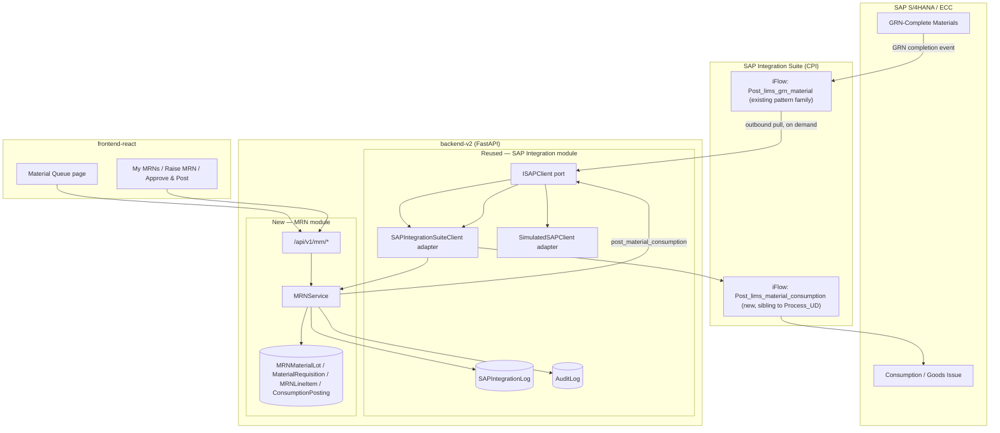
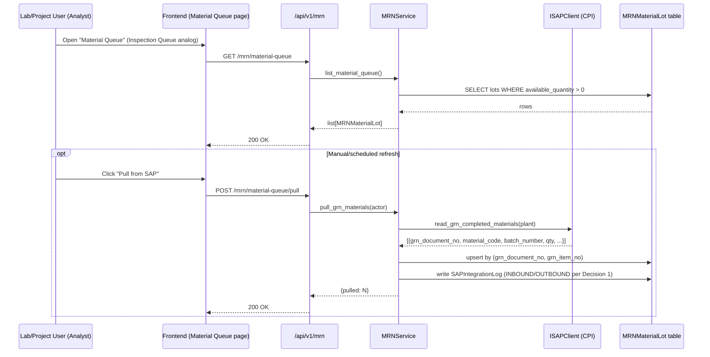
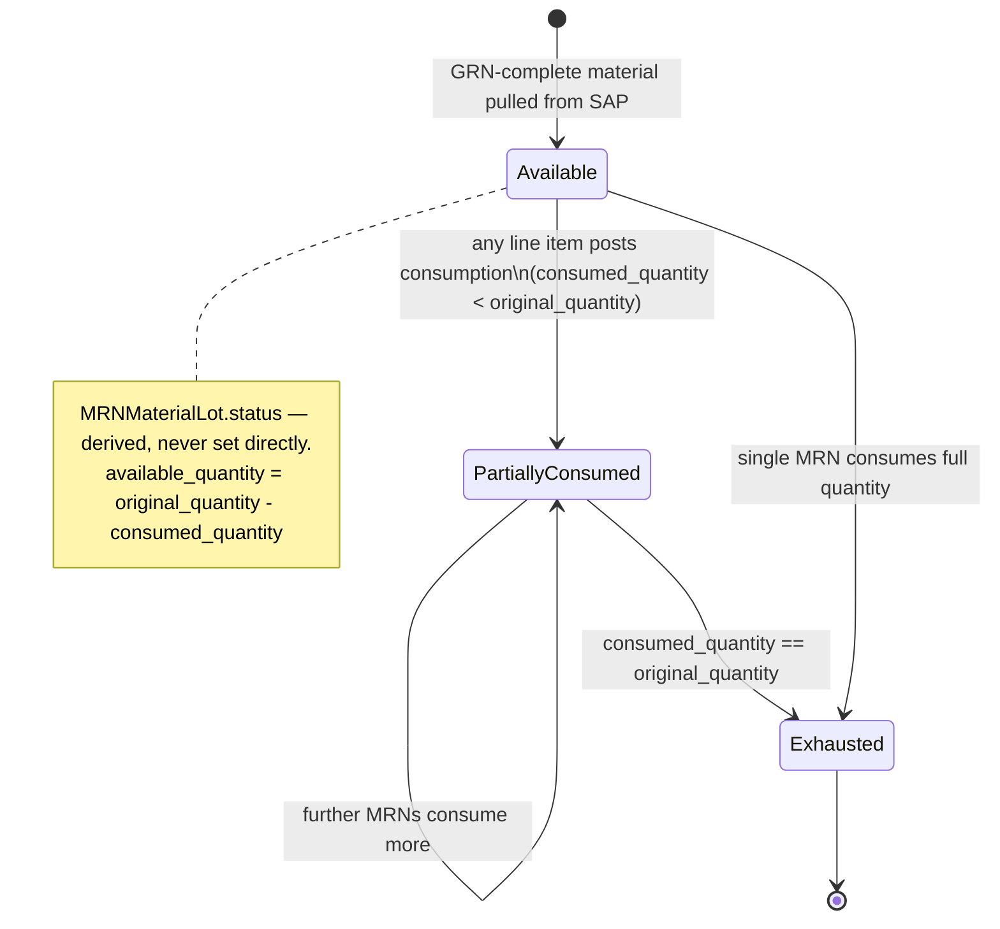
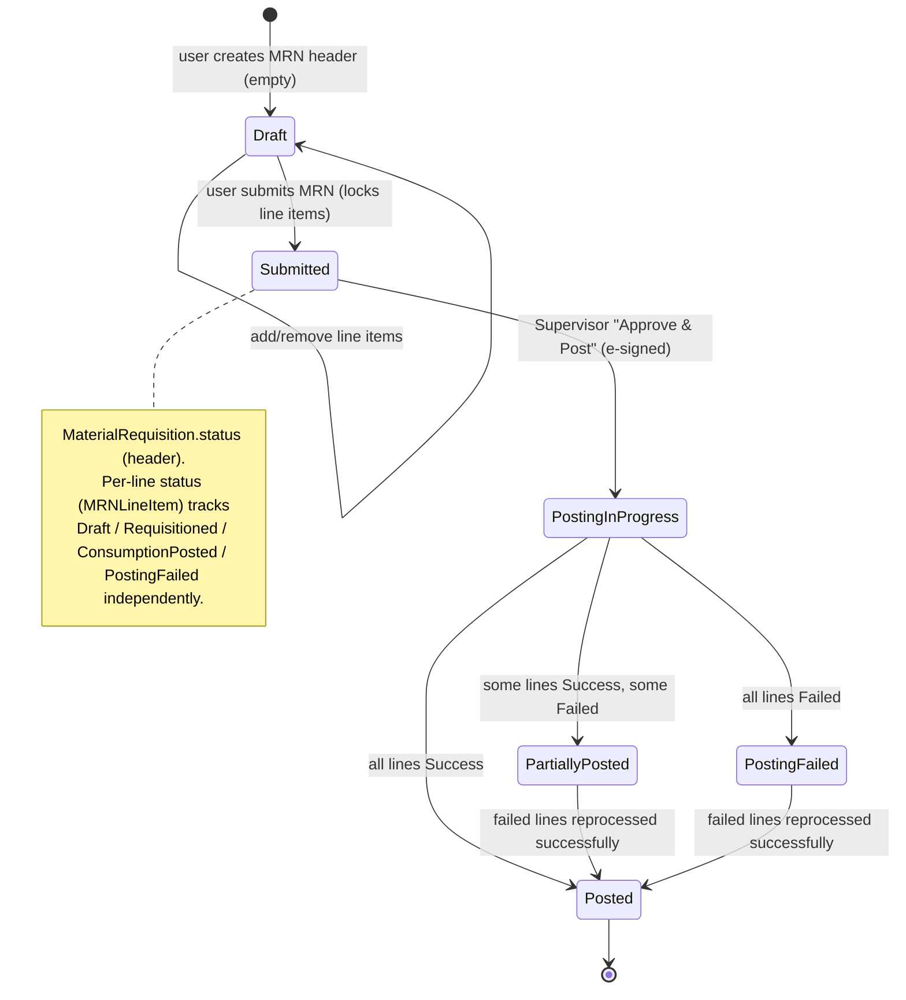

# Design Document: MRN — Material Requisition & Consumption Module

## Overview

This module digitizes the "last mile" of material handling at the R&D plant: from the moment a
material lot has **completed GRN (Goods Receipt Note) in SAP**, through the lab/project user
raising a **Material Requisition Note (MRN)** against one or more such lots, to the **outbound
consumption posting back to SAP** that deducts the requisitioned quantity and marks the lot
exhausted once fully consumed.

It is built as a new vertical slice inside the existing `backend-v2` (FastAPI Clean Architecture:
`api → application → domain → infrastructure`) and `frontend-react` (React 18 + TypeScript +
TanStack Query + PrimeReact) codebases at `rd-lab-instance`, reusing the SAP CPI integration
plumbing, audit/e-signature patterns, and 4-role RBAC model already established by the
`sap-integration` and `sample-management` features. No new services, workers, or datastores
(no Celery/Redis, no Django) are introduced — everything is direct async FastAPI + SQLAlchemy,
matching the rest of this codebase.

Per the user's clarification, this iteration deliberately narrows the BRD-MRCMP-001 scope: there
is **one** SAP data source (materials that have completed GRN at the R&D plant) instead of full
PO/vendor/cost-center master sync, and the BRD's `VERIFIED ⇄ HELD → RECEIVED` receipt-verification
states collapse away because GRN-complete, as delivered by SAP, already implies "received and
verified" for this plant. Project Code → Cost Center master validation (BRD FR-PRJ) is also
deferred; project code is captured as free text this iteration (see Decision Point 3).

## Open Decision Points (Resolved)

These were called out early because they materially change the domain model, RBAC, and SAP
contract. All six have now been confirmed by the user (recommended options accepted as-is).
Kept here for historical record; see `requirements.md` for how each decision is expressed as
acceptance criteria.

| # | Decision | Resolution | Status |
|---|---|---|---|
| **1** | **Push vs. pull** for the GRN-complete material feed from SAP CPI | **Confirmed: Pull.** `ISAPClient.read_grn_completed_materials`, on-demand pull, mirroring `read_inspection_lot()`. No new inbound endpoint is built this iteration. Push (Decision 1a) remains a documented fallback only, not built. | ✅ Confirmed |
| **2** | Does an **approval gate** exist between "MRN raised with quantities" and "consumption posted to SAP"? | **Confirmed: Yes.** MRN must be **Submitted**, then **Approved & Posted** by a Supervisor-equivalent role with e-signature, mirroring `post_usage_decision`'s e-sign pattern. | ✅ Confirmed |
| **3** | Does **Project Code → Cost Center master validation** (BRD FR-PRJ) belong in this iteration? | **Confirmed: No, deferred to Phase 2.** `project_code` is captured as a lightly-validated free-text string on the MRN line item this iteration. | ✅ Confirmed |
| **4** | Do we need **new roles** (Store Executive, Store Manager) or map onto the existing 4 (Admin, Analyst, Supervisor, QA)? | **Confirmed: Map onto existing 4.** Store-Manager-equivalent approval maps to **Supervisor**. No new roles introduced. | ✅ Confirmed |
| **5** | Notification delivery (email + in-portal) per BRD Appendix B | **Confirmed: Deferred to Phase 2.** AuditLog/SAPIntegrationLog entries are emitted now for traceability; no notification gateway this iteration. | ✅ Confirmed |
| **6** | Natural/idempotency key for a GRN line from SAP (exact field names) | **Confirmed: `(grn_document_no, grn_item_no)`** as the natural key, `grn_document_no` as the idempotency seed for consumption postings. **Flagged as an open assumption in requirements.md** — must be confirmed with SAP CoE / the user's team before implementation, since the actual SAP CPI GRN-feed payload schema is not yet available. | ✅ Confirmed (with follow-up assumption flagged) |

## Architecture (High-Level Design)

### System Diagram



### Module Boundary: Reused vs. New

**Reused as-is (no changes):**
- `ISAPClient` port and its `SimulatedSAPClient` / `SAPIntegrationSuiteClient` adapters — same
  transport, same Basic-Auth-to-CPI-tenant pattern.
- `AuditLog`, `SAPIntegrationLog` entities and their repositories — every MRN state change and
  every SAP call writes through these unchanged.
- `require_role`, `get_current_user`, `verify_esignature` (via `AuthService`) dependencies.
- `ESignDialog.tsx`, `StatusBadge.tsx`, `usePermissions.ts` on the frontend.

**Extended (small, additive changes to existing files):**
- `ISAPClient`: two new abstract methods (`read_grn_completed_materials`,
  `post_material_consumption`), implemented in both `SimulatedSAPClient` and
  `SAPIntegrationSuiteClient`.
- `Container` (`dependency_injection.py`): one new `get_mrn_service()` factory.
- `settings.py`: MRN numbering group + (if push is chosen) reuse of the existing
  `SAP_INBOUND_API_KEY` guard for a new inbound route.

**New (this module only):**
- Domain entities: `MRNMaterialLot`, `MaterialRequisition`, `MRNLineItem`, `ConsumptionPosting`.
- `MRNService` application service.
- `IMRNMaterialLotRepository`, `IMaterialRequisitionRepository`, `IConsumptionPostingRepository`
  + SQLAlchemy implementations.
- `MRNNumberGenerator` domain service (sibling to `SampleCodeGenerator`).
- `/api/v1/mrn/*` endpoints, Pydantic schemas.
- Frontend `features/mrn/*` (queue page, MRN workspace, approve-and-post dialog).

### Data Flow — Inbound GRN-Complete Material Queue



### Data Flow — Outbound Consumption Posting

```mermaid
sequenceDiagram
    participant Sup as Store-Manager-equivalent (Supervisor)
    participant FE as Frontend (MRN detail)
    participant API as /api/v1/mrn
    participant SVC as MRNService
    participant SAP as ISAPClient (CPI)
    participant DB as ConsumptionPosting / MRNLineItem / MRNMaterialLot

    Sup->>FE: Open submitted MRN → "Approve & Post"
    FE->>API: POST /mrn/{id}/approve-post {password, comments}
    API->>SVC: verify_esignature(actor, password)
    SVC->>SVC: approve_and_post_consumption(mrn_id, actor)
    loop each MRNLineItem
        SVC->>DB: build idempotency_key = f"{mrn_number}-{line_no}"
        SVC->>SAP: post_material_consumption(material_code, batch, plant, qty, idempotency_key)
        alt success
            SAP-->>SVC: {sap_doc_no, raw}
            SVC->>DB: ConsumptionPosting.status=Success, sap_doc_no
            SVC->>DB: MRNLineItem.status=ConsumptionPosted
            SVC->>DB: MRNMaterialLot.consumed_quantity += qty; recompute status
        else failure
            SAP-->>SVC: error
            SVC->>DB: ConsumptionPosting.status=Failed, error_message
            SVC->>DB: MRNLineItem.status=PostingFailed
        end
        SVC->>DB: write AuditLog + SAPIntegrationLog
    end
    SVC->>DB: recompute MaterialRequisition.status (Posted / PartiallyPosted / PostingFailed)
    SVC-->>API: MRN summary
    API-->>FE: 200 OK
```

### Simplified State Model

BRD Appendix A's `REQUESTED → VERIFIED ⇄ HELD → RECEIVED → RESERVED → READY FOR ISSUE → ISSUED →
CONSUMED/POSTED` collapses for this iteration because GRN-complete (as delivered by the single SAP
feed) already implies "received and verified" — there is no separate Store Executive
verification/hold step in scope. The result is two cooperating state machines:





## Correctness Properties

*A property is a characteristic or behavior that should hold true across all valid executions of
a system — essentially, a formal statement about what the system should do. Properties serve as
the bridge between human-readable specifications and machine-verifiable correctness guarantees.*

### Property 1: Material queue excludes exhausted/zero-quantity lots

For any set of MRNMaterialLot records with varying `original_quantity` and `consumed_quantity`,
the material queue returned to an authorized user contains exactly those lots where
`available_quantity` (`original_quantity - consumed_quantity`) is greater than zero, and excludes
all others.

**Validates: Requirements 1.1, 9.2**

### Property 2: Lot status is a deterministic function of quantities

For any MRNMaterialLot with `0 <= consumed_quantity <= original_quantity`, the derived status is
Available when `consumed_quantity == 0`, PartiallyConsumed when
`0 < consumed_quantity < original_quantity`, and Exhausted when
`consumed_quantity == original_quantity`.

**Validates: Requirements 9.1**

### Property 3: GRN pull upsert is idempotent by natural key

For any sequence of GRN-completed material records pulled from SAP, including records that repeat
the same `(grn_document_no, grn_item_no)` natural key across multiple pulls, upserting results in
exactly one MRNMaterialLot record per distinct natural key, with the most recently pulled data
reflected.

**Validates: Requirements 2.2, 2.3**

### Property 4: Failed SAP pull is a no-op on existing data

For any existing set of MRNMaterialLot records and any simulated SAP_Client failure during a
pull, the MRNMaterialLot table remains unchanged after the failed pull, and a SAPIntegrationLog
entry with status Failed and an error message is written.

**Validates: Requirements 2.5**

### Property 5: Successful SAP integration calls are logged with accurate content

For any successful call to `SAP_Client.read_grn_completed_materials` or
`SAP_Client.post_material_consumption`, THE MRN_Service writes a SAPIntegrationLog entry whose
transaction type, direction, request payload, response payload, and status accurately reflect the
call, and (for pulls) writes an AuditLog entry recording the correct count of lots pulled.

**Validates: Requirements 2.4, 2.6, 7.7, 12.1**

### Property 6: Unauthorized requests are rejected and leave state unchanged

For any MRN action (viewing the queue, triggering a pull, creating/editing/submitting an MRN,
approving-and-posting, or reprocessing) requested by a user whose role is not among the roles
permitted for that action, THE MRN_Service rejects the request with an authorization error and
leaves all MRN-related records unchanged.

**Validates: Requirements 1.3, 2.7, 4.8, 6.3, 8.5, 11.1, 11.2, 11.3, 11.4**

### Property 7: MRN numbers are unique and well-formed

For any sequence of MaterialRequisition creations, each generated `mrn_number` matches the
date-based sequential format and no two MaterialRequisition records ever share the same
`mrn_number`.

**Validates: Requirements 3.1, 3.2, 4.1**

### Property 8: Line item quantity validation

For any MRNMaterialLot with a given `available_quantity`, adding a line item with
`requested_quantity <= 0` or `requested_quantity > available_quantity` is rejected and the
MaterialRequisition's line items remain unchanged.

**Validates: Requirements 4.3, 4.4**

### Property 9: Line item project_code validation

For any string composed entirely of whitespace characters (including the empty string) supplied
as `project_code`, adding a line item with that `project_code` is rejected.

**Validates: Requirements 4.5**

### Property 10: Draft-only line item mutation

For any MaterialRequisition, adding or removing line items succeeds while its status is Draft, and
is rejected for every non-Draft status (Submitted, PostingInProgress, Posted, PartiallyPosted,
PostingFailed), leaving line items unchanged in the rejected case.

**Validates: Requirements 4.6, 4.7**

### Property 11: Submission requires at least one line item and Draft status

For any MaterialRequisition, submission succeeds (transitioning to Submitted and locking line
items) if and only if its status is Draft and it has at least one line item; submission from any
other status, or of a Draft MRN with zero line items, is rejected and its status is left
unchanged.

**Validates: Requirements 5.1, 5.2, 5.3**

### Property 12: Approval e-signature gate

For any Submitted MaterialRequisition, an approve-and-post request from a Supervisor with an
incorrect e-signature password leaves the MaterialRequisition's status unchanged and returns an
authentication error, while a request with the correct password transitions the status to
PostingInProgress before any line item is posted to SAP.

**Validates: Requirements 6.1, 6.2, 6.4**

### Property 13: Approve-and-post requires Submitted status

For any MaterialRequisition whose status is not Submitted, an approve-and-post request is rejected
and its status is left unchanged.

**Validates: Requirements 6.5**

### Property 14: All line items are attempted during posting

For any MaterialRequisition entering PostingInProgress with N line items and any mix of per-line
success/failure outcomes, THE MRN_Service attempts to post all N line items to SAP_Client,
regardless of earlier line item failures.

**Validates: Requirements 7.1, 7.5**

### Property 15: Idempotency key is deterministic and unique per line

For any `mrn_number` and line number pair, the derived `idempotency_key` is deterministic (the
same pair always produces the same key) and distinct pairs produce distinct keys.

**Validates: Requirements 7.2**

### Property 16: Posting outcome updates line, lot, and posting record consistently

For any line item posting attempt, a successful outcome results in a ConsumptionPosting record
with status Success and the SAP document number, the MRNLineItem status set to ConsumptionPosted,
and the referenced MRNMaterialLot's `consumed_quantity` increased by the posted quantity; a failed
outcome results in a ConsumptionPosting record with status Failed and an error message, the
MRNLineItem status set to PostingFailed, and the referenced MRNMaterialLot's `consumed_quantity`
left unchanged.

**Validates: Requirements 7.3, 7.4**

### Property 17: MRN header status reflects the combined line outcome

For any combination of per-line success/failure outcomes across a MaterialRequisition's line
items, after all attempts complete the MaterialRequisition's status is Posted if all lines
succeeded, PartiallyPosted if some succeeded and some failed, or PostingFailed if all failed.

**Validates: Requirements 7.6**

### Property 18: Successful postings are never re-submitted to SAP

For any MRNLineItem with an existing ConsumptionPosting of status Success, re-invoking the posting
logic for that line item does not call `SAP_Client.post_material_consumption` again and returns
the existing ConsumptionPosting record unchanged.

**Validates: Requirements 8.1**

### Property 19: Reprocessing targets only failed lines and preserves posting-record identity

For any MaterialRequisition with a mix of ConsumptionPosted and PostingFailed line items,
reprocessing retries `SAP_Client.post_material_consumption` only for the PostingFailed lines, does
not call SAP_Client for already-ConsumptionPosted lines, and when a retried line succeeds, updates
its existing ConsumptionPosting record (identified by `idempotency_key`) to Success rather than
creating an additional record.

**Validates: Requirements 8.2, 8.3**

### Property 20: Reprocessing resolves MRN status once all lines succeed

For any MaterialRequisition in PartiallyPosted or PostingFailed status, reprocessing that results
in every previously failed line item succeeding transitions the MaterialRequisition's status to
Posted.

**Validates: Requirements 8.4**

### Property 21: Reprocessing requires PartiallyPosted or PostingFailed status

For any MaterialRequisition whose status is not PartiallyPosted or PostingFailed, a reprocess
request is rejected.

**Validates: Requirements 8.6**

### Property 22: Posting cannot over-consume a lot

For any MRNLineItem whose `requested_quantity`, if posted, would cause its referenced
MRNMaterialLot's `consumed_quantity` to exceed `original_quantity`, THE MRN_Service rejects that
line item's posting with a validation error and does not call
`SAP_Client.post_material_consumption`.

**Validates: Requirements 9.3**

### Property 23: Every status change writes a complete audit entry

For any state transition of a MaterialRequisition, MRNLineItem, or MRNMaterialLot, THE MRN_Service
writes an AuditLog entry containing the acting user's username, the action performed, the table
name, the record identifier, and the previous and new status values.

**Validates: Requirements 5.4, 10.1**

