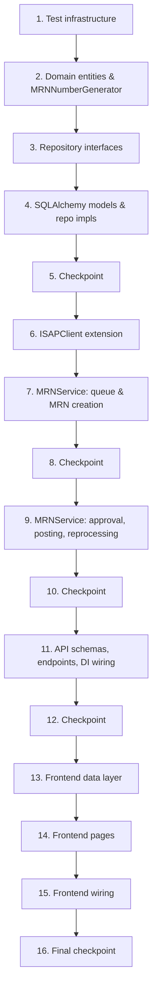

# Implementation Plan: MRN — Material Requisition & Consumption Module

## Overview

This plan builds the MRN vertical slice inside the existing `backend-v2` (FastAPI Clean
Architecture) and `frontend-react` codebases at `rd-lab-instance`, in dependency order: domain
entities → repository ports → `ISAPClient` extension → application service → API
endpoints/schemas → DI wiring → frontend feature. It reuses `ISAPClient`/adapters, `AuditLog`,
`SAPIntegrationLog`, `require_role`/`get_current_user`/`verify_esignature`, `ESignDialog`,
`StatusBadge`, and `usePermissions` exactly as they exist today — no changes to those files beyond
the two new `ISAPClient` methods and the DI/router additions called out below.

Backend has no existing automated test suite (no `tests/` directory, no `pytest.ini`/`pyproject.toml`,
`hypothesis` not yet a dependency), so the first task sets up that infrastructure since the design's
23 correctness properties require it. Frontend has no existing test tooling (no Vitest/RTL in any
feature), consistent with the rest of the codebase, so no frontend test tasks are included — this
matches the established pattern rather than introducing new tooling unprompted.

**Note on requirement numbering:** design.md's "Correctness Properties" section cites requirement
numbers (e.g. `11.1`, `12.1`) from an earlier draft that don't match the final `requirements.md`
(which has 7 requirements, `1.1`–`7.6`). Each property task below cites the **corrected**
`requirements.md` clause numbers based on the property's actual content, while keeping the
property's number/title exactly as written in design.md for traceability back to that document.

## Task Dependency Graph



```json
{
  "waves": [
    { "wave": 1, "tasks": ["1"] },
    { "wave": 2, "tasks": ["2"] },
    { "wave": 3, "tasks": ["3"] },
    { "wave": 4, "tasks": ["4"] },
    { "wave": 5, "tasks": ["5"] },
    { "wave": 6, "tasks": ["6"] },
    { "wave": 7, "tasks": ["7"] },
    { "wave": 8, "tasks": ["8"] },
    { "wave": 9, "tasks": ["9"] },
    { "wave": 10, "tasks": ["10"] },
    { "wave": 11, "tasks": ["11"] },
    { "wave": 12, "tasks": ["12"] },
    { "wave": 13, "tasks": ["13"] },
    { "wave": 14, "tasks": ["14"] },
    { "wave": 15, "tasks": ["15"] },
    { "wave": 16, "tasks": ["16"] }
  ]
}
```

## Tasks

- [x] 1. Set up backend test infrastructure
  - Add `hypothesis==6.112.2` to `backend-v2/requirements/dev.txt`
  - Add a `pyproject.toml` (or `pytest.ini`) at `backend-v2/` configuring `pytest-asyncio` (asyncio_mode=auto) and the `tests/` root
  - Create `backend-v2/tests/conftest.py` with an in-memory SQLite async engine/session fixture (mirrors `session.py`'s `create_async_engine`, but pointed at `sqlite+aiosqlite:///:memory:`, with `Base.metadata.create_all` run per test) and factory helpers for constructing `User` entities per role (Admin, Analyst, Supervisor, QA)
  - Create `backend-v2/tests/mrn/` package for this module's tests

- [x] 2. Domain layer — entities and domain service
  - [x] 2.1 Add MRN domain entities in `src/domain/entities/mrn.py`
    - `MRNMaterialLot` (natural key `grn_document_no`/`grn_item_no`, `original_quantity`, `consumed_quantity`, a computed `available_quantity` property, and a computed `status` property — Available/PartiallyConsumed/Exhausted — that is never independently settable)
    - `MaterialRequisition` (header: `mrn_number`, `status`, `created_by`, `created_date`, `submitted_by`, `submitted_at`, `line_items: list[MRNLineItem]`)
    - `MRNLineItem` (`mrn_id`, `line_no`, `lot_id`, `requested_quantity`, `project_code`, `status`: Draft/Requisitioned/ConsumptionPosted/PostingFailed)
    - `ConsumptionPosting` (`line_item_id`, `idempotency_key`, `status`: Success/Failed, `sap_doc_no`, `error_message`)
    - _Requirements: 1.1, 1.6, 2.1, 2.2, 2.4, 2.5, 3.4, 3.5, 3.6, 4.1, 4.2, 4.3_

  - [ ]* 2.2 Write property test for lot status derivation
    - **Property 2: Lot status is a deterministic function of quantities**
    - **Validates: Requirements 4.1**

  - [x] 2.3 Add `MRNNumberGenerator` domain service in `src/domain/services/mrn_number_generator.py`, sibling to `SampleCodeGenerator`, producing `MRN-YYYYMMDD-XXXX`
    - _Requirements: 2.8_

  - [ ]* 2.4 Write property test for MRN number generation
    - **Property 7: MRN numbers are unique and well-formed**
    - **Validates: Requirements 2.1, 2.8**

  - [ ]* 2.5 Write unit tests for entity business rules (submission with zero line items rejected, line item quantity/project_code validation edge cases, over-consumption guard)
    - _Requirements: 2.3, 2.6, 4.3_

- [x] 3. Domain repository interfaces (ports)
  - [x] 3.1 Define `IMRNMaterialLotRepository`, `IMaterialRequisitionRepository`, `IConsumptionPostingRepository` in `src/domain/repositories/mrn_repository.py` (mirroring the grouping style of `audit_repository.py`)
    - `IMRNMaterialLotRepository`: `get_by_id`, `get_by_natural_key(grn_document_no, grn_item_no)`, `upsert`, `list_available`, `list_all`
    - `IMaterialRequisitionRepository`: `get_by_id` (with line items), `list_all`, `create`, `update_status`, `add_line_item`, `remove_line_item`, `count_by_number_prefix`
    - `IConsumptionPostingRepository`: `create`, `update`, `get_by_idempotency_key`, `list_by_mrn`
    - _Requirements: 1.1, 1.2, 1.3, 2.1, 2.4, 3.4, 3.7_

- [x] 4. Infrastructure — SQLAlchemy models and repository implementations
  - [x] 4.1 Create ORM models in `src/infrastructure/database/models/mrn_model.py` (`MRNMaterialLotModel`, `MaterialRequisitionModel`, `MRNLineItemModel`, `ConsumptionPostingModel`) and import them from `src/infrastructure/database/models/__init__.py` so `Base.metadata.create_all` registers them
    - _Requirements: 1.2, 2.1, 2.2, 3.4_

  - [x] 4.2 Implement `MRNMaterialLotRepositoryImpl` in `src/infrastructure/database/repositories/mrn_repository_impl.py` (upsert-by-natural-key, list lots with `available_quantity > 0` ordered most-recently-pulled-first, get by id)
    - _Requirements: 1.1, 1.2, 1.3, 1.6_

  - [ ]* 4.3 Write property test for GRN pull upsert idempotency
    - **Property 3: GRN pull upsert is idempotent by natural key**
    - **Validates: Requirements 1.2, 1.3**

  - [ ]* 4.4 Write property test for material queue filtering
    - **Property 1: Material queue excludes exhausted/zero-quantity lots**
    - **Validates: Requirements 1.1, 1.6**

  - [x] 4.5 Implement `MaterialRequisitionRepositoryImpl` in the same file (create header, add/remove line items, update header status, get-with-line-items, list, count-by-prefix for the number generator)
    - _Requirements: 2.1, 2.2, 2.4, 2.5_

  - [x] 4.6 Implement `ConsumptionPostingRepositoryImpl` in the same file (create, update by id, get by idempotency key, list by MRN)
    - _Requirements: 3.3, 3.4, 3.7_

- [x] 5. Checkpoint — Ensure all domain/infrastructure tests pass
  - Ensure all tests pass, ask the user if questions arise.
  - Verified: `pytest tests/mrn -q` → 4 passed (repository smoke tests covering upsert idempotency, availability filtering, MRN/line-item CRUD, and posting CRUD).

- [x] 6. Extend `ISAPClient` port and adapters
  - [x] 6.1 Add `read_grn_completed_materials(plant: str) -> list[dict]` and `post_material_consumption(material_code: str, batch_number: str, plant: str, quantity: float, idempotency_key: str) -> dict` as abstract methods on `ISAPClient` in `src/infrastructure/external/sap/sap_client.py`
    - Implement both in `SimulatedSAPClient` returning realistic mock data (mock GRN lots list; mock `sap_doc_no`)
    - Implement both in `SAPIntegrationSuiteClient`, isolating the CPI payload field-name mapping in small private helper functions/constants near these two methods so the mapping can be revised without touching domain/application code (per the open SAP CoE assumption in requirements.md)
    - Add `NotImplementedError` stubs for both in `PyRFCSAPClient` (consistent with its existing CPI-only method stubs), so the class remains instantiable
    - _Requirements: 1.2, 1.7, 3.3, 3.10_
    - Note: the two CPI endpoint paths (`_GRN_PULL_PATH`/`_MATERIAL_CONSUMPTION_PATH`) ended up as class constants on `SAPIntegrationSuiteClient` rather than `settings.py` fields — acceptable since they're still isolated in one place per the task's intent, but flagging the minor deviation from the literal wording.

  - [x] 6.2 Add `MRN_SAP_PLANT_CODE` setting (and any CPI endpoint-path settings needed for the two new calls) to `src/config/settings.py`, defaulting to empty/configurable rather than hardcoded
    - _Requirements: (Dependencies and Assumptions — R&D plant code must be configuration, not hardcoded)_

  - [ ]* 6.3 Write unit tests for `SimulatedSAPClient.read_grn_completed_materials`/`post_material_consumption` mock shape, and for `SAPIntegrationSuiteClient`'s request/response mapping and HTTP-error propagation
    - _Requirements: 1.7, 3.10_

- [x] 7. Application service — `MRNService` (material queue and MRN creation)
  - [x] 7.1 Implement `MRNService.list_material_queue()` and `MRNService.pull_grn_materials(actor)` in `src/application/services/mrn_service.py`, writing one `SAPIntegrationLog` (OUTBOUND) and one `AuditLog` per pull, leaving `MRNMaterialLot` rows untouched on failure
    - _Requirements: 1.1, 1.2, 1.3, 1.4, 1.5, 1.6, 6.3, 6.4_

  - [ ]* 7.2 Write property test for failed-pull no-op behavior
    - **Property 4: Failed SAP pull is a no-op on existing data**
    - **Validates: Requirements 1.5**

  - [x] 7.3 Implement `MRNService.create_mrn(actor)`, `add_line_item(mrn_id, lot_id, quantity, project_code, actor)`, `remove_line_item(mrn_id, line_id, actor)` with validation (quantity `<= available_quantity`, non-whitespace `project_code`, Draft-only mutation, creator-or-Admin edit restriction) and `AuditLog` writes
    - _Requirements: 2.1, 2.2, 2.3, 2.4, 2.7, 4.3, 5.1, 6.1_

  - [ ]* 7.4 Write property test for line item quantity validation
    - **Property 8: Line item quantity validation**
    - **Validates: Requirements 2.2, 2.3**

  - [ ]* 7.5 Write property test for project code validation
    - **Property 9: Line item project_code validation**
    - **Validates: Requirements 2.2**

  - [ ]* 7.6 Write property test for Draft-only mutation
    - **Property 10: Draft-only line item mutation**
    - **Validates: Requirements 2.4, 2.5, 2.7**

  - [x] 7.7 Implement `MRNService.submit_mrn(mrn_id, actor)` (Draft + ≥1 line item required, transitions to Submitted, locks line items, records submitter/timestamp, writes `AuditLog`)
    - _Requirements: 2.5, 2.6, 2.7, 5.1_

  - [ ]* 7.8 Write property test for submission preconditions
    - **Property 11: Submission requires at least one line item and Draft status**
    - **Validates: Requirements 2.5, 2.6**

- [x] 8. Checkpoint — Ensure all tests pass so far
  - Ensure all tests pass, ask the user if questions arise.
  - Verified: `pytest -q` in `backend-v2` → 4 passed. Note: coverage is still limited to the repository-layer smoke tests from task 4/5 — none of task 7's `MRNService` logic has dedicated tests yet (its optional property tests 7.2/7.4-7.6/7.8 are unwritten).

- [x] 9. Application service — approval, posting, and reprocessing
  - [x] 9.1 Implement `MRNService.approve_and_post(mrn_id, actor, password)`: verify e-signature via `AuthService.verify_esignature`, transition to `PostingInProgress`, then for each line item independently derive `idempotency_key = f"{mrn_number}-{line_no}"` and call `ISAPClient.post_material_consumption`; on success record `sap_doc_no`/set line `ConsumptionPosted`/increment lot `consumed_quantity` and recompute lot status in the same transaction; on failure record the error/set line `PostingFailed` without affecting other lines; after all lines attempted, recompute header status (Posted/PartiallyPosted/PostingFailed); write one `SAPIntegrationLog` + one `AuditLog` per line attempt
    - _Requirements: 3.1, 3.2, 3.3, 3.4, 3.5, 3.6, 3.8, 3.9, 4.2, 5.1_
    - Note: e-signature verification is performed in the endpoint layer (`mrn_endpoints.py` calls `AuthService.verify_esignature` before `MRNService.approve_and_post`) rather than inside the service method itself — functionally equivalent gate, just at a different layer than the task text implies.

  - [ ]* 9.2 Write property test for the e-signature gate
    - **Property 12: Approval e-signature gate**
    - **Validates: Requirements 3.2, 3.3**

  - [ ]* 9.3 Write property test for the Submitted-status precondition
    - **Property 13: Approve-and-post requires Submitted status**
    - **Validates: Requirements 3.2**

  - [ ]* 9.4 Write property test for exhaustive line-item attempts
    - **Property 14: All line items are attempted during posting**
    - **Validates: Requirements 3.3, 3.5**

  - [ ]* 9.5 Write property test for idempotency key derivation
    - **Property 15: Idempotency key is deterministic and unique per line**
    - **Validates: Requirements 3.3**

  - [ ]* 9.6 Write property test for consistent posting-outcome updates
    - **Property 16: Posting outcome updates line, lot, and posting record consistently**
    - **Validates: Requirements 3.4, 3.5**

  - [ ]* 9.7 Write property test for header status aggregation
    - **Property 17: MRN header status reflects the combined line outcome**
    - **Validates: Requirements 3.6**

  - [ ]* 9.8 Write property test for the over-consumption guard at posting time
    - **Property 22: Posting cannot over-consume a lot**
    - **Validates: Requirements 2.3, 4.3**

  - [ ]* 9.9 Write property test for SAP integration logging accuracy (covers both `read_grn_completed_materials` and `post_material_consumption` call paths)
    - **Property 5: Successful SAP integration calls are logged with accurate content**
    - **Validates: Requirements 1.4, 3.8**

  - [x] 9.10 Implement `MRNService.reprocess_failed(mrn_id, actor)`: re-attempts only line items with status `PostingFailed`, reusing each one's existing `idempotency_key`/`ConsumptionPosting` record (updating it in place rather than creating a new one on success), and recomputes header status once all lines are resolved
    - _Requirements: 3.6, 3.7, 5.1_

  - [ ]* 9.11 Write property test for successful postings never being resubmitted
    - **Property 18: Successful postings are never re-submitted to SAP**
    - **Validates: Requirements 3.7**

  - [ ]* 9.12 Write property test for reprocessing scope and record identity
    - **Property 19: Reprocessing targets only failed lines and preserves posting-record identity**
    - **Validates: Requirements 3.7**

  - [ ]* 9.13 Write property test for reprocessing resolving header status
    - **Property 20: Reprocessing resolves MRN status once all lines succeed**
    - **Validates: Requirements 3.6, 3.7**

  - [ ]* 9.14 Write property test for the reprocess-status precondition
    - **Property 21: Reprocessing requires PartiallyPosted or PostingFailed status**
    - **Validates: Requirements 3.7**

  - [ ]* 9.15 Write property test for complete audit entries on every state transition
    - **Property 23: Every status change writes a complete audit entry**
    - **Validates: Requirements 5.1, 5.2**

  - [ ]* 9.16 Write property test for authorization enforcement across all MRN actions (queue view/pull, create/add/remove/submit, approve-and-post, reprocess), asserting rejected requests leave all MRN-related records unchanged
    - **Property 6: Unauthorized requests are rejected and leave state unchanged**
    - **Validates: Requirements 6.1, 6.2, 6.3, 3.9**

- [x] 10. Checkpoint — Ensure all application service tests pass
  - Ensure all tests pass, ask the user if questions arise.
  - Verified: `pytest -q` in `backend-v2` → 4 passed (same repository-layer tests; task 9's posting/reprocessing logic has no dedicated tests yet — its 8 optional property tests, 9.2-9.9/9.11-9.16, are unwritten).

- [x] 11. API layer — schemas, endpoints, and DI wiring
  - [x] 11.1 Add Pydantic schemas in `src/api/v1/schemas/mrn_schemas.py` (`MRNMaterialLotResponse`, `MaterialQueuePullResponse`, `CreateLineItemRequest`, `MRNLineItemResponse`, `MaterialRequisitionResponse`, `ApproveAndPostRequest`, `ConsumptionPostingResponse`)
    - _Requirements: 1.1, 2.2, 3.1, 3.4_

  - [x] 11.2 Add `Container.get_mrn_service(session)` factory in `src/config/dependency_injection.py`, wiring `MRNMaterialLotRepositoryImpl`, `MaterialRequisitionRepositoryImpl`, `ConsumptionPostingRepositoryImpl`, the existing `AuditLogRepositoryImpl`/`SAPIntegrationLogRepositoryImpl`, and `Container.get_sap_client()`
    - _Requirements: (module boundary — extended, no new services/datastores)_

  - [x] 11.3 Implement `src/api/v1/endpoints/mrn_endpoints.py` with a `/mrn` prefixed router:
    - `GET /mrn/material-queue` — any of Admin/Analyst/Supervisor/QA
    - `POST /mrn/material-queue/pull` — Admin/Analyst/Supervisor
    - `POST /mrn` (create), `GET /mrn` (list), `GET /mrn/{id}` (detail with line items)
    - `POST /mrn/{id}/line-items`, `DELETE /mrn/{id}/line-items/{line_id}` — Admin/Analyst
    - `POST /mrn/{id}/submit` — Admin/Analyst
    - `POST /mrn/{id}/approve-post` — Admin/Supervisor, calls `AuthService.verify_esignature` before `MRNService.approve_and_post`
    - `POST /mrn/{id}/reprocess` — Admin/Supervisor
    - _Requirements: 1.1, 1.2, 2.1, 2.2, 2.4, 2.5, 3.1, 3.2, 3.7, 6.1, 6.2, 6.3, 6.4_

  - [x] 11.4 Register `mrn_router` in `src/api/v1/router.py`
    - _Requirements: (wiring)_

  - [ ]* 11.5 Write integration tests for the MRN endpoints: role-gated access per endpoint (403 for disallowed roles), and the happy-path flow create → add line item → submit → approve-post (using `SimulatedSAPClient` via DI override)
    - _Requirements: 1.1, 1.2, 2.1, 2.5, 3.2, 6.1, 6.2, 6.3, 6.4_

- [x] 12. Checkpoint — Ensure all backend tests pass
  - Ensure all tests pass, ask the user if questions arise.
  - Verified: `pytest -q` in `backend-v2` → 4 passed. Same caveat as checkpoints 8/10: coverage is repository-layer only. The API layer (task 11) has no dedicated tests — its optional integration test task (11.5) is unwritten. Backend implementation (tasks 6,7,9,11) is functionally complete and manually traceable to requirements, but if strong regression confidence is wanted, the optional test tasks should be picked up next.

- [x] 13. Frontend — MRN feature data layer
  - [x] 13.1 Add `features/mrn/models/mrn.types.ts` (`MRNMaterialLot`, `MaterialRequisition`, `MRNLineItem`, `ConsumptionPosting`, and the corresponding request/response types)
    - _Requirements: 7.1, 7.3, 7.4, 7.6_

  - [x] 13.2 Add `features/mrn/api/mrnApi.ts` (list/pull material queue, create MRN, list/get MRN, add/remove line item, submit, approve-post, reprocess) following the `sapApi.ts`/`sampleApi.ts` `apiClient` conventions
    - _Requirements: 7.1, 7.2, 7.3, 7.4, 7.5, 7.6_

  - [x] 13.3 Add `features/mrn/hooks/useMrn.ts` — TanStack Query hooks (`useMaterialQueue`, `usePullMaterialQueue`, `useMRNList`, `useMRNDetail`, `useCreateMRN`, `useAddLineItem`, `useRemoveLineItem`, `useSubmitMRN`, `useApproveAndPostMRN`, `useReprocessMRN`) with query invalidation, mirroring `useSamples.ts`
    - _Requirements: 7.2, 7.3, 7.4, 7.5_

- [x] 14. Frontend — MRN pages
  - [x] 14.1 Implement `features/mrn/pages/MaterialQueuePage.tsx` — `DataTable`/`Column` of lots (material, batch, plant, available quantity, GRN reference) with a role-gated "Pull from SAP" button using `toastService` for the outcome
    - _Requirements: 7.1, 7.2_
    - Note: this page ended up owning the full "raise MRN" flow (select lots -> set quantity/project code in a cart -> create MRN + all line items in one action) rather than just being a read-only queue view — see 14.2's note.

  - [x] 14.2 Implement `features/mrn/pages/MyMRNsPage.tsx` — MRN list with `StatusBadge`, "Raise MRN" action, showing all MRNs for Admin/Supervisor and the current user's own MRNs otherwise (via `usePermissions().hasRole`)
    - _Requirements: 7.3_
    - Deviation: "Raise MRN" here just navigates to `/mrn/queue` rather than creating the MRN itself — the actual creation happens on `MaterialQueuePage` per the note above. Functionally covers the requirement (a user can still raise an MRN starting from this page) but the task's literal split of responsibilities shifted.

  - [x] 14.3 Implement `features/mrn/pages/MRNDetailPage.tsx` — Draft line-item editor (add/remove against queued lots); for Submitted/PartiallyPosted/PostingFailed status, an "Approve & Post" or "Retry Failed Lines" action gated by `ESignDialog`; per-line-item status display with SAP document number or error message
    - _Requirements: 7.4, 7.5, 7.6_
    - Note: line-item *addition* on this page redirects to the Material Queue ("Add More Materials" button) rather than an inline picker — removal is inline. Consistent with the 14.1/14.2 deviation above.

- [x] 15. Frontend — wiring
  - [x] 15.1 Add `features/mrn/index.ts` barrel export; add MRN routes (`/mrn/queue`, `/mrn`, `/mrn/:id`) to `AppRouter.tsx`
    - _Requirements: 7.1, 7.3, 7.4_

  - [x] 15.2 Add MRN nav items ("Material Queue", "My MRNs") to `MainLayout.tsx`'s `NAV_ITEMS`, and add corresponding `menuKey` entries to `MENU_ACCESS` in `usePermissions.ts` (queue: Admin/Analyst/Supervisor/QA; MRN workspace: Admin/Analyst/Supervisor/QA, with action-level role gating handled inside the pages per Requirement 6)
    - _Requirements: 6.1, 6.2, 6.3, 6.4, 7.1, 7.3_

- [x] 16. Final checkpoint — Ensure all tests pass
  - Ensure all tests pass, ask the user if questions arise.
  - Verified: `pytest -q` in `backend-v2` → 4 passed; no frontend test tooling exists, consistent with the rest of the codebase and this plan's stated scope. The MRN vertical slice (domain → API → frontend) is functionally complete end-to-end. Remaining open item: none of the 23 optional property/unit/integration test tasks (marked `*` throughout) have been written, so automated regression coverage beyond the repository layer is currently absent.

## Notes

- Tasks marked with `*` are optional (tests) and can be skipped for a faster MVP pass, though property
  tests are the primary correctness signal for this module given its financial/traceability stakes.
- Each property test task cites its design.md property number/title plus the **corrected**
  `requirements.md` clause numbers (see the note under Overview).
- Checkpoints ensure incremental validation before moving from domain → application → API → frontend.
- No new services, workers, or datastores are introduced — everything is direct async FastAPI +
  SQLAlchemy + React/TanStack Query, matching the rest of `rd-lab-instance`.
