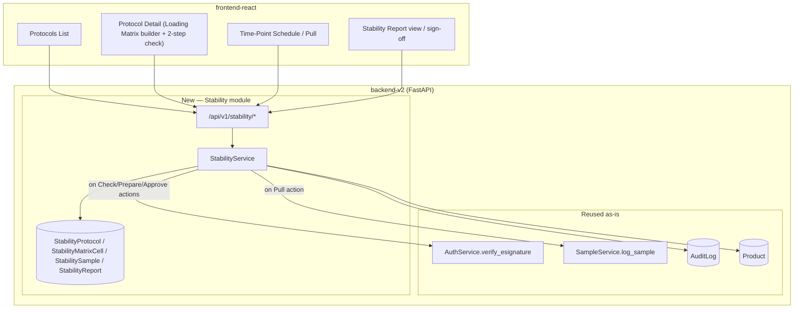
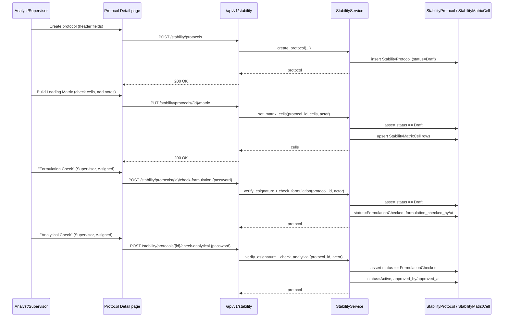
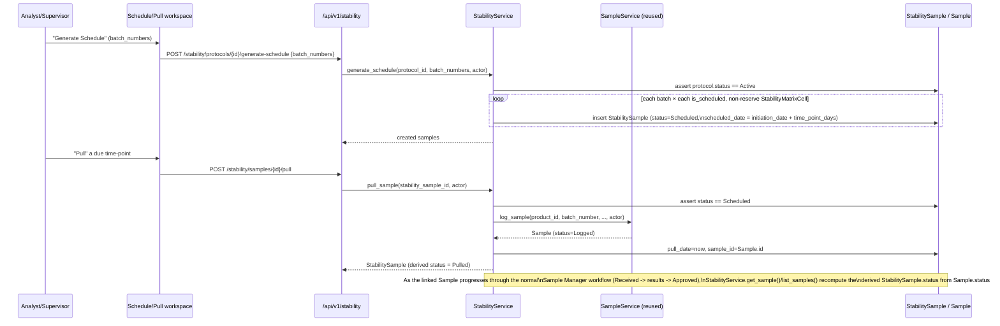
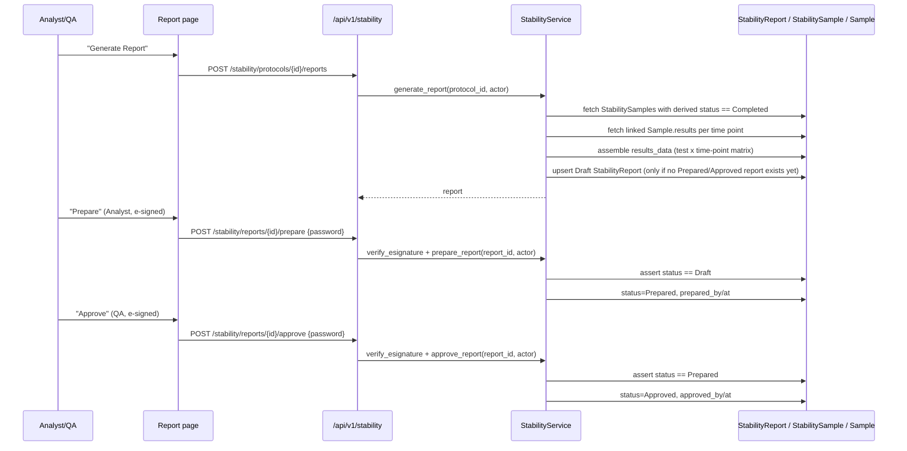
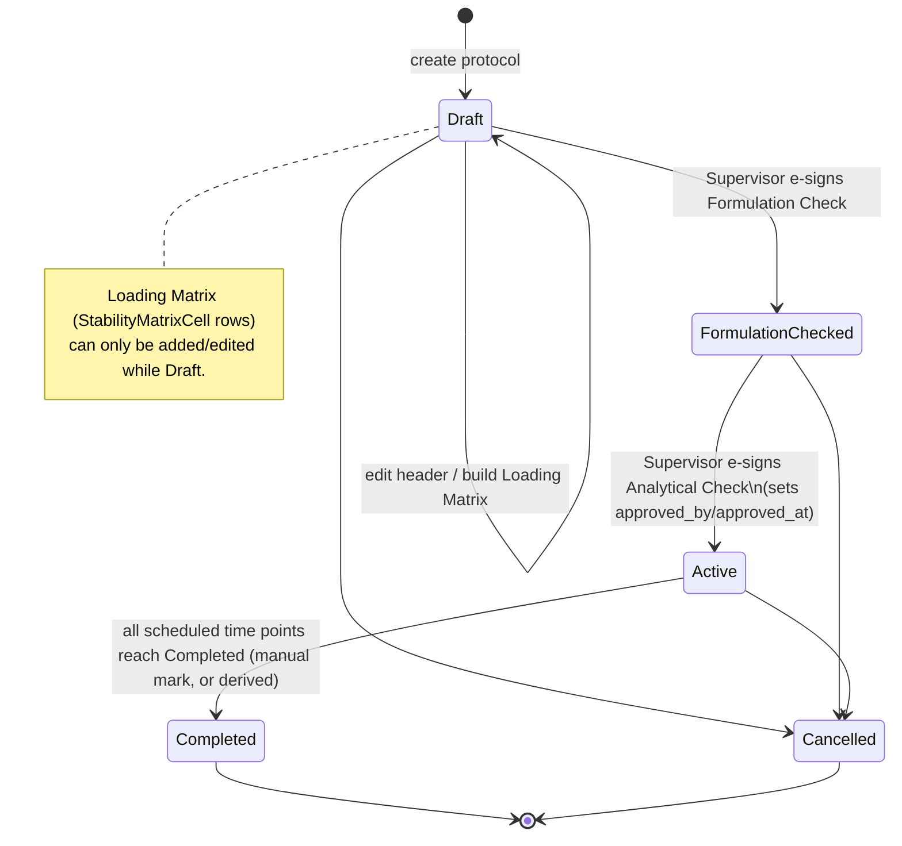
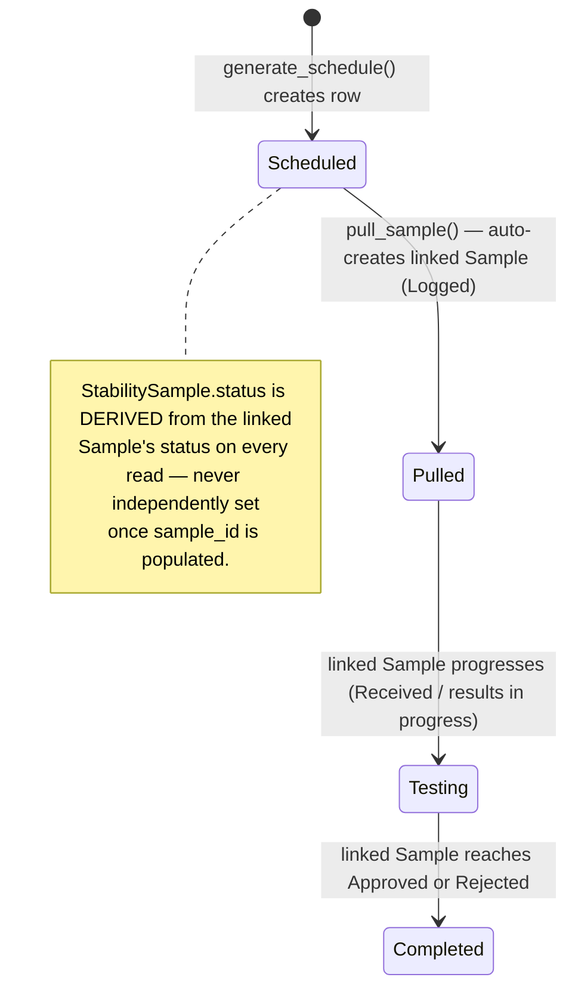
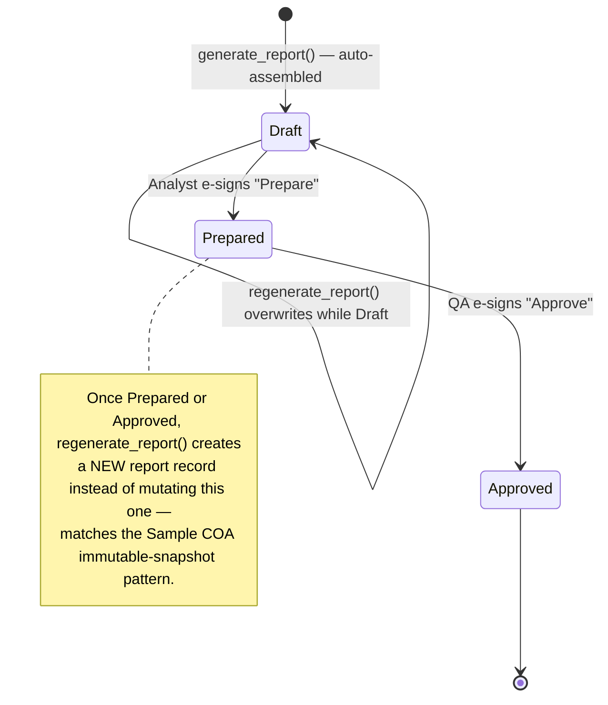

# Design Document: Stability Management Module

## Overview

This module completes the Stability Management vertical slice inside the existing `backend-v2`
(FastAPI Clean Architecture: `api → application → domain → infrastructure`) and `frontend-react`
(React 18 + TypeScript + TanStack Query + PrimeReact) codebases at `rd-lab-instance`. Today the
module only supports creating a Draft `StabilityProtocol` and manually creating flat
`StabilitySample` time-point rows — there is no Loading Matrix, no approval workflow, no
generated time-point schedule, no linkage to the Sample Manager for actual testing, and no
Stability Report.

This design closes that gap end to end, modeled directly on the two real document formats
extracted this session (`Stability_Protocol_Format.txt`, `Stability_Report_Format.txt`) and
reusing the same patterns already proven by the MRN and Sample Manager modules: e-signature via
`AuthService.verify_esignature`, `AuditLog` trail, the existing 4-role RBAC model (no new roles),
and — per explicit instruction — `SampleService` is reused (not duplicated) for the moment a
stability time-point pull becomes an actual tested Sample.

Because the scope is large enough to justify its own vertical slice (mirroring how MRN was pulled
out of Resource Manager), Stability is extracted from `ResourceService`/`resource_endpoints.py`
into its own `StabilityService`/`stability_endpoints.py`/`stability_repository.py`, and gets its
own top-level frontend nav section ("Stability Management") instead of living under Resource
Manager. No new services, workers, or datastores are introduced (no Celery/Redis, no Django) —
everything is direct async FastAPI + SQLAlchemy + React/TanStack Query, and all work happens only
in `rd-lab-instance` (never `backend-v2`/`frontend-react` at the repo root).

## Open Decision Points (Resolved)

These were flagged because they materially change the domain model and RBAC mapping. All have
been confirmed by the user this session (recommended options accepted except where noted).

| # | Decision | Resolution | Status |
|---|---|---|---|
| **1** | How to reconcile the real protocol doc's **day-based** Loading Matrix (15/30/.../1095 days) with the existing **month-based** entity fields (`duration_months`, `testing_frequency` CSV, `time_point_months`) | **Confirmed: Support both explicitly.** Each `StabilityMatrixCell` stores an explicit `time_point_days` plus a derived/approximate `time_point_month_label` (e.g. day 90 → "3M") for display and month-based reporting. Legacy `duration_months`/`testing_frequency` fields are kept as coarse summary fields on the protocol header, not the scheduling source of truth. | ✅ Confirmed |
| **2** | Role mapping for the protocol's two "Checked By" signatures (R&D Formulation, R&D Analytical) — no separate "Approver" role exists in the real doc | **Confirmed: Both checks = Supervisor**, as two sequential, independently e-signed steps: `Draft → FormulationChecked → Active`. The existing (currently unused) `approved_by`/`approved_at` fields are wired to the second (Analytical) check, which is what activates the protocol. | ✅ Confirmed |
| **3** | Is Stability Report generation automatic or user-triggered? | **Confirmed: Manual trigger, auto-assembled data.** A user (Analyst or Supervisor) clicks "Generate Report"; the system assembles the Results table from all `Completed` time points at that moment. Re-triggering regenerates a `Draft` report; it does not mutate an already-`Prepared`/`Approved` report (immutable once signed, matching the Sample COA-snapshot pattern). | ✅ Confirmed |
| **4** | How does a time-point pull connect to the Sample Manager? | **Confirmed: Auto-create a Sample when marked Pulled.** Marking a `StabilitySample` as Pulled calls `SampleService.log_sample()` (reusing the product's Active Specification) in the same action and links the new `Sample.id` back onto the `StabilitySample`. | ✅ Confirmed |
| **5** | Role mapping for the Stability Report's four-signature footer (Prepared / Checked / Reviewed / Approved) | **Confirmed: Collapse to two system-enforced gates.** `Prepared By` = Analyst (e-signed), `Approved By` = QA (e-signed, final release). "Checked By" / "Reviewed By" are captured as free-text signature fields on the report for print fidelity to the real document, but are **not** separate workflow states. | ✅ Confirmed |
| **6** | Frontend placement | **Confirmed: New top-level "Stability Management" nav section**, replacing the flat page currently nested under Resource Manager. | ✅ Confirmed |

## Architecture

### System Diagram



### Module Boundary: Reused vs. New

**Reused as-is (no changes):**
- `AuthService.verify_esignature`, `require_role`, `get_current_user` dependencies.
- `AuditLog` entity/repository.
- `SampleService.log_sample()` — called directly by `StabilityService` when a time-point is
  pulled; no result-entry logic is duplicated. Testing/result submission/review continues to
  happen entirely inside the existing Sample Manager UI/API.
- `ESignDialog.tsx`, `StatusBadge.tsx`, `usePermissions.ts` on the frontend.

**Removed/relocated:**
- Stability methods currently on `ResourceService` (`list_stability_protocols`,
  `create_stability_protocol`, `list_stability_samples`, `create_stability_sample`) move to the
  new `StabilityService`. `IStabilityRepository` moves out of `resource_repositories.py` into its
  own `stability_repository.py`. The `/stability/protocols` and `/stability/samples` routes move
  out of `resource_endpoints.py` into `stability_endpoints.py`.
- `StabilityPage.tsx` under `features/resource-management` is removed; replaced by
  `features/stability/*`.

**New (this module only):**
- Domain entities: `StabilityMatrixCell`, `StabilityReport`; extensions to `StabilityProtocol`
  and `StabilitySample`.
- `StabilityService` application service (constructed with a reference to `SampleService`).
- `IStabilityProtocolRepository`, `IStabilityMatrixCellRepository`, `IStabilitySampleRepository`,
  `IStabilityReportRepository` (or grouped as one `IStabilityRepository` with clearly separated
  method groups, mirroring how `resource_repositories.py` grouped multiple small repos before).
- `StabilityCodeGenerator` / `StabilityReportNumberGenerator` domain services, sibling to
  `SampleCodeGenerator`.
- `/api/v1/stability/*` endpoints, Pydantic schemas.
- Frontend `features/stability/*` (Protocols list, Protocol detail with matrix builder + checks,
  Schedule/Pull workspace, Report view).

## Components and Interfaces

### StabilityService (new application service)

Consolidates all Stability Management operations, replacing the four Stability methods currently
on `ResourceService`. Constructed with references to the new Stability repositories plus the
existing `AuditLogRepository` and — critically — the existing `SampleService`, so that pulling a
time point can call `SampleService.log_sample()` directly instead of duplicating sample-creation
logic.

```pascal
INTERFACE StabilityService
  // Protocol CRUD + header
  list_protocols(): list[StabilityProtocol]
  get_protocol(protocol_id): StabilityProtocol
  create_protocol(header_fields, actor): StabilityProtocol

  // Loading Matrix (Draft-only)
  set_matrix_cells(protocol_id, cells: list[MatrixCellInput], actor): list[StabilityMatrixCell]
  list_matrix_cells(protocol_id): list[StabilityMatrixCell]

  // Two-step approval
  check_formulation(protocol_id, actor): StabilityProtocol
  check_analytical(protocol_id, actor): StabilityProtocol

  // Schedule + pull
  generate_schedule(protocol_id, batch_numbers: list[str], actor): list[StabilitySample]
  list_samples(protocol_id): list[StabilitySample]   // status recomputed per row on read
  pull_sample(stability_sample_id, actor): StabilitySample

  // Reports
  generate_report(protocol_id, actor): StabilityReport
  get_report(report_id): StabilityReport
  list_reports(protocol_id): list[StabilityReport]
  prepare_report(report_id, actor): StabilityReport
  approve_report(report_id, actor): StabilityReport
END INTERFACE
```

### IStabilityRepository (new, replaces the one currently in resource_repositories.py)

```pascal
INTERFACE IStabilityRepository
  get_protocol_by_id(id): StabilityProtocol | null
  list_protocols(): list[StabilityProtocol]
  create_protocol(protocol): StabilityProtocol
  update_protocol(protocol): StabilityProtocol
  count_protocols(): int

  list_matrix_cells(protocol_id): list[StabilityMatrixCell]
  upsert_matrix_cell(cell): StabilityMatrixCell
  get_matrix_cell_by_natural_key(protocol_id, condition, time_point_days, is_reserve): StabilityMatrixCell | null

  list_samples(protocol_id): list[StabilitySample]
  get_sample_by_id(id): StabilitySample | null
  create_sample(sample): StabilitySample
  update_sample(sample): StabilitySample
  exists_sample_for_cell(protocol_id, batch_number, matrix_cell_id): bool

  list_reports(protocol_id): list[StabilityReport]
  get_report_by_id(id): StabilityReport | null
  get_latest_signed_report(protocol_id): StabilityReport | null   // Prepared or Approved
  create_report(report): StabilityReport
  update_report(report): StabilityReport
  count_reports(): int
END INTERFACE
```

### Frontend components (new — `features/stability/`)

- `ProtocolsListPage` — table of protocols with `StatusBadge`, "New Protocol" action (Admin/Supervisor).
- `ProtocolDetailPage` — header fields, Loading Matrix builder (checkbox grid + per-cell note
  input), Formulation/Analytical Check actions gated by `ESignDialog` (Supervisor/Admin).
- `ScheduleWorkspacePage` — "Generate Schedule" action (Admin/Analyst) plus a table of
  `StabilitySample` rows with derived status and a "Pull" action per Scheduled row.
- `ReportsPage` — "Generate Report" action, and per-report "Prepare"/"Approve" actions gated by
  `ESignDialog`, using `StatusBadge` for report status.

Reused as-is: `ESignDialog.tsx`, `StatusBadge.tsx`, `usePermissions.ts`, `toastService`.

## Data Models

```pascal
STRUCTURE StabilityProtocol   // extends existing entity
  // existing fields, kept
  protocol_code, product_id, condition, duration_months, study_type,
  testing_frequency, status, approved_by, approved_at

  // new header fields (from Stability_Protocol_Format.txt)
  label_claim, mfg_date, batch_number, placebo_batch_number, batch_size,
  stability_initiation_date, no_of_samples_time_points, fill_volume,
  api_name, api_batch_no, api_source,
  primary_pack, secondary_pack, headspace, orientation,   // Upright | Inverted
  remarks

  // new workflow fields
  formulation_checked_by, formulation_checked_at    // Supervisor e-sign #1
  // approved_by / approved_at (existing, now wired) = Supervisor e-sign #2 (Analytical check),
  // which is also what transitions status -> Active

  status ∈ { Draft, FormulationChecked, Active, Completed, Cancelled }
END STRUCTURE

STRUCTURE StabilityMatrixCell   // new — one row of the Loading Matrix grid
  id, protocol_id
  condition: String           // e.g. "40°C±2°C/75%±5%RH", "25°C±2°C/60%±5%RH", "Other"
  is_reserve: Boolean         // true for the "Reserve" column (no time_point_days)
  time_point_days: Integer | null     // e.g. 15, 30, 60, 90, 180, 270, 365, 545, 730, 1095
  time_point_month_label: String | null  // derived display label, e.g. "3M" for day 90
  is_scheduled: Boolean       // whether this cell is checked/included in the study
  notes: String | null        // per-cell annotation, e.g. "17 vials FP"
  UNIQUE(protocol_id, condition, time_point_days, is_reserve)
END STRUCTURE

STRUCTURE StabilitySample   // extends existing entity
  // existing fields, kept
  protocol_id, batch_number, scheduled_date, pull_date, sample_id, comments

  // new fields
  matrix_cell_id            // FK -> StabilityMatrixCell (which condition/time-point this is)
  condition                 // denormalized from matrix cell, for display without a join
  time_point_days           // renamed/added alongside time_point_months (kept, nullable)

  // status is DERIVED, not independently settable once a sample_id is linked:
  //   no sample_id            -> Scheduled
  //   sample_id, Sample.status ∈ {Logged, Received}       -> Pulled
  //   sample_id, Sample.status ∈ Testing-in-progress states -> Testing
  //   sample_id, Sample.status ∈ {Approved, Rejected}      -> Completed
  status ∈ { Scheduled, Pulled, Testing, Completed }
END STRUCTURE

STRUCTURE StabilityReport   // new
  id, protocol_id, report_number, status ∈ { Draft, Prepared, Approved }

  // header snapshot (from Stability_Report_Format.txt), captured at generation time
  product_name, composition_label, manufactured_at, stability_study_type,
  batch_no, stability_condition, batch_size, date_of_commencement,
  manufacturing_date, stability_protocol_no, expiry_date,
  api_source, api_batch_number, packing

  // assembled results table: one row per test, one column per Completed time point
  results_data: JSON   // [{ test_id, test_name, specification, results: { "Initial": ..., "30 Days": ... } }]
  remarks

  // signature footer
  prepared_by, prepared_at         // Analyst e-sign (system-enforced gate)
  checked_by_name, reviewed_by_name  // free-text, print-only, not workflow gates
  approved_by, approved_at         // QA e-sign (system-enforced gate, final release)

  generated_by, generated_at       // system auto-assembly timestamp (distinct from "Prepared")
END STRUCTURE
```

### Sequence — Protocol Creation, Loading Matrix, and Two-Step Check



### Sequence — Generate Schedule, Pull Time-Point, Status Sync



### Sequence — Stability Report Generation and Sign-Off



### State Models







## Error Handling

### Error Scenario 1: Loading Matrix edit on a non-Draft protocol

**Condition**: A user attempts to add/update/remove `StabilityMatrixCell` rows on a protocol
whose status is `FormulationChecked`, `Active`, `Completed`, or `Cancelled`.
**Response**: The API returns a validation error (`ValidationException`, HTTP 400) naming the
current status; no matrix rows are changed.
**Recovery**: None needed — the matrix remains exactly as it was before the request.

### Error Scenario 2: Out-of-order or mis-authenticated approval checks

**Condition**: A Formulation/Analytical Check is attempted with an incorrect e-signature password,
or the Analytical Check is attempted before the Formulation Check has completed.
**Response**: An authentication error (`ESignatureVerificationError`) or validation error
(wrong source status) is returned; the protocol's status and signature fields are left unchanged.
**Recovery**: The user re-enters the correct password, or performs the checks in the correct
order.

### Error Scenario 3: Schedule generation on an inactive protocol

**Condition**: "Generate Schedule" is called on a protocol that is not `Active`.
**Response**: A validation error is returned; no `StabilitySample` rows are created.
**Recovery**: The user completes both approval checks first, then retries.

### Error Scenario 4: Pull fails mid-Sample-creation

**Condition**: `SampleService.log_sample()` raises (e.g. no Active Specification for the product)
during a pull.
**Response**: The exception propagates; the `StabilitySample` row is left with `pull_date` unset
and `sample_id` unset (the update to the `StabilitySample` only happens after `log_sample()`
returns successfully, inside the same service method) — no partial state.
**Recovery**: The underlying issue (e.g. missing Active Specification) is resolved via the
existing Sample Manager/Specification workflow, then the pull is retried.

### Error Scenario 5: Report regeneration after sign-off

**Condition**: "Generate Report" is triggered again after a report has already been `Prepared`
or `Approved`.
**Response**: The system does not raise an error; it creates a new `Draft` report record instead
of mutating the existing signed one.
**Recovery**: Not applicable — this is expected behavior, matching the Sample COA immutable
snapshot pattern.

### Error Scenario 6: Unauthorized action

**Condition**: A user without the required role attempts any Stability action (matrix edit,
checks, schedule/pull, report generate/prepare/approve).
**Response**: `require_role` rejects the request with an authorization error (HTTP 403) before
`StabilityService` is invoked; no records are changed.
**Recovery**: The user requests the action through a user with the appropriate role.

## Testing Strategy

### Unit Testing Approach

Cover domain-level business rules directly on the entities/value objects: `StabilityMatrixCell`
natural-key uniqueness, `StabilitySample`'s derived-status computation from a linked Sample's
status, `StabilityProtocol`'s two-step check transitions, and `StabilityReport`'s Draft-vs-signed
regeneration behavior. Mirrors the unit-test style already used for `Sample`/`Specification`
entity rules.

### Property-Based Testing Approach

Each of the 15 Correctness Properties above is implemented as a property-based test using
**Hypothesis** (already a dependency per the MRN module's test infrastructure), generating random
combinations of matrix cells, batch numbers, protocol/report statuses, and role/e-signature
inputs to verify the stated invariants hold — particularly the derived-status computations
(Properties 6, 9), the Draft-only/status-precondition gates (Properties 1, 3, 4, 5, 8, 11, 12),
and the RBAC/audit invariants (Properties 13, 15) that mirror the MRN module's Property 6/23
pattern.

**Property Test Library**: Hypothesis (Python), consistent with the existing `backend-v2/tests/`
infrastructure set up for the MRN module.

### Integration Testing Approach

End-to-end API tests covering the full happy path: create protocol → set Loading Matrix →
Formulation Check → Analytical Check → generate schedule → pull a time point (asserting a linked
Sample is created) → progress the linked Sample to Approved via the existing Sample Manager
endpoints → generate report → prepare → approve. Role-gated 403 tests per endpoint, matching the
MRN module's integration test task.

## Correctness Properties

*A property is a characteristic or behavior that should hold true across all valid executions of
a system — essentially, a formal statement about what the system should do. Properties serve as
the bridge between human-readable specifications and machine-verifiable correctness guarantees.*

### Property 1: Loading Matrix mutation is Draft-only

For any `StabilityProtocol`, adding, updating, or removing `StabilityMatrixCell` rows succeeds
only while the protocol's status is `Draft`, and is rejected for every other status, leaving the
matrix unchanged in the rejected case.

**Validates: Requirements 1.4**

### Property 2: Matrix cell uniqueness

For any `StabilityProtocol`, no two `StabilityMatrixCell` rows share the same
`(protocol_id, condition, time_point_days, is_reserve)` combination; setting the matrix upserts by
this natural key rather than creating duplicates.

**Validates: Requirements 1.3**

### Property 3: Formulation-check e-signature gate

For a `Draft` protocol, a Formulation-Check request from a Supervisor with an incorrect
e-signature password leaves the protocol's status unchanged and returns an authentication error;
a request with the correct password transitions status to `FormulationChecked` and records
`formulation_checked_by`/`formulation_checked_at`.

**Validates: Requirements 3.1, 3.2, 3.3**

### Property 4: Analytical check requires prior Formulation check

An Analytical-Check request is accepted only when the protocol's status is `FormulationChecked`;
attempting it from `Draft`, `Active`, `Completed`, or `Cancelled` is rejected and the status is
left unchanged. On success, the protocol transitions to `Active` and both `approved_by` and
`approved_at` are populated.

**Validates: Requirements 3.4, 3.5, 3.6**

### Property 5: Generate Schedule requires an Active protocol

`generate_schedule()` succeeds only when the protocol's status is `Active`; for any other status
it is rejected and no `StabilitySample` rows are created.

**Validates: Requirements 4.2**

### Property 6: Schedule generation covers exactly the scheduled, non-reserve matrix cells

For any `Active` protocol with a given set of `StabilityMatrixCell` rows and a given list of
`batch_numbers`, `generate_schedule()` creates exactly one `StabilitySample` per
`(batch_number, matrix_cell)` pair for every cell where `is_scheduled == true` and
`is_reserve == false`, and creates no rows for cells that are unchecked or marked Reserve.

**Validates: Requirements 4.1, 4.4, 4.5**

### Property 7: Scheduled date is a deterministic function of initiation date and time point

For any generated `StabilitySample`, its `scheduled_date` equals
`protocol.stability_initiation_date + matrix_cell.time_point_days` days.

**Validates: Requirements 4.3**

### Property 8: Pull requires Scheduled status and is atomic with Sample creation

`pull_sample()` succeeds only when the `StabilitySample`'s derived status is `Scheduled`; on
success it calls `SampleService.log_sample()` exactly once, links the returned `Sample.id`, and
sets `pull_date`; on any failure of the underlying Sample creation, no partial state (pull_date
set without a linked sample, or vice versa) is left behind.

**Validates: Requirements 5.1, 5.2, 5.3**

### Property 9: StabilitySample status is a deterministic derivation of the linked Sample's status

For any `StabilitySample` with no linked `sample_id`, its status is `Scheduled`. For any
`StabilitySample` with a linked Sample, its status is `Pulled` when the Sample's status is
`Logged` or `Received`, `Testing` when the Sample has results in progress, and `Completed` when
the Sample's status is `Approved` or `Rejected` — and this derivation is recomputed on every read,
never drifting from the linked Sample's actual current status.

**Validates: Requirements 5.4**

### Property 10: Report generation includes only Completed time points

For any protocol with a mix of `Scheduled`/`Pulled`/`Testing`/`Completed` `StabilitySample` rows,
`generate_report()`'s assembled `results_data` includes results only from time points whose
derived status is `Completed`, and excludes all others.

**Validates: Requirements 6.1**

### Property 11: Report regeneration does not mutate a signed report

For any protocol with an existing `Prepared` or `Approved` `StabilityReport`, calling
`generate_report()` again creates a new `Draft` report record rather than modifying the existing
signed one, which remains byte-for-byte unchanged.

**Validates: Requirements 6.3**

### Property 12: Report Prepare/Approve e-signature gates with role enforcement

A "Prepare" action on a `Draft` report succeeds only for an Analyst (or Admin) with a correct
e-signature password, transitioning it to `Prepared`; an "Approve" action on a `Prepared` report
succeeds only for a QA (or Admin) user with a correct e-signature password, transitioning it to
`Approved`. Incorrect passwords, wrong roles, or wrong source status all leave the report
unchanged and return an error.

**Validates: Requirements 7.1, 7.2, 7.3, 7.4, 7.5**

### Property 13: Unauthorized requests are rejected and leave state unchanged

For any Stability action (matrix edit, formulation/analytical check, generate-schedule, pull,
generate/prepare/approve report) requested by a user whose role is not among the roles permitted
for that action, the system rejects the request with an authorization error and leaves all
Stability-related records unchanged.

**Validates: Requirements 8.1, 8.2, 8.3, 8.4, 8.5**

### Property 14: Protocol and report identifiers are unique and well-formed

For any sequence of protocol creations, each generated `protocol_code` is unique across all
protocols. For any sequence of report generations, each generated `report_number` is unique
across all reports.

**Validates: Requirements 10.1, 10.2**

### Property 15: Every state transition writes a complete audit entry

For any state transition of a `StabilityProtocol`, `StabilitySample`, or `StabilityReport`, the
system writes an `AuditLog` entry containing the acting user's username, the action performed,
the table name, the record identifier, and the previous and new status values.

**Validates: Requirements 9.1, 9.2, 9.3**

## Dependencies and Assumptions Requiring Confirmation

- **Batch selection at schedule-generation time**: the design lets the user pass an explicit
  `batch_numbers` list to `generate_schedule()` (defaulting to `[protocol.batch_number]`), rather
  than assuming only the single primary batch is ever scheduled. This should be confirmed against
  real usage (e.g. does the Placebo Batch also get its own time-point pulls, or is it tracked only
  administratively?).
- **Standard day list customizability**: the Loading Matrix builder defaults to the exact day list
  from `Stability_Protocol_Format.txt` (15/30/60/90/180/270/365/545/730/1095 + Reserve) but allows
  a protocol to add/remove columns for non-standard studies. Confirm whether this flexibility is
  actually needed or whether the day list should be a hard-coded fixed set.
- **Condition list**: the six condition rows from the real doc (40°C/75%RH, 30°C/65%RH,
  30°C/75%RH, 25°C/60%RH, 5°C, Other) are offered as a suggested/default set but `condition` is
  stored as free text on `StabilityMatrixCell`, consistent with how `condition` is already
  free-text on the existing `StabilityProtocol` entity.
