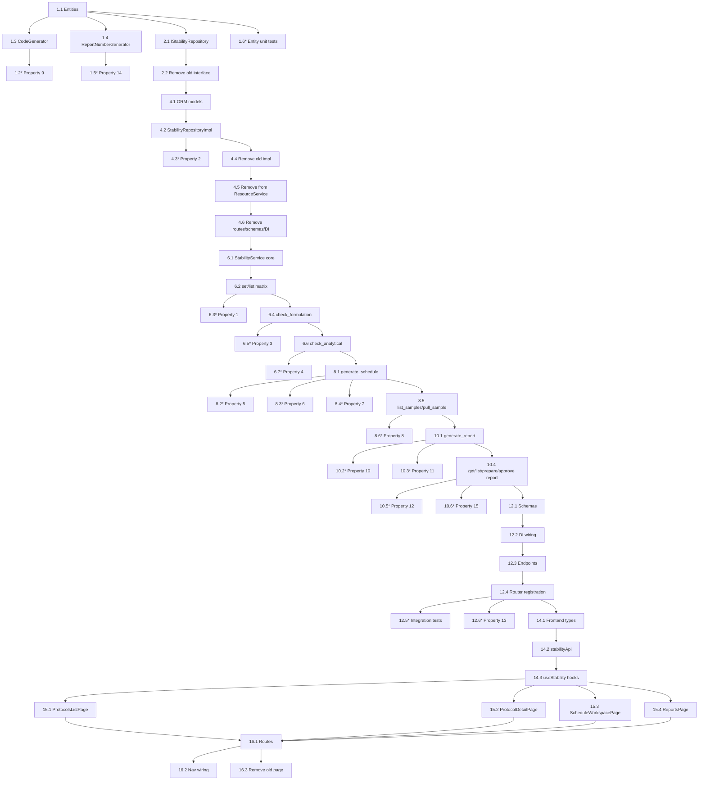

# Implementation Plan: Stability Management Module

## Overview

This plan builds the Stability Management vertical slice inside the existing `backend-v2`
(FastAPI Clean Architecture) and `frontend-react` codebases at `rd-lab-instance`, in dependency
order: domain entities → `StabilityCodeGenerator`/`StabilityReportNumberGenerator` → repository
interfaces → ORM models + repository implementations (including relocating the old
`IStabilityRepository`/`StabilityRepositoryImpl` and the four Stability methods currently on
`ResourceService`/`resource_endpoints.py` out of Resource Manager) → `StabilityService` →
API schemas/endpoints/DI wiring/router registration → frontend feature → nav/routing wiring
(new top-level "Stability Management" section, replacing the old flat page) → final checkpoint.

It reuses `AuthService.verify_esignature`, `require_role`/`get_current_user`, `AuditLog`,
`SampleService.log_sample()`, `ESignDialog`, `StatusBadge`, and `usePermissions` exactly as they
exist today. Backend test infrastructure (`backend-v2/tests/conftest.py` with its in-memory
SQLite fixture, `pytest-asyncio`, and `hypothesis`) was already set up for the MRN module and is
reused as-is — no new test infrastructure is created. New backend tests live under
`backend-v2/tests/stability/`. Frontend has no test tooling anywhere in the codebase (matching
the established pattern), so no frontend test tasks are included.

## Tasks

- [ ] 1. Domain layer — entities and domain services
  - [ ] 1.1 Extend/add domain entities in `src/domain/entities/stability.py`
    - Extend `StabilityProtocol` with the new header fields (`label_claim`, `mfg_date`,
      `batch_number`, `placebo_batch_number`, `batch_size`, `stability_initiation_date`,
      `no_of_samples_time_points`, `fill_volume`, `api_name`, `api_batch_no`, `api_source`,
      `primary_pack`, `secondary_pack`, `headspace`, `orientation`, `remarks`) and the workflow
      fields `formulation_checked_by`/`formulation_checked_at`; extend `status` to include
      `FormulationChecked`
    - Extend `StabilitySample` with `matrix_cell_id`, `condition`, `time_point_days` (kept
      alongside the existing `time_point_months`)
    - Add a `StabilityMatrixCell` dataclass (`protocol_id`, `condition`, `is_reserve`,
      `time_point_days`, `time_point_month_label`, `is_scheduled`, `notes`)
    - Add a `StabilityReport` dataclass with the header snapshot fields, `results_data: dict`,
      `remarks`, and the sign-off fields (`prepared_by`/`at`, `checked_by_name`,
      `reviewed_by_name`, `approved_by`/`at`, `generated_by`/`at`)
    - Add a pure `StabilitySample.compute_status(linked_sample_status: str | None) -> str`
      static/class method implementing the derivation rule (no linked sample → `Scheduled`;
      `Logged`/`Received` → `Pulled`; results-in-progress → `Testing`; `Approved`/`Rejected` →
      `Completed`)
    - _Requirements: 1.1, 1.5, 2.1, 2.2, 3.1, 3.4, 5.4, 6.4, 7.6_

  - [ ]* 1.2 Write property test for derived status computation
    - **Property 9: StabilitySample status is a deterministic derivation of the linked Sample's status**
    - **Validates: Requirements 5.4**

  - [ ] 1.3 Add `StabilityCodeGenerator` domain service in
    `src/domain/services/stability_code_generator.py`, sibling to `SampleCodeGenerator`,
    generating `protocol_code` values (e.g. `STAB-YYYYMMDD-XXXX`)
    - _Requirements: 10.1_

  - [ ] 1.4 Add `StabilityReportNumberGenerator` domain service in
    `src/domain/services/stability_report_number_generator.py`, generating `report_number`
    values following an analogous sequential, prefixed convention
    - _Requirements: 10.2_

  - [ ]* 1.5 Write property test for protocol/report identifier uniqueness
    - **Property 14: Protocol and report identifiers are unique and well-formed**
    - **Validates: Requirements 10.1, 10.2**

  - [ ]* 1.6 Write unit tests for entity business rules (`StabilityMatrixCell` natural-key
    equality, `StabilitySample.compute_status` edge cases not covered by the property test,
    `StabilityReport` Draft-vs-signed distinction)
    - _Requirements: 1.3, 6.3_

- [ ] 2. Domain repository interfaces (ports)
  - [ ] 2.1 Define `IStabilityRepository` in new `src/domain/repositories/stability_repository.py`
    (mirroring the grouping style of `mrn_repository.py`): protocol CRUD (`get_protocol_by_id`,
    `list_protocols`, `create_protocol`, `update_protocol`, `count_protocols`); matrix cell
    methods (`list_matrix_cells`, `upsert_matrix_cell`, `get_matrix_cell_by_natural_key`); sample
    methods (`list_samples`, `get_sample_by_id`, `create_sample`, `update_sample`,
    `exists_sample_for_cell`); report methods (`list_reports`, `get_report_by_id`,
    `get_latest_signed_report`, `create_report`, `update_report`, `count_reports`)
    - _Requirements: 1.3, 1.4, 4.1, 4.5, 5.1, 6.2, 6.3, 10.1, 10.2_

  - [ ] 2.2 Remove the old `IStabilityRepository` interface and its now-unused
    `StabilityProtocol`/`StabilitySample` imports from `src/domain/repositories/resource_repositories.py`
    - _Requirements: (module boundary — relocated per design's "Removed/relocated" section)_

- [ ] 3. Checkpoint — Ensure domain layer tests pass
  - Ensure all tests pass, ask the user if questions arise.

- [ ] 4. Infrastructure — ORM models, repository implementation, and relocation from Resource Manager
  - [ ] 4.1 Extend `src/infrastructure/database/models/stability_model.py`: add the new columns
    to `StabilityProtocolModel` and `StabilitySampleModel`; add `StabilityMatrixCellModel` with a
    unique constraint on `(protocol_id, condition, time_point_days, is_reserve)`; add
    `StabilityReportModel`; ensure new models remain imported from
    `src/infrastructure/database/models/__init__.py`
    - _Requirements: 1.1, 1.3, 1.5, 2.1, 4.3, 5.4, 6.4, 7.6_

  - [ ] 4.2 Implement `StabilityRepositoryImpl` in new
    `src/infrastructure/database/repositories/stability_repository_impl.py` implementing all of
    `IStabilityRepository` (protocol CRUD; matrix cell upsert-by-natural-key + list; sample CRUD
    + `exists_sample_for_cell`; report CRUD + `get_latest_signed_report` returning the most
    recent `Prepared`/`Approved` report)
    - _Requirements: 1.3, 1.4, 4.1, 4.5, 6.2, 6.3_

  - [ ]* 4.3 Write property test for matrix cell uniqueness / upsert-by-natural-key
    - **Property 2: Matrix cell uniqueness**
    - **Validates: Requirements 1.3**

  - [ ] 4.4 Remove `StabilityRepositoryImpl` and its stability entity/model imports from
    `src/infrastructure/database/repositories/resource_repositories_impl.py`
    - _Requirements: (module boundary — relocation)_

  - [ ] 4.5 Remove `list_stability_protocols`, `create_stability_protocol`,
    `list_stability_samples`, `create_stability_sample` and the `stability_repo`
    constructor parameter/import from `src/application/services/resource_service.py`
    - _Requirements: (module boundary — relocation)_

  - [ ] 4.6 Remove the `/stability/protocols` and `/stability/samples` routes and their schema
    imports from `src/api/v1/endpoints/resource_endpoints.py`; remove
    `CreateStabilityProtocolRequest`/`StabilityProtocolResponse`/`CreateStabilitySampleRequest`/
    `StabilitySampleResponse` from `src/api/v1/schemas/resource_schemas.py`; update
    `Container.get_resource_service` in `src/config/dependency_injection.py` to drop the
    `StabilityRepositoryImpl` argument
    - _Requirements: (module boundary — relocation)_

- [ ] 5. Checkpoint — Ensure infrastructure layer tests pass
  - Ensure all tests pass, ask the user if questions arise.

- [ ] 6. Application service — StabilityService (protocol, matrix, approval workflow)
  - [ ] 6.1 Create `src/application/services/stability_service.py` with `StabilityService.__init__`
    (repositories + `AuditLogRepository` + a reference to `SampleService`), `list_protocols`,
    `get_protocol`, and `create_protocol` (using `StabilityCodeGenerator`, writing an `AuditLog`
    entry)
    - _Requirements: 2.1, 2.2, 9.1, 10.1_

  - [ ] 6.2 Implement `set_matrix_cells`/`list_matrix_cells`: reject when protocol status is not
    `Draft`; upsert cells by `(protocol_id, condition, time_point_days, is_reserve)`; derive and
    store `time_point_month_label` per cell; write an `AuditLog` entry on matrix edit
    - _Requirements: 1.1, 1.2, 1.3, 1.4, 1.5, 1.6, 9.1_

  - [ ]* 6.3 Write property test for the Loading Matrix Draft-only mutation gate
    - **Property 1: Loading Matrix mutation is Draft-only**
    - **Validates: Requirements 1.4**

  - [ ] 6.4 Implement `check_formulation(protocol_id, actor)`: reject when protocol status is not
    `Draft`; on success set `formulation_checked_by`/`formulation_checked_at`, transition status
    to `FormulationChecked`, write an `AuditLog` entry
    - _Requirements: 3.1, 3.2, 3.3, 9.1_

  - [ ]* 6.5 Write property test for the Formulation-check e-signature gate and status precondition
    - **Property 3: Formulation-check e-signature gate**
    - **Validates: Requirements 3.1, 3.2, 3.3**

  - [ ] 6.6 Implement `check_analytical(protocol_id, actor)`: reject when protocol status is not
    `FormulationChecked`; on success set `approved_by`/`approved_at`, transition status to
    `Active`, write an `AuditLog` entry
    - _Requirements: 3.4, 3.5, 3.6, 9.1_

  - [ ]* 6.7 Write property test for the Analytical-check precondition and transition
    - **Property 4: Analytical check requires prior Formulation check**
    - **Validates: Requirements 3.4, 3.5, 3.6**

- [ ] 7. Checkpoint — Ensure protocol/matrix/approval tests pass
  - Ensure all tests pass, ask the user if questions arise.

- [ ] 8. Application service — StabilityService (schedule, pull, Sample Manager linkage)
  - [ ] 8.1 Implement `generate_schedule(protocol_id, batch_numbers, actor)` in
    `stability_service.py`: reject when protocol status is not `Active`; for every batch number ×
    every `StabilityMatrixCell` where `is_scheduled == true` and `is_reserve == false`, skip
    combinations that already have a `StabilitySample` via `exists_sample_for_cell` and otherwise
    create one, computing `scheduled_date = protocol.stability_initiation_date + time_point_days`;
    write an `AuditLog` entry per created sample
    - _Requirements: 4.1, 4.2, 4.3, 4.4, 4.5, 9.2_

  - [ ]* 8.2 Write property test for the Generate Schedule Active-status precondition
    - **Property 5: Generate Schedule requires an Active protocol**
    - **Validates: Requirements 4.2**

  - [ ]* 8.3 Write property test for schedule generation coverage of scheduled, non-reserve cells
    - **Property 6: Schedule generation covers exactly the scheduled, non-reserve matrix cells**
    - **Validates: Requirements 4.1, 4.4, 4.5**

  - [ ]* 8.4 Write property test for deterministic `scheduled_date` computation
    - **Property 7: Scheduled date is a deterministic function of initiation date and time point**
    - **Validates: Requirements 4.3**

  - [ ] 8.5 Implement `list_samples(protocol_id)` (recomputing each row's derived status via
    `StabilitySample.compute_status` against its linked Sample's current status on every read)
    and `pull_sample(stability_sample_id, actor)` (reject unless derived status is `Scheduled`;
    call `SampleService.log_sample()` exactly once; set `sample_id` and `pull_date` together only
    after `log_sample()` returns successfully, leaving no partial state on failure; write an
    `AuditLog` entry)
    - _Requirements: 5.1, 5.2, 5.3, 5.4, 5.5, 9.2_

  - [ ]* 8.6 Write property test for the Pull precondition and atomicity with Sample creation
    - **Property 8: Pull requires Scheduled status and is atomic with Sample creation**
    - **Validates: Requirements 5.1, 5.2, 5.3**

- [ ] 9. Checkpoint — Ensure schedule/pull tests pass
  - Ensure all tests pass, ask the user if questions arise.

- [ ] 10. Application service — StabilityService (report generation and sign-off)
  - [ ] 10.1 Implement `generate_report(protocol_id, actor)` in `stability_service.py`: assemble
    `results_data` (one row per test, one column per time point) using only `StabilitySample`
    rows whose derived status is `Completed` and their linked Sample's results; populate the
    header snapshot fields from the protocol; use `get_latest_signed_report` to decide whether to
    overwrite the existing `Draft` or create a new one when a `Prepared`/`Approved` report already
    exists; generate `report_number` via `StabilityReportNumberGenerator`; write an `AuditLog` entry
    - _Requirements: 6.1, 6.2, 6.3, 6.4, 9.3, 10.2_

  - [ ]* 10.2 Write property test for report generation including only Completed time points
    - **Property 10: Report generation includes only Completed time points**
    - **Validates: Requirements 6.1**

  - [ ]* 10.3 Write property test for report regeneration not mutating a signed report
    - **Property 11: Report regeneration does not mutate a signed report**
    - **Validates: Requirements 6.3**

  - [ ] 10.4 Implement `get_report(report_id)`, `list_reports(protocol_id)`,
    `prepare_report(report_id, actor)` (reject unless status is `Draft`; set
    `prepared_by`/`prepared_at`; transition to `Prepared`), and `approve_report(report_id, actor)`
    (reject unless status is `Prepared`; set `approved_by`/`approved_at`; transition to
    `Approved`); write an `AuditLog` entry on each transition
    - _Requirements: 7.1, 7.2, 7.3, 7.4, 7.6, 9.3_

  - [ ]* 10.5 Write property test for the Prepare/Approve e-signature gates with role enforcement
    - **Property 12: Report Prepare/Approve e-signature gates with role enforcement**
    - **Validates: Requirements 7.1, 7.2, 7.3, 7.4, 7.5**

  - [ ]* 10.6 Write property test for complete audit entries on every state transition across the
    full `StabilityService` surface (protocol create/matrix edit/checks, sample generate/pull,
    report generate/prepare/approve)
    - **Property 15: Every state transition writes a complete audit entry**
    - **Validates: Requirements 9.1, 9.2, 9.3**

- [ ] 11. Checkpoint — Ensure all StabilityService tests pass
  - Ensure all tests pass, ask the user if questions arise.

- [ ] 12. API layer — schemas, endpoints, DI wiring, router registration
  - [ ] 12.1 Add Pydantic schemas in new `src/api/v1/schemas/stability_schemas.py`
    (`CreateProtocolRequest`, `StabilityProtocolResponse`, `MatrixCellInput`,
    `SetMatrixCellsRequest`, `StabilityMatrixCellResponse`, `EsignActionRequest`,
    `GenerateScheduleRequest`, `StabilitySampleResponse`, `StabilityReportResponse`)
    - _Requirements: 1.1, 1.2, 2.1, 3.1, 4.1, 5.1, 6.4, 7.1_

  - [ ] 12.2 Add `Container.get_stability_service(session)` factory in
    `src/config/dependency_injection.py`, wiring `StabilityRepositoryImpl`,
    `Container.get_sample_service(session)` (for the pull-to-Sample linkage), and the existing
    `AuditLogRepositoryImpl`
    - _Requirements: (module boundary — extended, no new services/datastores)_

  - [ ] 12.3 Implement `src/api/v1/endpoints/stability_endpoints.py` with a `/stability`
    prefixed router:
    - `GET /stability/protocols`, `POST /stability/protocols` (Admin/Supervisor)
    - `GET /stability/protocols/{id}`, `GET /stability/protocols/{id}/matrix` (any role),
      `PUT /stability/protocols/{id}/matrix` (Admin/Supervisor)
    - `POST /stability/protocols/{id}/check-formulation`,
      `POST /stability/protocols/{id}/check-analytical` (Admin/Supervisor, calling
      `AuthService.verify_esignature` before the service call)
    - `POST /stability/protocols/{id}/generate-schedule` (Admin/Analyst),
      `GET /stability/protocols/{id}/samples` (any role),
      `POST /stability/samples/{id}/pull` (Admin/Analyst)
    - `POST /stability/protocols/{id}/reports` (Admin/Analyst),
      `GET /stability/protocols/{id}/reports`, `GET /stability/reports/{id}` (any role)
    - `POST /stability/reports/{id}/prepare` (Admin/Analyst, e-sign),
      `POST /stability/reports/{id}/approve` (Admin/QA, e-sign)
    - _Requirements: 8.1, 8.2, 8.3, 8.4, 8.5, 8.6_

  - [ ] 12.4 Register `stability_router` in `src/api/v1/router.py`
    - _Requirements: (wiring)_

  - [ ]* 12.5 Write integration tests for the Stability endpoints: role-gated 403 tests per
    endpoint, and the happy-path flow create protocol → set matrix → formulation check →
    analytical check → generate schedule → pull (asserting a linked Sample is created) →
    progress the linked Sample to `Approved` via the existing Sample Manager endpoints →
    generate report → prepare → approve
    - _Requirements: 8.1, 8.2, 8.3, 8.4, 8.5, 8.6_

  - [ ]* 12.6 Write property test for unauthorized requests across all Stability actions
    - **Property 13: Unauthorized requests are rejected and leave state unchanged**
    - **Validates: Requirements 8.1, 8.2, 8.3, 8.4, 8.5**

- [ ] 13. Checkpoint — Ensure all backend tests pass
  - Ensure all tests pass, ask the user if questions arise.

- [ ] 14. Frontend — Stability feature data layer
  - [ ] 14.1 Add `features/stability/models/stability.types.ts` (`StabilityProtocol`,
    `StabilityMatrixCell`, `StabilitySample`, `StabilityReport`, and the corresponding
    request/response types)
    - _Requirements: 11.2, 11.3, 11.4_

  - [ ] 14.2 Add `features/stability/api/stabilityApi.ts` (list/create/get protocols, get/set
    matrix, check-formulation, check-analytical, generate-schedule, list samples, pull,
    generate/list/get reports, prepare, approve) following the `mrnApi.ts` `apiClient` conventions
    - _Requirements: 11.2, 11.3, 11.4_

  - [ ] 14.3 Add `features/stability/hooks/useStability.ts` — TanStack Query hooks
    (`useProtocols`, `useProtocolDetail`, `useCreateProtocol`, `useMatrixCells`,
    `useSetMatrixCells`, `useCheckFormulation`, `useCheckAnalytical`, `useGenerateSchedule`,
    `useProtocolSamples`, `usePullSample`, `useReports`, `useGenerateReport`,
    `usePrepareReport`, `useApproveReport`) with query invalidation, mirroring `useMrn.ts`
    - _Requirements: 11.2, 11.3, 11.4_

- [ ] 15. Frontend — Stability pages
  - [ ] 15.1 Implement `features/stability/pages/ProtocolsListPage.tsx` — table of protocols with
    `StatusBadge`, "New Protocol" action gated to Admin/Supervisor
    - _Requirements: 11.1_

  - [ ] 15.2 Implement `features/stability/pages/ProtocolDetailPage.tsx` — header fields, a
    Loading Matrix builder (condition × time-point checkbox grid with per-cell notes, defaulting
    to the six suggested conditions and the standard day columns 15/30/60/90/180/270/365/545/
    730/1095 + Reserve), and the Formulation/Analytical Check actions gated by `ESignDialog`
    - _Requirements: 11.2_

  - [ ] 15.3 Implement `features/stability/pages/ScheduleWorkspacePage.tsx` — "Generate Schedule"
    action (batch numbers input) and a table of `StabilitySample` rows with derived status and a
    "Pull" action per `Scheduled` row
    - _Requirements: 11.3_

  - [ ] 15.4 Implement `features/stability/pages/ReportsPage.tsx` — "Generate Report" action, and
    per-report "Prepare"/"Approve" actions gated by `ESignDialog`, using `StatusBadge` for status
    - _Requirements: 11.4_

- [ ] 16. Frontend — nav/routing wiring and removal of the old flat Stability page
  - [ ] 16.1 Add `features/stability/index.ts` barrel export; add Stability routes
    (`/stability/protocols`, `/stability/protocols/:id`, `/stability/protocols/:id/schedule`,
    `/stability/protocols/:id/reports`) to `AppRouter.tsx`; remove the old `/stability` route and
    the `StabilityPage` import
    - _Requirements: 11.1_

  - [ ] 16.2 Replace the single "Stability" nav item (currently under section "Resource Manager")
    in `MainLayout.tsx`'s `NAV_ITEMS` with a new top-level "Stability Management" section
    containing nav entries for the new routes; keep the `stability` key in `MENU_ACCESS` in
    `usePermissions.ts` readable by all four roles (action-level gating is handled inside the
    pages per Requirement 8)
    - _Requirements: 8.1, 8.2, 8.3, 8.4, 8.5, 8.6, 11.1_

  - [ ] 16.3 Remove `StabilityPage.tsx`, the `useStabilityProtocols`/`useCreateStabilityProtocol`
    hooks, `stabilityApi`, and the `StabilityProtocol` type from
    `features/resource-management/*` (pages, hooks, api, models, and its `index.ts` export)
    - _Requirements: (module boundary — relocation)_

- [ ] 17. Final checkpoint — Ensure all tests pass
  - Ensure all tests pass, ask the user if questions arise.

## Notes

- Tasks marked with `*` are optional (tests) and can be skipped for a faster MVP pass; property
  tests remain the primary correctness signal for this module's status-machine and derived-status
  invariants.
- Each property test task cites its design.md property number/title plus the corresponding
  `requirements.md` clause numbers, which already align 1:1 with design.md's citations for this
  module (no renumbering was needed, unlike the MRN module).
- Checkpoints ensure incremental validation before moving from domain → infrastructure →
  application → API → frontend.
- No new services, workers, or datastores are introduced — everything is direct async FastAPI +
  SQLAlchemy + React/TanStack Query, matching the rest of `rd-lab-instance`.
- Test infrastructure (`backend-v2/tests/conftest.py`, `pytest-asyncio`, `hypothesis`) is reused
  as-is from the MRN module; new tests live under `backend-v2/tests/stability/`.

## Task Dependency Graph



```json
{
  "waves": [
    { "id": 0, "tasks": ["1.1"] },
    { "id": 1, "tasks": ["1.3", "1.4"] },
    { "id": 2, "tasks": ["1.2", "1.5", "1.6"] },
    { "id": 3, "tasks": ["2.1", "2.2"] },
    { "id": 4, "tasks": ["4.1"] },
    { "id": 5, "tasks": ["4.2"] },
    { "id": 6, "tasks": ["4.3", "4.4", "4.5"] },
    { "id": 7, "tasks": ["4.6"] },
    { "id": 8, "tasks": ["6.1"] },
    { "id": 9, "tasks": ["6.2"] },
    { "id": 10, "tasks": ["6.3", "6.4"] },
    { "id": 11, "tasks": ["6.5", "6.6"] },
    { "id": 12, "tasks": ["6.7"] },
    { "id": 13, "tasks": ["8.1"] },
    { "id": 14, "tasks": ["8.2", "8.3", "8.4"] },
    { "id": 15, "tasks": ["8.5"] },
    { "id": 16, "tasks": ["8.6"] },
    { "id": 17, "tasks": ["10.1"] },
    { "id": 18, "tasks": ["10.2", "10.3"] },
    { "id": 19, "tasks": ["10.4"] },
    { "id": 20, "tasks": ["10.5", "10.6"] },
    { "id": 21, "tasks": ["12.1"] },
    { "id": 22, "tasks": ["12.2"] },
    { "id": 23, "tasks": ["12.3"] },
    { "id": 24, "tasks": ["12.4"] },
    { "id": 25, "tasks": ["12.5", "12.6"] },
    { "id": 26, "tasks": ["14.1"] },
    { "id": 27, "tasks": ["14.2"] },
    { "id": 28, "tasks": ["14.3"] },
    { "id": 29, "tasks": ["15.1", "15.2", "15.3", "15.4"] },
    { "id": 30, "tasks": ["16.1"] },
    { "id": 31, "tasks": ["16.2", "16.3"] }
  ]
}
```
