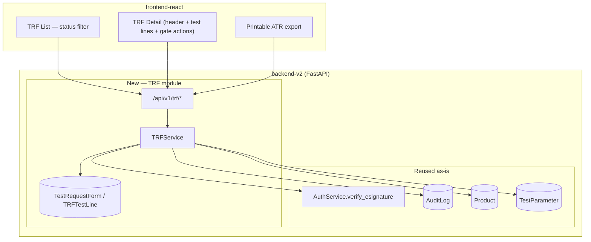
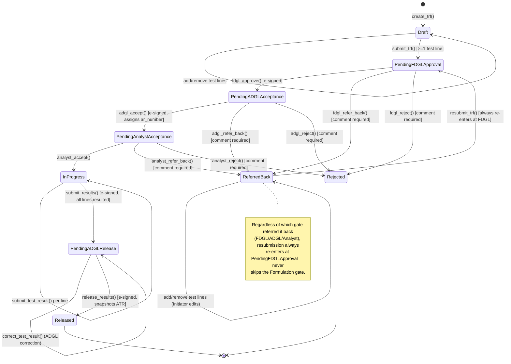

# Design Document: TRF — Test Request Form Module

## Overview

This module builds the TRF (Test Request Form) vertical slice inside the existing `backend-v2`
(FastAPI Clean Architecture: `api → application → domain → infrastructure`) and `frontend-react`
(React 18 + TypeScript + TanStack Query + PrimeReact) codebases at `rd-lab-instance`. TRF is the
functional-parity migration target for the existing standalone Mendix TRF portal described in
`TRF_USER_MANUAL_V2 1.pdf` and `Emcure_RnD_LIMS_Design_and_Roadmap.md`: a request/approval
container in which one or more analytical tests are raised against a product/batch, routed through
a two-gate departmental approval chain (Formulation, then Analytical), tested by an Analyst, and
released with an auto-generated Analytical Test Report (ATR).

Per the roadmap document, **TRF is the hub of the four-module program** — Stability's main output
is TRFs (auto-generated at each pull point) and COA's only input is released TRF results. This
module is built to stand on its own (functional parity with the Mendix baseline, scoped down where
noted below) while reserving a `source`/`stability_pull_ref` hook so that Stability's "Pull" action
can be pointed at TRF creation instead of direct Sample creation in a later iteration, without
reshaping this module's core.

This design reuses the same platform patterns already proven by MRN, Stability, and Sample
Manager: e-signature via `AuthService.verify_esignature`, `AuditLog` trail, the existing 4-role
RBAC model (Admin/Analyst/Supervisor/QA — **no new roles**), and the sequential-prefixed
numbering convention (`{PREFIX}-YYYYMMDD-XXXX`) already used for `MRN-*`, `STAB-*`, and
`SMP-*`. No new services, workers, or datastores are introduced (no Celery/Redis, no file storage
service) — everything is direct async FastAPI + SQLAlchemy + React/TanStack Query, and all work
happens only in `rd-lab-instance`.

## Key Design Decisions

The Mendix baseline uses a 5-role model (Admin, Initiator, FDGL, ADGL, Analyst) and a
Group-prefixed numbering scheme (`{GROUP}/TRF/{YY}/{NNNNN}`) that don't exist in this system.
Per the standing instruction to introduce **no new roles, services, or datastores**, the following
mapping decisions are made now (matching the pattern already used for MRN and Stability) rather
than raised as open questions — flag any of these to revisit if they don't match intent:

| # | Decision | Resolution |
|---|---|---|
| **1** | Role mapping (5 Mendix roles → 4 existing roles) | **Initiator → Admin/Analyst** (any user who can raise a TRF); **FDGL → Supervisor** (first approval gate, mirrors Supervisor's review role in Sample Manager); **ADGL → QA** (acceptance + final result release, mirrors QA's release role in Sample Manager/COA); **Analyst → Analyst** (accepts assigned TRFs, enters results). Admin can additionally perform every gate action, matching the "Admin can do everything" pattern already used in MRN/Stability. One user can hold only one role today (no multi-role), so the same person cannot be both Initiator and FDGL on their own TRF unless they are Admin — this is acceptable segregation-of-duties behavior, not a gap. |
| **2** | TRF/AR numbering | Simplified to `TRF-YYYYMMDD-XXXX` and `AR-YYYYMMDD-XXXX` (sequential, prefixed, date-scoped), matching `MRNNumberGenerator`/`StabilityCodeGenerator`. The real `{GROUP}/TRF/{YY}/{NNNNN}` scheme requires a `Group` master that does not exist in this system and is out of scope this iteration. |
| **3** | E-signature points | Per the roadmap's explicit compliance list ("TRF FDGL Approval, ADGL Acceptance, Result Release" are named e-sign points) plus the existing `result_endpoints.py` precedent (Analyst result submission is e-signed in Sample Manager): **FDGL Approve, ADGL Accept, Analyst Submit Results, and ADGL Release are e-signed** (`AuthService.verify_esignature`). Refer-Back, Reject, Analyst Accept, and Resubmit are role-gated but not e-signed, matching how Refer-Back/Reject are treated as "stop and reconsider" actions rather than positive GxP commitments in the source material. |
| **4** | Team/analyst assignment | The Mendix baseline's "assigned to my team" concept requires a `Group`/team-membership master that doesn't exist here. Simplified: once ADGL accepts a TRF, **any Analyst can self-assign by accepting it** (first-come), rather than ADGL explicitly assigning a specific analyst or team. This mirrors how Sample Manager has no pre-assignment of analysts to samples either. |
| **5** | Test line specification/results | Per-test `specification`, `raw_data_reference`, `result`, and `remark` are free-text fields on each TRF test line (matching the actual Mendix data-entry screen), **not** auto-pulled from the `Specification` master and **not** run through a structured calculation engine (dissolution matrices, assay formulas, etc.). Both are explicitly called out in the roadmap as "Extensions beyond Mendix parity" for a later phase — this module ships functional parity first. |
| **6** | Attachments | No file-upload infrastructure exists anywhere in this codebase today. Attachments (chromatogram PDFs, raw data sheets) are **out of scope this iteration** — `raw_data_reference` remains a free-text reference field (e.g. "LNB template no. TS2599/25"), exactly matching how the current Mendix/paper baseline already uses it as a reference, not an uploaded file. |
| **7** | Stability integration hook | A nullable `source` (`Manual` \| `Stability`) and nullable `stability_pull_ref` field are added to the TRF header now, per the roadmap's explicit module-dependency chain, so that a future Stability change can create TRFs directly. **Actually wiring Stability's "Pull" action to create a TRF instead of a Sample is out of scope this iteration** — TRF must exist and be stable first. |
| **8** | ATR generation | Delivered as a **printable, browser-based export** (matching the pattern just built for the Stability Protocol/Report), not a server-rendered PDF service (no WeasyPrint/wkhtmltopdf dependency introduced). The ATR view is generated on demand from the TRF's current header, test lines, and workflow signature history — available once status is `Released`. |
| **9** | Dashboards/tabs | The Mendix manual describes distinct tab sets per role (All/Refer-Back for Initiator; Pending Approval for FDGL; To-Be-Received/Results-Approval for ADGL; To-Be-Received for Analyst). This module implements **one TRF list page with a status filter and a role-aware default filter**, rather than five pixel-matched dashboards — functional coverage is equivalent (every status is visible and actionable by the right role) but the UI is not a tab-for-tab clone of the Mendix screens. |

## Architecture

### System Diagram



### Module Boundary

**Reused as-is (no changes):**
- `AuthService.verify_esignature`, `require_role`, `get_current_user`.
- `AuditLog` entity/repository.
- `Product` (for the TRF's product/batch reference) and `TestParameter` (Test Master, for test
  line selection) — read-only lookups, no changes to either.
- `ESignDialog.tsx`, `StatusBadge.tsx`, `usePermissions.ts` on the frontend.

**New (this module only):**
- Domain entities: `TestRequestForm`, `TRFTestLine`.
- `TRFNumberGenerator` / `ARNumberGenerator` domain services, siblings to `MRNNumberGenerator`.
- `ITRFRepository`.
- `TRFService` application service.
- `/api/v1/trf/*` endpoints, Pydantic schemas.
- Frontend `features/trf/*` (TRF list, TRF detail with gate actions, printable ATR export).

## Components and Interfaces

### TRFService (new application service)

```pascal
INTERFACE TRFService
  // Header + test lines (Draft / ReferredBack only)
  list_trfs(actor): list[TestRequestForm]              // Admin/QA/Supervisor see all; others see own+assigned
  get_trf(trf_id): TestRequestForm
  create_trf(header_fields, actor): TestRequestForm     // status=Draft, trf_number generated
  add_test_line(trf_id, test_id, specification, raw_data_reference, remark, actor): TRFTestLine
  remove_test_line(trf_id, line_id, actor): None

  // Initiator submission
  submit_trf(trf_id, actor): TestRequestForm            // Draft/ReferredBack -> PendingFDGLApproval

  // FDGL gate (Supervisor/Admin)
  fdgl_approve(trf_id, actor, password): TestRequestForm    // e-signed -> PendingADGLAcceptance
  fdgl_refer_back(trf_id, actor, comments): TestRequestForm // -> ReferredBack
  fdgl_reject(trf_id, actor, comments): TestRequestForm     // -> Rejected

  // ADGL gate 1 — acceptance (QA/Admin)
  adgl_accept(trf_id, actor, password): TestRequestForm      // e-signed -> PendingAnalystAcceptance, assigns ar_number
  adgl_refer_back(trf_id, actor, comments): TestRequestForm  // -> ReferredBack
  adgl_reject(trf_id, actor, comments): TestRequestForm      // -> Rejected

  // Analyst gate — acceptance + result entry
  analyst_accept(trf_id, actor): TestRequestForm             // -> InProgress
  analyst_refer_back(trf_id, actor, comments): TestRequestForm  // -> ReferredBack
  analyst_reject(trf_id, actor, comments): TestRequestForm      // -> Rejected
  submit_test_result(line_id, result, remark, actor): TRFTestLine  // while InProgress
  submit_results(trf_id, actor, password): TestRequestForm      // e-signed; requires every line to have a result -> PendingADGLRelease

  // ADGL gate 2 — review + release (QA/Admin)
  correct_test_result(line_id, result, remark, actor): TRFTestLine  // while PendingADGLRelease only
  release_results(trf_id, actor, password): TestRequestForm         // e-signed -> Released; snapshots ATR data

  // Re-submission after Refer-Back
  resubmit_trf(trf_id, actor): TestRequestForm            // ReferredBack -> PendingFDGLApproval (always re-enters at FDGL)

  // ATR
  get_atr(trf_id): dict   // only available once status == Released
END INTERFACE
```

### ITRFRepository (new)

```pascal
INTERFACE ITRFRepository
  get_by_id(trf_id): TestRequestForm | null
  list_all(): list[TestRequestForm]
  create(trf): TestRequestForm
  update(trf): TestRequestForm
  count_by_number_prefix(prefix): int         // for TRFNumberGenerator
  count_ar_by_number_prefix(prefix): int      // for ARNumberGenerator

  add_test_line(trf_id, line): TRFTestLine
  remove_test_line(trf_id, line_id): None
  update_test_line(line): TRFTestLine
  get_test_line_by_id(line_id): TRFTestLine | null
END INTERFACE
```

### Frontend components (new — `features/trf/`)

- `TRFListPage` — table of TRFs with `StatusBadge`, a status filter dropdown, and a
  role-aware default filter (Initiator sees "My TRFs" by default; FDGL sees "Pending My
  Approval"; ADGL sees "Pending My Acceptance/Release"; Analyst sees "Pending My Acceptance").
  "New TRF" action (Admin/Analyst).
- `TRFDetailPage` — header fields, test-line table (add/remove while `Draft`/`ReferredBack`, or
  `PendingFDGLApproval` for FDGL adding more tests), and the gate action buttons appropriate to
  the current status + viewer's role, each gated by `ESignDialog` where e-signature is required
  or a plain comment dialog for Refer-Back/Reject.
- `PrintATRPage` — standalone printable ATR export (header block, test-details table, remarks,
  5-signature chain: Initiated/Approved/Accepted/Analysed/Released By with department + date),
  available once `Released`, following the same browser-print pattern as the Stability
  Protocol/Report exports.

Reused as-is: `ESignDialog.tsx`, `StatusBadge.tsx`, `usePermissions.ts`, `toastService`.

## Data Models

```pascal
STRUCTURE TestRequestForm
  id, trf_number: String            // TRF-YYYYMMDD-XXXX
  ar_number: String | null          // AR-YYYYMMDD-XXXX, assigned at ADGL Accept

  product_id: Integer               // FK -> Product
  batch_number: String
  label_claim: String | null
  stage_of_sample: String | null    // e.g. "In-process", "Finished Product"
  group_name: String | null         // free-text department/group, no Group master this iteration
  quantity: String | null
  storage_condition: String | null
  storage_period: String | null
  pack_details: String | null
  manufactured_by: String | null
  mfg_date: DateTime | null
  expiry_or_retest_date: DateTime | null
  remark: String | null

  source: String                    // "Manual" | "Stability" — reserved hook, default "Manual"
  stability_pull_ref: Integer | null // reserved FK -> StabilitySample, unused this iteration

  status: String  // Draft, PendingFDGLApproval, PendingADGLAcceptance, PendingAnalystAcceptance,
                   // InProgress, PendingADGLRelease, Released, ReferredBack, Rejected

  initiated_by, initiated_at
  fdgl_approved_by, fdgl_approved_at
  adgl_accepted_by, adgl_accepted_at
  analyst_accepted_by, analyst_accepted_at
  results_submitted_by, results_submitted_at
  released_by, released_at
  referred_back_by, referred_back_at, referred_back_comments
  rejected_by, rejected_at, rejected_comments

  test_lines: list[TRFTestLine]
  atr_snapshot: JSON | null          // captured at release, immutable — mirrors Sample's coa_data pattern
END STRUCTURE

STRUCTURE TRFTestLine
  id, trf_id, line_no
  test_id: Integer                  // FK -> TestParameter (Test Master)
  specification: String | null      // free text this iteration (Decision 5)
  raw_data_reference: String | null // free text reference, no file attachment (Decision 6)
  result: String | null
  remark: String | null
  status: String  // Pending, Resulted   (derived display only — no independent workflow)
END STRUCTURE
```

### State Model



### Sequence — Create, Submit, Two-Gate Approval

```mermaid
sequenceDiagram
    participant Init as Initiator (Admin/Analyst)
    participant FDGL as Supervisor
    participant ADGL as QA
    participant API as /api/v1/trf
    participant SVC as TRFService
    participant DB as TestRequestForm

    Init->>API: POST /trf {header fields}
    API->>SVC: create_trf(...)
    SVC->>DB: insert (status=Draft, trf_number generated)
    Init->>API: POST /trf/{id}/test-lines (repeat per test)
    Init->>API: POST /trf/{id}/submit
    API->>SVC: submit_trf(id, actor)
    SVC->>DB: assert >=1 line; status=PendingFDGLApproval

    FDGL->>API: POST /trf/{id}/fdgl-approve {password}
    API->>SVC: verify_esignature + fdgl_approve(id, actor)
    SVC->>DB: assert status==PendingFDGLApproval; status=PendingADGLAcceptance

    ADGL->>API: POST /trf/{id}/adgl-accept {password}
    API->>SVC: verify_esignature + adgl_accept(id, actor)
    SVC->>DB: assert status==PendingADGLAcceptance
    SVC->>DB: generate ar_number; status=PendingAnalystAcceptance
```

### Sequence — Analyst Testing, Result Submission, Release

```mermaid
sequenceDiagram
    participant An as Analyst
    participant ADGL as QA
    participant API as /api/v1/trf
    participant SVC as TRFService
    participant DB as TestRequestForm / TRFTestLine

    An->>API: POST /trf/{id}/analyst-accept
    API->>SVC: analyst_accept(id, actor)
    SVC->>DB: assert status==PendingAnalystAcceptance; status=InProgress

    loop each test line
        An->>API: PUT /trf/test-lines/{line_id} {result, remark}
        API->>SVC: submit_test_result(line_id, ...)
        SVC->>DB: update line
    end

    An->>API: POST /trf/{id}/submit-results {password}
    API->>SVC: verify_esignature + submit_results(id, actor)
    SVC->>DB: assert every line has a result; status=PendingADGLRelease

    opt ADGL correction
        ADGL->>API: PUT /trf/test-lines/{line_id} {result, remark}
        API->>SVC: correct_test_result(line_id, ...) [only while PendingADGLRelease]
    end

    ADGL->>API: POST /trf/{id}/release {password}
    API->>SVC: verify_esignature + release_results(id, actor)
    SVC->>DB: assert status==PendingADGLRelease
    SVC->>DB: snapshot atr_snapshot (header + lines + signature history); status=Released
```

## Error Handling

### Error Scenario 1: Gate action attempted from the wrong status
**Condition**: Any gate transition (approve/accept/refer-back/reject/submit/release) is attempted
while the TRF is not in that transition's required source status.
**Response**: `ValidationException` (HTTP 400) naming the current status; no fields change.
**Recovery**: None needed — state is left exactly as it was.

### Error Scenario 2: Refer-Back or Reject without a comment
**Condition**: A Refer-Back or Reject action is submitted with a blank/whitespace-only `comments`.
**Response**: `ValidationException`; the TRF's status is left unchanged.
**Recovery**: The user re-submits with a non-blank comment.

### Error Scenario 3: Incorrect e-signature password
**Condition**: FDGL Approve, ADGL Accept, Submit Results, or Release is attempted with an
incorrect password.
**Response**: `ESignatureVerificationError`; the TRF's status and all fields are left unchanged.
**Recovery**: The user re-enters the correct password.

### Error Scenario 4: Submit Results with unresulted lines
**Condition**: Analyst attempts `submit_results()` while one or more `TRFTestLine` rows have a
blank `result`.
**Response**: `ValidationException` naming the unresulted line(s); status stays `InProgress`.
**Recovery**: The analyst fills in every line's result, then retries.

### Error Scenario 5: Test line mutation outside an editable status
**Condition**: `add_test_line`/`remove_test_line` is attempted while the TRF's status is not
`Draft`, `ReferredBack`, or (for FDGL only) `PendingFDGLApproval`.
**Response**: `ValidationException`; no line is added or removed.
**Recovery**: None needed — the test line list is left exactly as it was.

### Error Scenario 6: ATR requested before release
**Condition**: `get_atr(trf_id)` is called while status is not `Released`.
**Response**: `ValidationException`.
**Recovery**: The user waits for/performs the release action first.

### Error Scenario 7: Unauthorized action
**Condition**: A user without the required role attempts any gate action.
**Response**: `require_role` rejects with HTTP 403 before `TRFService` is invoked; no records
change.
**Recovery**: The action is performed by a user holding the correct role.

## Testing Strategy

### Unit Testing Approach
Cover domain-level rules directly on `TestRequestForm`/`TRFTestLine`: valid source-status per
transition, comment-required enforcement for Refer-Back/Reject, "every line resulted" check
before `submit_results()`, and the ATR-snapshot-only-once-Released rule.

### Property-Based Testing Approach
Each Correctness Property below is implemented as a Hypothesis property test (reusing the test
infrastructure already set up for MRN — `backend-v2/tests/conftest.py`, `pytest-asyncio`,
`hypothesis`), generating random sequences of gate actions, comments, and role/e-signature inputs
to verify the stated invariants hold, particularly the status-precondition gates (Properties 1–5)
and the "always re-enters at FDGL" invariant (Property 12).

### Integration Testing Approach
End-to-end API tests covering the full happy path: create → add test lines → submit → FDGL
approve → ADGL accept (AR number assigned) → Analyst accept → submit test results → submit
results → ADGL corrects a line → release (ATR available). Plus one full Refer-Back loop
(FDGL refers back → Initiator edits → resubmit → re-enters at FDGL) and one Reject path. Role-gated
403 tests per endpoint, matching the MRN/Stability integration test pattern.

## Correctness Properties

### Property 1: TRF/AR number uniqueness and well-formedness
Every `TestRequestForm.trf_number` is unique and matches `TRF-YYYYMMDD-XXXX`; every assigned
`ar_number` is unique and matches `AR-YYYYMMDD-XXXX`.
**Validates: Decision 2**

### Property 2: AR number is assigned exactly once, only at ADGL Accept
`ar_number` is `null` for every status prior to `PendingAnalystAcceptance`, and is populated
exactly once, at the `adgl_accept()` transition, never re-generated on subsequent transitions.
**Validates: TRFService.adgl_accept**

### Property 3: Submit requires at least one test line
`submit_trf()` succeeds only when the TRF has one or more `TRFTestLine` rows; with zero lines it
is rejected and the status remains `Draft`/`ReferredBack`.
**Validates: TRFService.submit_trf**

### Property 4: Each gate transition requires its exact source status
For every transition (`fdgl_approve`, `fdgl_refer_back`, `fdgl_reject`, `adgl_accept`,
`adgl_refer_back`, `adgl_reject`, `analyst_accept`, `analyst_refer_back`, `analyst_reject`,
`submit_results`, `release_results`), the transition succeeds only from its documented source
status and is rejected (state unchanged) from every other status.
**Validates: State Model transitions**

### Property 5: Refer-Back and Reject require a non-blank comment
Any Refer-Back or Reject action with a blank or whitespace-only `comments` value is rejected and
leaves the TRF's status unchanged; a non-blank comment succeeds and is persisted verbatim.
**Validates: Error Scenario 2**

### Property 6: E-signature gate correctness
For each of `fdgl_approve`, `adgl_accept`, `submit_results`, and `release_results`, an incorrect
e-signature password leaves the TRF's status and all fields unchanged and returns an
authentication error; the correct password performs the documented transition.
**Validates: Decision 3**

### Property 7: Submit Results requires every line to have a result
`submit_results()` succeeds only when every `TRFTestLine` on the TRF has a non-blank `result`;
if any line is blank, the request is rejected and the status remains `InProgress`.
**Validates: Error Scenario 4**

### Property 8: Result correction is ADGL-and-PendingADGLRelease-only
`correct_test_result()` succeeds only while the parent TRF's status is `PendingADGLRelease` and
the caller holds QA or Admin; it is rejected in every other status or for every other role.
**Validates: TRFService.correct_test_result**

### Property 9: ATR is available only once Released
`get_atr()` returns data only when status is `Released`; for every other status it is rejected.
**Validates: Error Scenario 6**

### Property 10: Test line mutation is editable-status-only
`add_test_line()`/`remove_test_line()` succeed only while status is `Draft`, `ReferredBack`, or
(FDGL role only) `PendingFDGLApproval`; every other combination of status/role is rejected and
the line list is left unchanged.
**Validates: Error Scenario 5**

### Property 11: RBAC is enforced per action and leaves state unchanged when rejected
For every `TRFService` action, a caller lacking the documented required role receives an
authorization error and no field on the TRF or its test lines changes.
**Validates: Decision 1, Error Scenario 7**

### Property 12: Resubmission always re-enters at the Formulation gate
Regardless of which gate (FDGL, ADGL, or Analyst) performed the Refer-Back, `resubmit_trf()`
always transitions `ReferredBack → PendingFDGLApproval`, never directly to `PendingADGLAcceptance`
or `PendingAnalystAcceptance`.
**Validates: State Model — ReferredBack note**

### Property 13: Every state transition writes a complete audit entry
Every successful call to `create_trf`, `submit_trf`, any gate transition, `submit_test_result`,
`correct_test_result`, or `release_results` writes exactly one `AuditLog` entry capturing the
actor, action, and old/new status (where applicable).
**Validates: platform-wide audit requirement (matches MRN/Stability Property 23/15)**

### Property 14: ATR snapshot is immutable once captured
Once `release_results()` captures `atr_snapshot`, no subsequent action mutates its content —
`get_atr()` always returns the exact snapshot captured at release time, even if the underlying
`Product`/`TestParameter` master data later changes.
**Validates: Decision 8 — matches Sample's `coa_data` immutable-snapshot pattern**

## Dependencies and Assumptions Requiring Confirmation

- **Role mapping (Decision 1)**: Initiator=Admin/Analyst, FDGL=Supervisor, ADGL=QA is a
  reasonable default mapping but has not been confirmed with the actual R&D organization —
  confirm FDGL/ADGL headcount maps cleanly onto existing Supervisor/QA users.
- **Numbering scheme (Decision 2)**: `TRF-YYYYMMDD-XXXX`/`AR-YYYYMMDD-XXXX` deviates from the
  real `{GROUP}/TRF/{YY}/{NNNNN}` convention. If Group-prefixed numbering is a hard regulatory/
  traceability requirement (not just a UX preference), a `Group` master and prefix-aware
  generator would need to be added before go-live.
- **Team assignment (Decision 4)**: self-assign-by-accept for Analysts is a simplification;
  confirm whether ADGL explicitly assigning a TRF to a named analyst is a hard requirement.
