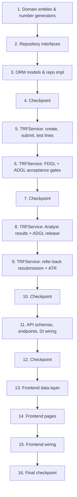

# Implementation Plan: TRF — Test Request Form Module

## Overview

This plan builds the TRF vertical slice inside the existing `backend-v2` (FastAPI Clean
Architecture) and `frontend-react` codebases at `rd-lab-instance`, in dependency order: domain
entities → number generators → repository interfaces → ORM models + repository implementation →
`TRFService` → API schemas/endpoints/DI wiring/router registration → frontend feature → nav/
routing wiring → final checkpoint.

It reuses `AuthService.verify_esignature`, `require_role`/`get_current_user`, `AuditLog`,
`Product`/`TestParameter` (read-only lookups), `ESignDialog`, `StatusBadge`, and `usePermissions`
exactly as they exist today. Backend test infrastructure (`backend-v2/tests/conftest.py`,
`pytest-asyncio`, `hypothesis`) was already set up for the MRN module and is reused as-is — no new
test infrastructure is created. New backend tests live under `backend-v2/tests/trf/`. Frontend has
no test tooling anywhere in the codebase (matching the established pattern), so no frontend test
tasks are included.

## Task Dependency Graph



```json
{
  "waves": [
    { "wave": 1, "tasks": ["1"] },
    { "wave": 2, "tasks": ["2"] },
    { "wave": 3, "tasks": ["3"] },
    { "wave": 4, "tasks": ["4"] },
    { "wave": 5, "tasks": ["5"] },
    { "wave": 6, "tasks": ["6"] },
    { "wave": 7, "tasks": ["7"] },
    { "wave": 8, "tasks": ["8"] },
    { "wave": 9, "tasks": ["9"] },
    { "wave": 10, "tasks": ["10"] },
    { "wave": 11, "tasks": ["11"] },
    { "wave": 12, "tasks": ["12"] },
    { "wave": 13, "tasks": ["13"] },
    { "wave": 14, "tasks": ["14"] },
    { "wave": 15, "tasks": ["15"] },
    { "wave": 16, "tasks": ["16"] }
  ]
}
```

## Tasks

- [ ] 1. Domain layer — entities and number generators
  - [ ] 1.1 Add `TestRequestForm` and `TRFTestLine` dataclasses in
    `src/domain/entities/trf.py`: header fields (product_id, batch_number, label_claim,
    stage_of_sample, group_name, quantity, storage_condition, storage_period, pack_details,
    manufactured_by, mfg_date, expiry_or_retest_date, remark), the `source`/`stability_pull_ref`
    reserved hook fields, all workflow signature fields (initiated/fdgl_approved/adgl_accepted/
    analyst_accepted/results_submitted/released/referred_back/rejected — each with `_by`/`_at`,
    plus `referred_back_comments`/`rejected_comments`), `status`, `trf_number`, `ar_number`,
    `atr_snapshot`, and `test_lines: list[TRFTestLine]`; implement status-transition guard
    methods (`can_submit`, `can_fdgl_act`, `can_adgl_accept_act`, `can_analyst_act`,
    `can_correct_result`, `can_release`, `can_resubmit`) and the transition methods themselves
    (`submit`, `fdgl_approve`, `fdgl_refer_back`, `fdgl_reject`, `adgl_accept`, `adgl_refer_back`,
    `adgl_reject`, `analyst_accept`, `analyst_refer_back`, `analyst_reject`,
    `all_lines_resulted()`, `release`, `resubmit`)
    - _Requirements: 1.1, 2.1, 2.2, 2.3, 3.1, 3.3, 3.5, 4.1, 4.3, 4.4, 4.6, 5.1, 5.2, 5.4, 5.5, 6.3, 6.5, 7.2, 7.3_

  - [ ]* 1.2 Write property test for status-precondition guards on every transition method
    - **Property 4: Each gate transition requires its exact source status**
    - **Validates: State Model transitions**

  - [ ]* 1.3 Write property test for Refer-Back/Reject comment requirement
    - **Property 5: Refer-Back and Reject require a non-blank comment**
    - **Validates: Requirements 3.4**

  - [ ]* 1.4 Write property test for "all lines resulted" gate
    - **Property 7: Submit Results requires every line to have a result**
    - **Validates: Requirements 5.5**

  - [ ] 1.5 Add `TRFNumberGenerator` in `src/domain/services/trf_number_generator.py` and
    `ARNumberGenerator` in `src/domain/services/ar_number_generator.py`, siblings to
    `MRNNumberGenerator`, producing `TRF-YYYYMMDD-XXXX` and `AR-YYYYMMDD-XXXX`
    - _Requirements: 11.1, 11.2_

  - [ ]* 1.6 Write property test for TRF/AR number uniqueness and format
    - **Property 1: TRF/AR number uniqueness and well-formedness**
    - **Validates: Requirements 11.1, 11.2**

- [ ] 2. Domain repository interfaces (ports)
  - [ ] 2.1 Define `ITRFRepository` in `src/domain/repositories/trf_repository.py` (mirroring
    the grouping style of `mrn_repository.py`): `get_by_id`, `list_all`, `create`, `update`,
    `count_by_number_prefix`, `count_ar_by_number_prefix`, `add_test_line`, `remove_test_line`,
    `update_test_line`, `get_test_line_by_id`
    - _Requirements: 1.1, 1.2, 1.3, 11.1, 11.2_

- [ ] 3. Infrastructure — SQLAlchemy models and repository implementation
  - [ ] 3.1 Create ORM models in `src/infrastructure/database/models/trf_model.py`
    (`TestRequestFormModel` with unique constraints on `trf_number` and `ar_number`,
    `TRFTestLineModel` with a FK to `TestRequestFormModel` and to `TestModel`), import them from
    `src/infrastructure/database/models/__init__.py`
    - _Requirements: 1.1, 1.2, 4.6, 11.1, 11.2_

  - [ ] 3.2 Implement `TRFRepositoryImpl` in
    `src/infrastructure/database/repositories/trf_repository_impl.py` implementing all of
    `ITRFRepository`, with entity↔model mapping including denormalized test name/code projection
    on line responses where useful
    - _Requirements: 1.1, 1.2, 1.3, 11.1, 11.2_

  - [ ]* 3.3 Write a repository smoke test (mirroring MRN's `test_repository_smoke.py`): create a
    TRF with test lines, update header, add/remove lines, verify unique-constraint enforcement on
    `trf_number`/`ar_number`
    - _Requirements: 1.1, 1.2, 1.3_

- [ ] 4. Checkpoint — Ensure all domain/infrastructure tests pass
  - Ensure all tests pass, ask the user if questions arise.

- [ ] 5. Application service — TRFService (creation, test lines, submission)
  - [ ] 5.1 Implement `src/application/services/trf_service.py` with `TRFService.__init__`
    (repository + `AuditLogRepository`), `list_trfs(actor)` (Admin/QA/Supervisor see all; others
    see TRFs they initiated or are currently assigned/accepted on), `get_trf(trf_id)`, and
    `create_trf(header_fields, actor)` (Admin/Analyst only; uses `TRFNumberGenerator`; writes an
    `AuditLog` entry)
    - _Requirements: 1.1, 1.5, 9.1, 10.1, 11.1_

  - [ ] 5.2 Implement `add_test_line(trf_id, test_id, specification, raw_data_reference, remark,
    actor)` and `remove_test_line(trf_id, line_id, actor)`: validate editable status
    (Draft/ReferredBack for Initiator, or PendingFDGLApproval for Supervisor/Admin acting as
    FDGL); write an `AuditLog` entry
    - _Requirements: 1.2, 1.3, 1.4, 9.1, 9.2, 10.1_

  - [ ]* 5.3 Write property test for test-line mutation editable-status gate
    - **Property 10: Test line mutation is editable-status-only**
    - **Validates: Requirements 1.4**

  - [ ] 5.4 Implement `submit_trf(trf_id, actor)`: require Draft/ReferredBack status and >=1 test
    line; transition to `PendingFDGLApproval`; write an `AuditLog` entry
    - _Requirements: 2.1, 2.2, 2.3, 10.1_

  - [ ]* 5.5 Write property test for the submit-requires-a-line gate
    - **Property 3: Submit requires at least one test line**
    - **Validates: Requirements 2.2**

- [ ] 6. Application service — TRFService (FDGL and ADGL acceptance gates)
  - [ ] 6.1 Implement `fdgl_approve(trf_id, actor, password)` (Supervisor/Admin, e-signed via
    `AuthService.verify_esignature`; requires `PendingFDGLApproval`; transitions to
    `PendingADGLAcceptance`), `fdgl_refer_back(trf_id, actor, comments)`, and
    `fdgl_reject(trf_id, actor, comments)` (both requiring a non-blank comment); write an
    `AuditLog` entry per action
    - _Requirements: 3.1, 3.2, 3.3, 3.4, 3.5, 3.6, 9.2, 10.1_

  - [ ]* 6.2 Write property test for the FDGL e-signature gate
    - **Property 6 (FDGL half): E-signature gate correctness**
    - **Validates: Requirements 3.2**

  - [ ] 6.3 Implement `adgl_accept(trf_id, actor, password)` (QA/Admin, e-signed; requires
    `PendingADGLAcceptance`; generates and assigns `ar_number` via `ARNumberGenerator`;
    transitions to `PendingAnalystAcceptance`), `adgl_refer_back(trf_id, actor, comments)`, and
    `adgl_reject(trf_id, actor, comments)`; write an `AuditLog` entry per action
    - _Requirements: 4.1, 4.2, 4.3, 4.4, 4.5, 4.6, 9.3, 10.1, 11.2_

  - [ ]* 6.4 Write property test for AR number assignment timing
    - **Property 2: AR number is assigned exactly once, only at ADGL Accept**
    - **Validates: Requirements 4.6**

  - [ ]* 6.5 Write property test for the ADGL-accept e-signature gate
    - **Property 6 (ADGL-accept half): E-signature gate correctness**
    - **Validates: Requirements 4.2**

- [ ] 7. Checkpoint — Ensure protocol/gate tests pass so far
  - Ensure all tests pass, ask the user if questions arise.

- [ ] 8. Application service — TRFService (Analyst results and ADGL release)
  - [ ] 8.1 Implement `analyst_accept(trf_id, actor)` (Analyst/Admin, no e-sign; requires
    `PendingAnalystAcceptance`; transitions to `InProgress`), `analyst_refer_back(trf_id, actor,
    comments)`, and `analyst_reject(trf_id, actor, comments)`; write an `AuditLog` entry per
    action
    - _Requirements: 5.1, 5.2, 9.4, 10.1_

  - [ ] 8.2 Implement `submit_test_result(line_id, result, remark, actor)` (Analyst/Admin;
    requires parent TRF status `InProgress`) and `submit_results(trf_id, actor, password)`
    (e-signed; verifies every line has a non-blank result via `all_lines_resulted()`; transitions
    to `PendingADGLRelease`); write an `AuditLog` entry per action
    - _Requirements: 5.3, 5.4, 5.5, 5.6, 5.7, 9.4, 10.1, 10.2_

  - [ ]* 8.3 Write property test for the Submit Results e-signature gate
    - **Property 6 (Submit Results half): E-signature gate correctness**
    - **Validates: Requirements 5.6**

  - [ ] 8.4 Implement `correct_test_result(line_id, result, remark, actor)` (QA/Admin only;
    requires parent TRF status `PendingADGLRelease`) and `release_results(trf_id, actor,
    password)` (e-signed; requires `PendingADGLRelease`; assembles and stores `atr_snapshot`
    from the current header + test lines + full signature history; transitions to `Released`);
    write an `AuditLog` entry per action
    - _Requirements: 6.1, 6.2, 6.3, 6.4, 6.5, 9.3, 10.1_

  - [ ]* 8.5 Write property test for the result-correction ADGL-and-status gate
    - **Property 8: Result correction is ADGL-and-PendingADGLRelease-only**
    - **Validates: Requirements 6.2**

  - [ ]* 8.6 Write property test for the Release e-signature gate
    - **Property 6 (Release half): E-signature gate correctness**
    - **Validates: Requirements 6.4**

  - [ ]* 8.7 Write property test for ATR snapshot immutability
    - **Property 14: ATR snapshot is immutable once captured**
    - **Validates: Requirements 8.4**

- [ ] 9. Application service — TRFService (refer-back resubmission and ATR)
  - [ ] 9.1 Implement `resubmit_trf(trf_id, actor)` (Initiator/Admin; requires `ReferredBack`
    status; always transitions to `PendingFDGLApproval` regardless of which gate referred it
    back); write an `AuditLog` entry
    - _Requirements: 7.1, 7.2, 7.3, 10.1_

  - [ ]* 9.2 Write property test for the always-re-enters-at-FDGL invariant
    - **Property 12: Resubmission always re-enters at the Formulation gate**
    - **Validates: Requirements 7.2, 7.3**

  - [ ] 9.3 Implement `get_atr(trf_id)`: requires status `Released`; returns the stored
    `atr_snapshot`
    - _Requirements: 8.1, 8.2, 8.4_

  - [ ]* 9.4 Write property test for ATR availability gate
    - **Property 9: ATR is available only once Released**
    - **Validates: Requirements 8.2**

  - [ ]* 9.5 Write property test for complete audit entries on every transition across the full
    `TRFService` surface
    - **Property 13: Every state transition writes a complete audit entry**
    - **Validates: Requirements 10.1, 10.2**

  - [ ]* 9.6 Write property test for RBAC enforcement leaving state unchanged on rejection, across
    all `TRFService` actions
    - **Property 11: RBAC is enforced per action and leaves state unchanged when rejected**
    - **Validates: Requirements 9.1, 9.2, 9.3, 9.4**

- [ ] 10. Checkpoint — Ensure all TRFService tests pass
  - Ensure all tests pass, ask the user if questions arise.

- [ ] 11. API layer — schemas, endpoints, and DI wiring
  - [ ] 11.1 Add Pydantic schemas in `src/api/v1/schemas/trf_schemas.py`
    (`CreateTRFRequest`, `TRFResponse`, `CreateTestLineRequest`, `TRFTestLineResponse`,
    `SubmitTestResultRequest`, `EsignActionRequest` (reuse pattern), `ReferBackRejectRequest`
    (comments), `ATRResponse`)
    - _Requirements: 1.1, 1.2, 3.3, 5.4, 8.1_

  - [ ] 11.2 Add `Container.get_trf_service(session)` factory in
    `src/config/dependency_injection.py`, wiring `TRFRepositoryImpl` and the existing
    `AuditLogRepositoryImpl`
    - _Requirements: (module boundary — new, no new services/datastores)_

  - [ ] 11.3 Implement `src/api/v1/endpoints/trf_endpoints.py` with a `/trf` prefixed router:
    - `POST /trf` (create — Admin/Analyst), `GET /trf` (list, role-scoped), `GET /trf/{id}` (any
      role), `GET /trf/{id}/atr` (any role, requires Released)
    - `POST /trf/{id}/test-lines`, `DELETE /trf/{id}/test-lines/{line_id}` — Admin/Analyst
      (Draft/ReferredBack) or Admin/Supervisor (PendingFDGLApproval)
    - `POST /trf/{id}/submit` — Admin/Analyst
    - `POST /trf/{id}/fdgl-approve` (e-sign), `POST /trf/{id}/fdgl-refer-back`,
      `POST /trf/{id}/fdgl-reject` — Admin/Supervisor
    - `POST /trf/{id}/adgl-accept` (e-sign), `POST /trf/{id}/adgl-refer-back`,
      `POST /trf/{id}/adgl-reject` — Admin/QA
    - `POST /trf/{id}/analyst-accept`, `POST /trf/{id}/analyst-refer-back`,
      `POST /trf/{id}/analyst-reject` — Admin/Analyst
    - `PUT /trf/test-lines/{line_id}/result` — Admin/Analyst (while InProgress) or Admin/QA
      (while PendingADGLRelease, as correction)
    - `POST /trf/{id}/submit-results` (e-sign) — Admin/Analyst
    - `POST /trf/{id}/release` (e-sign) — Admin/QA
    - `POST /trf/{id}/resubmit` — Admin/Analyst
    - _Requirements: 9.1, 9.2, 9.3, 9.4, 9.5_

  - [ ] 11.4 Register `trf_router` in `src/api/v1/router.py`
    - _Requirements: (wiring)_

  - [ ]* 11.5 Write integration tests for the TRF endpoints: role-gated 403 tests per endpoint,
    the happy-path flow (create → add lines → submit → FDGL approve → ADGL accept → Analyst
    accept → submit results → ADGL correct → release → ATR), one full Refer-Back → resubmit loop,
    and one Reject path
    - _Requirements: 9.1, 9.2, 9.3, 9.4, 9.5_

- [ ] 12. Checkpoint — Ensure all backend tests pass
  - Ensure all tests pass, ask the user if questions arise.

- [ ] 13. Frontend — TRF feature data layer
  - [ ] 13.1 Add `features/trf/models/trf.types.ts` (`TestRequestForm`, `TRFTestLine`, and the
    corresponding request/response types, including `ATRResponse`)
    - _Requirements: 12.1, 12.2_

  - [ ] 13.2 Add `features/trf/api/trfApi.ts` (create/list/get TRF, add/remove test line, submit,
    fdgl-approve/refer-back/reject, adgl-accept/refer-back/reject, analyst-accept/refer-back/
    reject, submit test result, submit-results, release, resubmit, get ATR) following the
    `mrnApi.ts` `apiClient` conventions
    - _Requirements: 12.1, 12.2, 12.3, 12.4_

  - [ ] 13.3 Add `features/trf/hooks/useTRF.ts` — TanStack Query hooks mirroring `useMrn.ts`'s
    pattern (`useTRFList`, `useTRFDetail`, `useCreateTRF`, `useAddTestLine`,
    `useRemoveTestLine`, `useSubmitTRF`, `useFdglApprove`, `useFdglReferBack`, `useFdglReject`,
    `useAdglAccept`, `useAdglReferBack`, `useAdglReject`, `useAnalystAccept`,
    `useAnalystReferBack`, `useAnalystReject`, `useSubmitTestResult`, `useSubmitResults`,
    `useReleaseResults`, `useResubmitTRF`, `useATR`) with query invalidation
    - _Requirements: 12.1, 12.2, 12.3, 12.4_

- [ ] 14. Frontend — TRF pages
  - [ ] 14.1 Implement `features/trf/pages/TRFListPage.tsx` — `DataTable`/`Column` of TRFs with
    `StatusBadge`, a status filter dropdown, a role-aware default filter (per Requirement 12.1),
    and a "New TRF" action (Admin/Analyst)
    - _Requirements: 12.1_

  - [ ] 14.2 Implement `features/trf/pages/TRFDetailPage.tsx` — header fields, test-line
    table (add/remove while editable; result entry while InProgress; result correction while
    PendingADGLRelease for QA), and the gate action buttons appropriate to the current status +
    viewer's role, each gated by `ESignDialog` (for e-signed actions) or a comment dialog (for
    Refer-Back/Reject)
    - _Requirements: 12.2, 12.3_

  - [ ] 14.3 Implement `features/trf/pages/PrintATRPage.tsx` — standalone printable ATR export
    (header block, test-details table, remarks, 5-signature chain with role and date), following
    the same browser-print pattern as `PrintProtocolPage.tsx`/`PrintReportPage.tsx`, reachable
    from a "View/Print ATR" link on a Released TRF's detail page
    - _Requirements: 8.1, 8.3, 12.4_

- [ ] 15. Frontend — wiring
  - [ ] 15.1 Add `features/trf/index.ts` barrel export; add TRF routes (`/trf`, `/trf/:id`,
    `/trf/:id/atr/print`) to `AppRouter.tsx` (the print route outside `MainLayout`, mirroring the
    Stability print routes)
    - _Requirements: 12.1, 12.2, 12.4_

  - [ ] 15.2 Add a "TRF" nav item to `MainLayout.tsx`'s `NAV_ITEMS` (new top-level section, e.g.
    "Test Request Form") and a corresponding `trf` key to `MENU_ACCESS` in `usePermissions.ts`,
    readable by all four roles (action-level gating is handled inside the pages per
    Requirement 9)
    - _Requirements: 9.1, 9.2, 9.3, 9.4, 12.1_

- [ ] 16. Final checkpoint — Ensure all tests pass
  - Ensure all tests pass, ask the user if questions arise.

## Notes

- Tasks marked with `*` are optional (tests) and can be skipped for a faster MVP pass, though
  property tests remain the primary correctness signal for this module's status-machine
  invariants, matching the MRN/Stability precedent.
- Checkpoints ensure incremental validation before moving from domain → infrastructure →
  application → API → frontend.
- No new services, workers, or datastores are introduced — everything is direct async FastAPI +
  SQLAlchemy + React/TanStack Query, matching the rest of `rd-lab-instance`.
- Test infrastructure (`backend-v2/tests/conftest.py`, `pytest-asyncio`, `hypothesis`) is reused
  as-is from the MRN module; new tests live under `backend-v2/tests/trf/`.
