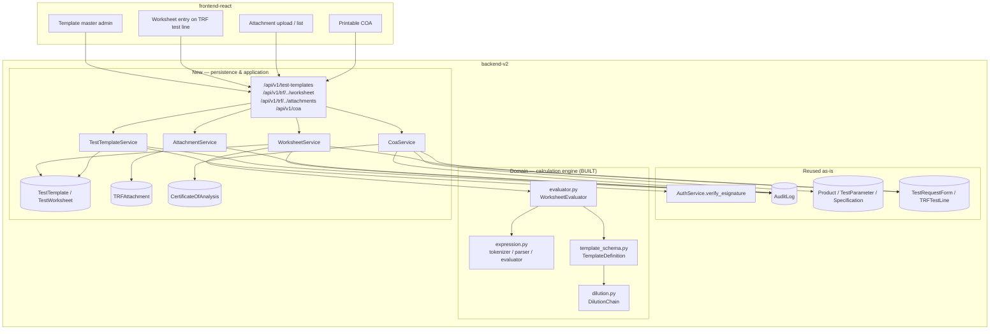
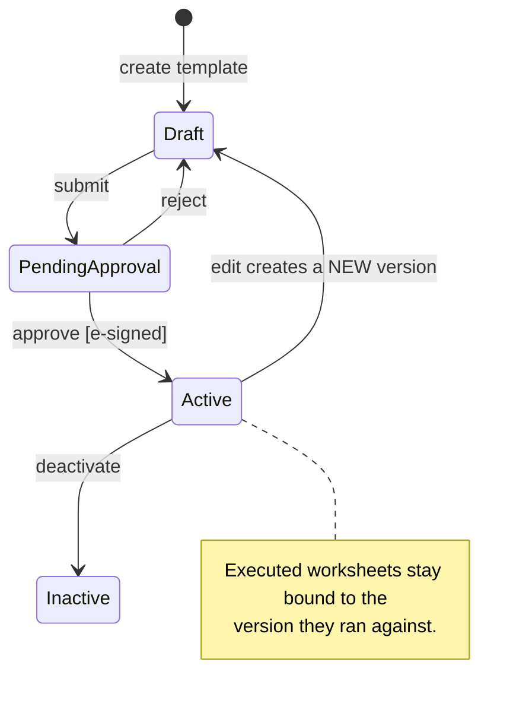

# Design Document

TRF Test Templates, Calculation Engine, Attachments & COA

## Overview

This module replaces 35 standalone Excel calculation workbooks with configurable, versioned test
templates inside the LIMS, wires them onto TRF test lines, adds file attachments per TRF, and
extends COA generation to compile all tests and results.

It is built inside the existing `backend-v2` (FastAPI Clean Architecture:
`api → application → domain → infrastructure`) and `frontend-react` codebases at `rd-lab-instance`,
reusing `AuthService.verify_esignature`, `require_role`/`get_current_user`, `AuditLog`,
`Product`/`TestParameter`/`Specification` masters, `ESignDialog`, `StatusBadge`, and
`usePermissions` as they exist today. No new roles, services, workers, or datastores.

**Status note:** the domain calculation engine described in §3 is **already implemented and
verified** (242 passing tests, including the `Assay by HPLC` sheet reproduced end-to-end). This
document records the design as validated by that work rather than as speculation; the remaining
sections (persistence, application, API, frontend, attachments, COA) are the design to be built.

## Analysis Basis

All 35 workbooks in `rd-lab-instance/Test types/` were parsed including formulas. The 8 legacy
`.xls` files required driving Excel via COM, because `xlrd` returns only cached values and silently
hid the logic of all four Related-Substances templates and both Content-Uniformity sheets. Raw
structural dumps are retained at `rd-lab-instance/_inspect_tests/` (`forms_dump.txt`,
`xls_formulas_dump.txt`) as implementation reference.

The 35 workbooks reduce to **14 calculation archetypes**, and almost every chromatographic test
reduces to one master equation (§3.2).

## Key Design Decisions

| # | Decision | Resolution |
|---|---|---|
| **1** | Templates as configuration, not code | Template definitions are JSON, versioned, and approved through an e-signed gate. Adding a new test form is a data operation, not a deployment. Parsed into validated dataclasses at load time so a malformed definition fails loudly rather than producing wrong numbers silently. |
| **2** | Expression evaluation | A purpose-built tokenizer + recursive-descent parser + tree evaluator. **Not `eval()`** — template definitions are user-editable and the outputs are GxP-reportable, so there must be no code-execution surface and a closed set of permitted operations. |
| **3** | Excel-compatible semantics are mandatory, not cosmetic | `round()` is half-away-from-zero (Python's built-in is banker's rounding and gives 2.0 for `round(2.5)` where Excel gives 3). Division by zero and missing inputs yield a blank sentinel, matching the `IFERROR(...,"")` wrapper on nearly every source formula. Blanks are *skipped* by `mean`/`sd`/`rsd`, not treated as zero, because the sheets pad ranges with empty cells. `sum()` of an empty range is **0** (Excel), while `mean()` of an empty range is blank — this distinction is what makes the first dissolution timepoint compute correctly. |
| **4** | Rounding position is load-bearing | The sheets round and truncate mid-chain, and RS totals sum *already-rounded* values. Each calculated field carries its own rounding spec, applied to that field's result, and the rounded value is what downstream fields see. Reproducing this ordering matters in the third decimal of reported impurity totals. |
| **5** | Three group kinds cover all 35 sheets | `singleton` (one implicit row), `table` (N repeating rows — standards, samples, impurities, units), `sequence` (ordered rows with access to earlier rows — dissolution timepoints). |
| **6** | Bracketing standards pool cumulatively | Block *k*'s statistics are computed over the initial standard replicates ∪ blocks 1..k, never over the bracketing injections alone. Expressed in templates as `rsd(pool(std.area, bkt1.area, bkt2.area))`. |
| **7** | Dilution chains are one abstraction | The `Vol/Pip`, `Dilution-n/Volume-n`, `Pipette/mL`, `Stock/mL of Stock`, and `V.F./Dil.` column variants across every sheet are the same algebra. Modelled as an ordered list of `(aliquot, diluted_to)` steps exposing `factor` and `inverse_factor`. Unused stages are neutral `1/1` steps. This single abstraction collapses most apparent template diversity. |
| **8** | Dissolution volumes are generated, not stored | The sheets hard-code `500/495/490/485…`. The template declares `{initial, withdrawal, replacement, mode}` and the volume series and carry-over corrections are derived, so changing the withdrawal volume cannot leave a stale constant behind. |
| **9** | Area entry is behind a seam from day one | Every area value carries a `source` (`ManualEntry` today, `CdsImport` later) and `TemplateDefinition.area_field_refs` exposes every area field generically. A Waters/Empower adapter can therefore be added without touching any template definition, the engine, or the UI field model. |
| **10** | Additive to the existing TRF flow | A test line with no template keeps today's free-text result entry. Worksheets write their reportable result into the existing test-line `result` field, so TRF submission, ADGL correction, release, and ATR behaviour are unchanged. |
| **11** | Attachments on the filesystem, not in the DB | Files are stored under a configurable path with generated storage names; the DB holds metadata only. Client-supplied paths are never trusted. Content type is validated against an allow-list *and* the file signature is checked. |
| **12** | COA follows the ATR precedent | Immutable snapshot captured at e-signed generation, rendered as a browser-printable page. No server-side PDF dependency (no WeasyPrint/wkhtmltopdf), matching the existing ATR and Stability print exports. |
| **13** | Five archetypes deferred as bespoke | Microbial cylinder-plate bioassay (2 workbooks — zone diameters and plate-position correction, not chromatographic areas), Franz-cell IVRT (1 — calibration-curve quantitation with flux vs √t), f1/f2 comparison (1 — consumes two *other* samples' released results), linearity qualification (1 — method validation, not a sample test), and the cross-test roll-ups (drug-to-lipid, free/entrapped — consume other tests' approved results). The engine already supports their math primitives (regression, log/exp); they are deferred for *data-shape* reasons, not capability. |

## Architecture



## Calculation Engine (implemented)

Located at `src/domain/services/calculation/`. Pure domain code: no I/O, no framework
dependencies, deterministic and side-effect free.

### 3.1 Modules

| Module | Responsibility |
|---|---|
| `expression.py` | Tokenizer, recursive-descent parser, tree evaluator, 25 built-in functions, `EMPTY` blank sentinel, `referenced_names()` for dependency extraction. |
| `dilution.py` | `DilutionStep` / `DilutionChain` with `factor` and `inverse_factor`; rejects non-physical volumes. |
| `template_schema.py` | `TemplateDefinition` and its `FieldDef` / `GroupDef` / `CriterionDef` / `RowSpec` / `Rounding` value objects, parsed and validated from JSON. |
| `evaluator.py` | `WorksheetEvaluator` — dependency-ordered evaluation, row scoping, criteria assessment, reportable-result extraction. |

### 3.2 The master equation

Every chromatographic quantitation (archetypes A1–A6, A13) is one product chain:

```
result = (sample_response / mean_std_response)
       × (std_weight ⁄ std_dilution_chain)          → standard concentration
       × (sample_dilution_chain ⁄ sample_amount)    → sample dilution factor
       × (MW_base / MW_salt)                        → salt/base conversion (1/1 when N/A)
       × potency term                               → P or P/100
       × unit normaliser                            → ×1000 (ppm), ×1e6, ×100, ÷LC, ×AvgWt/LC, vial factor
       [× RRF or ÷ RRF]                             → related substances only
```

A template selects which terms apply; the engine needs no per-archetype code.

### 3.3 Expression language

Arithmetic (`+ - * / ^`), comparison (`= == <> != < <= > >=`), logic (`and or not`), dotted and
indexed references, list literals, and lazy `if`.

Functions: `mean`/`average`, `sum`, `count`, `sd`/`stdev`, `rsd`, `min`, `max`, `round`, `trunc`,
`abs`, `sqrt`, `ln`, `log10`, `exp`, `slope`, `intercept`, `correl`, `blank`, `isblank`,
`coalesce`, `pool`, `cumsum`, `if`.

`pool(...)` implements cumulative bracketing (Decision 6). `cumsum(...)` and sequence-group
`prior.field` implement the dissolution carry-over recursion (Decision 8).

### 3.4 Scoping model

- Context fields and singleton-group fields: `key` and `group.field`.
- Multi-row groups expose each field as a **column series** — `group.field` is the list of values
  down the rows. This is what makes `mean(std_areas.area)` work.
- While evaluating a row-scoped field, that row's fields are in scope unqualified and via `row.`;
  every group's column series stays visible, so a row formula can reference a sheet-level aggregate.
- `sequence` groups additionally get `prev.field` (preceding row) and `prior.field` (all preceding
  rows as a list), plus one-based `rowno`.

Evaluation order is a topological sort over calculated fields; a circular reference raises
`EvaluationError` rather than silently blanking.

### 3.5 Verified behaviour

The `Assay by HPLC` sheet runs end-to-end from a template definition using the source product's own
inputs: standard concentration **5.023676 ppm**, mean standard area **252614.6**, %RSD **0.2946**,
preparations at **108.795%** and **108.882%**, reportable mean assay **108.838%**. System
suitability criteria evaluate and gate the reportable result. Parity tests additionally cover
Related Substances (both RRF modes, BLQ, area normalisation), Content Uniformity acceptance value,
dissolution volume recursion and carry-over, titrimetry, gravimetric, blank correction, and
multi-analyte peak sums.

## Data Models

```pascal
STRUCTURE TestTemplate
  id, code, name
  archetype: String              // A1..A14 classification
  test_id: Integer               // FK -> TestParameter
  version: Integer               // 1..n; a new version supersedes rather than mutates
  status: String                 // Draft | PendingApproval | Active | Inactive
  result_unit: String | null
  definition: JSON               // parsed by TemplateDefinition.parse()
  approved_by, approved_at, superseded_by_id
  + audit columns
END STRUCTURE

STRUCTURE TestWorksheet
  id
  trf_test_line_id: Integer      // FK -> TRFTestLine (one worksheet per line)
  template_id, template_version  // bound at creation; never re-pointed
  status: String                 // InProgress | Confirmed
  context_values: JSON           // {context_key: value}
  group_values: JSON             // {group_key: [{field_key: value}, ...]}
  computed_snapshot: JSON | null // values + rows + criteria at confirmation
  reportable_result: String | null
  confirmed_by, confirmed_at
  + audit columns
END STRUCTURE

STRUCTURE TRFAttachment
  id, trf_id, trf_test_line_id: Integer | null
  original_filename, content_type, size_bytes
  storage_name                   // generated; never client-supplied
  uploaded_by, uploaded_at
END STRUCTURE

STRUCTURE CertificateOfAnalysis
  id, coa_number                 // COA-YYYYMMDD-XXXX
  product_id, batch_number
  status: String                 // Released
  snapshot: JSON                 // immutable: header + per-test results + signatures
  released_by, released_at
  + audit columns
END STRUCTURE
```

`TestWorksheet` stores inputs and a *snapshot* of computed values rather than only the final number,
so a released result remains reproducible even if the template is later versioned (Requirement 2.7).

### State model



## Components and Interfaces

```pascal
INTERFACE TestTemplateService
  list_templates(test_id?, status?): list[TestTemplate]
  get_template(id): TestTemplate
  create_template(fields, actor): TestTemplate            // Admin; validates definition
  update_definition(id, definition, actor): TestTemplate  // Admin; Draft only
  new_version(id, actor): TestTemplate                    // Admin; clones Active -> Draft
  submit_for_approval(id, actor): TestTemplate            // Admin
  approve(id, actor, password): TestTemplate              // Supervisor/QA/Admin, e-signed
  deactivate(id, actor): TestTemplate                     // Admin
  templates_for_test(test_id): list[TestTemplate]         // Active only, for TRF selection
END INTERFACE

INTERFACE WorksheetService
  create_worksheet(test_line_id, template_id, actor): TestWorksheet   // pre-populates context
  get_worksheet(id): TestWorksheet
  get_worksheet_for_line(test_line_id): TestWorksheet | null
  preview(id, context_values, group_values): WorksheetResult          // compute WITHOUT persisting
  save_values(id, context_values, group_values, actor): TestWorksheet  // Analyst while InProgress
  correct_values(id, context_values, group_values, actor): TestWorksheet // QA while PendingADGLRelease
  confirm_result(id, actor): TestWorksheet   // blocks on blocking criteria; writes to test line
END INTERFACE

INTERFACE AttachmentService
  upload(trf_id, test_line_id?, filename, content_type, stream, actor): TRFAttachment
  list_for_trf(trf_id): list[TRFAttachment]
  open_stream(id): (metadata, stream)
  delete(id, actor): None        // rejected once the TRF is Released
END INTERFACE

INTERFACE CoaService
  generate(product_id, batch_number, actor, password): CertificateOfAnalysis  // QA/Admin, e-signed
  get(id): CertificateOfAnalysis
  list(product_id?, batch_number?): list[CertificateOfAnalysis]
END INTERFACE
```

`preview()` is separate from `save_values()` so the UI can recalculate live on every keystroke
without writing to the database or the audit trail.

## Error Handling

| Scenario | Response | Recovery |
|---|---|---|
| Malformed template definition submitted | `ValidationException` naming the offending path (`definition.groups[std].fields[2]`) | Author corrects the definition; nothing is persisted. |
| Circular reference between calculated fields | `ValidationException` listing the cycle | Author breaks the cycle. Detected at approval, not first use. |
| Worksheet inputs incomplete | Affected fields return blank; entry continues | None — expected mid-entry state. |
| Division by zero in a formula | Blank for that field | None. |
| Confirm attempted with a failing blocking criterion | `ValidationException` naming the failed criteria and observed values | Analyst investigates; the run may need repeating. |
| Worksheet edited outside the permitted TRF status | `ValidationException`; worksheet unchanged | Action performed at the correct workflow stage. |
| Attachment exceeds max size or fails the content-type/signature check | `ValidationException`; nothing stored | User uploads a valid PDF. |
| Attachment delete attempted on a Released TRF | `ValidationException`; attachment retained | None — immutability is intended. |
| COA requested for a batch with no released results | `ValidationException` | Release the TRFs first. |
| Template edited while Active | New `Draft` version created; Active untouched | None — intended behaviour. |

## Testing Strategy

**Unit** — the engine (done: 242 tests). Grammar, every built-in, Excel blank/rounding semantics,
dilution chains, schema validation, dependency ordering, cycle detection, row scoping, criteria.

**Workbook parity** — the highest-value layer. Each archetype gets a test transcribing a real
sheet's formula with that sheet's own inputs, expectations hand-derived from the formula rather than
copied from cached cells. This has already caught real defects in both directions: the `sum([])`
blank bug (which would have corrupted every dissolution first timepoint) and eight incorrect
expectations of my own.

**Integration** — API tests per endpoint for role gating (403s), the worksheet lifecycle
(create → save → preview → confirm → result on test line), attachment upload/download/delete
including rejection paths, and COA generation with an immutability check.

**Property-based** — determinism (same inputs ⇒ same outputs), context non-mutation, and that no
input combination raises out of the engine rather than returning blank.

## Correctness Properties

Properties marked **[verified]** already have passing tests from the engine work; the rest are to be
implemented alongside their layer.

### Property 1: Evaluation is deterministic and side-effect free **[verified]**
Evaluating the same template definition with the same inputs always yields identical outputs, and
never mutates the supplied context or value dictionaries.
**Validates: Requirements 2.6**

### Property 2: No expression can escape the closed vocabulary **[verified]**
No expression string can resolve a Python builtin, import a module, or invoke anything outside the
engine's function table. Unknown functions raise rather than silently returning blank.
**Validates: Requirements 1.2, 2.2**

### Property 3: Missing data yields blanks, never exceptions **[verified]**
For any template and any subset of its inputs left blank, evaluation completes and the affected
fields are blank. Division by zero, missing references, and unpaired regression series all produce
blanks.
**Validates: Requirements 2.5**

### Property 4: Aggregates skip blanks rather than treating them as zero **[verified]**
`mean`/`sd`/`rsd`/`count`/`min`/`max` over a padded range give the same answer as over the compacted
range. `sum` of an empty range is 0; `mean` of an empty range is blank.
**Validates: Requirements 4.6**

### Property 5: Rounding is applied where declared, and propagates **[verified]**
A calculated field's declared rounding is applied to its own result, and downstream fields consume
the rounded value. Summing already-rounded values is distinguishable from rounding a sum.
**Validates: Requirements 2.3, 2.4**

### Property 6: Bracketing statistics pool cumulatively **[verified]**
For every bracketing block *k*, its mean/SD/%RSD equal those of the standard replicates unioned with
blocks 1..k — never of block *k* alone.
**Validates: Requirements 2.2, 4.3**

### Property 7: Dilution chain factor and inverse are reciprocal **[verified]**
`chain.factor * chain.inverse_factor == 1` for any chain, and padding a chain with neutral `1/1`
steps does not change either.
**Validates: Requirements 3.1, 3.2**

### Property 8: Calculated fields evaluate in dependency order **[verified]**
For any declaration order, each calculated field sees fully-resolved values of everything it
references. A circular reference raises `EvaluationError` naming the cycle rather than producing a
blank or a partial value.
**Validates: Requirements 2.1**

### Property 9: A malformed definition never reaches evaluation **[verified]**
Every structurally invalid definition (unknown kinds, duplicate keys, invalid identifiers, reserved
names, bad row bounds, unresolvable `resultRef`, calculated field without expression) is rejected at
parse time with the offending path named.
**Validates: Requirements 1.2**

### Property 10: Template versioning preserves executed worksheets
Creating a new version of an `Active` template never alters the previous version, and every existing
worksheet continues to resolve against the template version it was created with.
**Validates: Requirements 1.4, 2.7**

### Property 11: Blocking criteria gate result confirmation
A worksheet with any failing blocking criterion cannot be confirmed, and no value is written to the
parent test line. Advisory failures never block. Blank observed values are not treated as failures.
**Validates: Requirements 5.5, 6.3**

### Property 12: Worksheet mutation respects TRF status and role
Input/area values change only via Analyst/Admin while the parent TRF is `InProgress`, or QA/Admin
while `PendingADGLRelease`. Every other combination leaves the worksheet byte-identical.
**Validates: Requirements 5.3, 5.6, 9.3, 9.4**

### Property 13: Confirmed results reach the test line unchanged
The value written to `TRFTestLine.result` equals the worksheet's computed reportable result, so
existing TRF submission, release, and ATR behaviour needs no knowledge of worksheets.
**Validates: Requirements 5.4, 5.7**

### Property 14: Area source is always recorded
Every persisted area value carries a `source`, defaulting to `ManualEntry`, and
`area_field_refs` enumerates every area field of any template without archetype-specific code.
**Validates: Requirements 4.2, 4.5**

### Property 15: Attachment validation cannot be bypassed
No upload is stored unless its content type is allow-listed, its signature matches, and its size is
within the configured cap. Stored paths are always generated; no client-supplied filename can
influence the storage path.
**Validates: Requirements 7.2, 7.3, 7.6**

### Property 16: Released records are immutable
Attachments on a `Released` TRF cannot be deleted; a captured COA snapshot and a confirmed worksheet
snapshot never change, regardless of later edits to product, test, specification, or template data.
**Validates: Requirements 7.5, 8.3, 2.7**

### Property 17: Every mutation writes exactly one audit entry
Template lifecycle transitions, worksheet saves and confirmations, attachment uploads and deletions,
and COA generation each write exactly one `AuditLog` entry capturing actor, action, and old/new
state where applicable.
**Validates: Requirements 10.1, 10.2, 10.3, 10.4**

## Security Considerations

- **No `eval()`.** Template expressions run through the closed-vocabulary parser. Verified: Python
  builtins (`__import__`, `open`, `eval`, `exec`, `globals`) resolve to blank, not callables.
- **Upload validation.** Content type must be in the allow-list *and* the file signature must match;
  size is capped by configuration. Storage names are generated — client filenames are stored as
  metadata only and never used as paths, so path traversal is not reachable.
- **Download authorisation.** Attachment streams are served only to authenticated users through the
  API; the storage directory is not web-exposed.
- **RBAC.** Template authoring is Admin-only; approval is Supervisor/QA/Admin; worksheet entry is
  Analyst/Admin gated on TRF status; correction is QA/Admin; COA release is QA/Admin.
- **Immutability.** Worksheet snapshots, COA snapshots, and attachments on released TRFs cannot be
  altered, and `AuditLog` has no user-facing edit or delete path.

## Archetype Fit

| Archetype | Workbooks | Fit |
|---|---|---|
All fourteen are now **built, seeded and pinned to their source workbooks** by hand-derived parity
tests in `tests/calculation/test_seeded_template_parity.py`. Nothing is deferred. The Fit column
records what each one needed, since that is what a reviewer coming to a template wants to know.

| Archetype | Workbooks | Fit |
|---|---|---|
| A1 Assay vs external standard | 2 | Reference implementation, verified end-to-end. |
| A2 Multi-analyte content | 6 | Generic + multi-row standards and peak-sum sub-peaks. |
| A3 Saturation solubility | 1 | Generic — A1 replicated across media columns. |
| A4 Related Substances vs standard | 4 | Generic + RRF mode flag, per-row LOQ/BLQ, sum-of-rounded totals. |
| A5 RS by area normalisation | 2 | Generic. |
| A6a–c Dissolution | 7 | `sequence` groups + generated volume model. |
| A6d Franz-cell IVRT | 1 | Calibration curve with intercept, not a single-point standard; Higuchi flux down the timepoints. |
| A7 f1/f2 comparison | 1 | Cross-sample report, not a test form. Arithmetic *was* in the sheet — see below. |
| A8 Content Uniformity | 2 | Generic — piecewise AV expression verified. |
| A9 Titrimetry | 1 | Generic; no area inputs. |
| A10 Gravimetric | 2 | Generic; no area inputs. Feeds A6b as a context input. |
| A11 Microbial bioassay | 2 | Zone-diameter grid, plate-position correction, curve fitted in log space. |
| A12 Derived roll-ups | 3 | Consume other tests' released results — transcribed, not yet linked. |
| A13 Trace/nitrosamine | 1 | Generic + blank correction. |
| A14 Linearity qualification | 1 | Method validation worksheet; regression per component. |

## Build Order

1. **Engine** (done) — dilution chains, master equation, statistics, cumulative pooling.
2. **Persistence** — entities, ORM models, repositories for template and worksheet.
3. **Application + API** — template master CRUD/approval, worksheet lifecycle, DI, router.
4. **Frontend** — template admin, worksheet entry on the TRF test line.
5. **Attachments** — storage, upload/download/delete, UI.
6. **COA** — compilation, snapshot, printable page.
7. **Archetype rollout** — seed A2/A3/A9/A10/A13, then A4/A5, then A6, then A8, then the five that
   had been held back: A6d, A7, A11, A12, A14.

All seven steps are complete. Step 7's ordering was the open question flagged in requirements.md;
it no longer matters, since every archetype is seeded.

## Dependencies and Assumptions Requiring Confirmation

Three of these are now closed. Resolutions recorded here because each changed what got built:

- ~~**Archetype priority**~~ Moot — all fourteen are seeded.
- ~~**`Free & Entrapped Drug`** normalises by total concentration twice.~~ **Resolved.** Not a double
  normalisation but a one-column reference slip in two entrapment cells, which substitute an
  already-normalised quantity for its measured partner. Correcting it makes both cells reconcile with
  `free + entrapped = whole`. The two forms differ by 0.08 % on the source data (95.07 against the
  sheet's 95.15) and coincide exactly when the assay is 100 %, which is presumably why it went
  unnoticed. **Still needs lab sign-off** that the corrected form is what they want reported, since
  it changes a number they have been issuing.
- ~~**f1/f2 arithmetic** is absent from the source sheet.~~ **Resolved.** It is present, spelled out
  one step per cell off to the right of the printed area, and is the FDA/EMA convention, so no choice
  had to be made. What the sheet gets wrong is its `R(t)`/`T(t)` column headings, which are swapped
  relative to the data feeding them — the numbers are right, and the denominator really is Σ
  reference. **Open:** f1/f2 rounding. 1 dp is used here; a boundary case (f2 = 49.96) rounds to 50.0
  and would read as a pass, so confirm whether the lab truncates or reports integers.

Still open, carried forward from requirements.md:

- **GxP validation** — parallel verification (same inputs through Excel and the LIMS) per template
  before it goes Active in production. The approval gate exists to support this.
- **Attachment storage location and retention** — assumed local configurable path, no retention
  policy this iteration.
- **COA specification source** — assumed the existing `Specification` master; confirm whether R&D
  COAs use QC release specifications or a separate R&D set.
