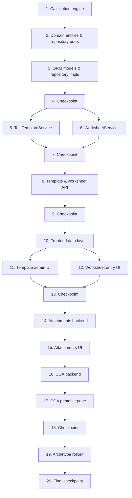

# Implementation Plan

TRF Test Templates, Calculation Engine, Attachments & COA

## Overview

This plan builds the module inside the existing `backend-v2` and `frontend-react` codebases at
`rd-lab-instance`, in dependency order: calculation engine → persistence → application services →
API → frontend → attachments → COA → archetype rollout.

It reuses `AuthService.verify_esignature`, `require_role`/`get_current_user`, `AuditLog`,
`Product`/`TestParameter`/`Specification`, `TestRequestForm`/`TRFTestLine`, `ESignDialog`,
`StatusBadge`, `usePermissions`, and the existing test infrastructure at `backend-v2/tests/`
(`conftest.py`, `pytest-asyncio`, `hypothesis`). Frontend has no test tooling anywhere in the
codebase, matching the established pattern, so no frontend test tasks are included.

**Task 1 is already complete** — the calculation engine is built and verified with 242 passing
tests, including the `Assay by HPLC` sheet reproduced end-to-end from a template definition.

## Task Dependency Graph



```json
{
  "waves": [
    { "wave": 1, "tasks": ["1"] },
    { "wave": 2, "tasks": ["2"] },
    { "wave": 3, "tasks": ["3"] },
    { "wave": 4, "tasks": ["4"] },
    { "wave": 5, "tasks": ["5", "6"] },
    { "wave": 6, "tasks": ["7"] },
    { "wave": 7, "tasks": ["8"] },
    { "wave": 8, "tasks": ["9"] },
    { "wave": 9, "tasks": ["10"] },
    { "wave": 10, "tasks": ["11", "12"] },
    { "wave": 11, "tasks": ["13"] },
    { "wave": 12, "tasks": ["14"] },
    { "wave": 13, "tasks": ["15"] },
    { "wave": 14, "tasks": ["16"] },
    { "wave": 15, "tasks": ["17"] },
    { "wave": 16, "tasks": ["18"] },
    { "wave": 17, "tasks": ["19"] },
    { "wave": 18, "tasks": ["20"] }
  ]
}
```

## Tasks

- [x] 1. Domain calculation engine
  - [x] 1.1 `src/domain/services/calculation/expression.py` — tokenizer, recursive-descent parser,
    tree evaluator, `EMPTY` blank sentinel, 25 built-in functions, `referenced_names()`. No `eval()`.
    - _Requirements: 2.1, 2.2, 2.3, 2.5, 2.6_
  - [x] 1.2 `src/domain/services/calculation/dilution.py` — `DilutionStep`/`DilutionChain` with
    `factor`/`inverse_factor`, rejecting non-physical volumes
    - _Requirements: 3.1, 3.2_
  - [x] 1.3 `src/domain/services/calculation/template_schema.py` — `TemplateDefinition` and its
    `FieldDef`/`GroupDef`/`CriterionDef`/`RowSpec`/`Rounding` value objects, validated at parse time
    - _Requirements: 1.2, 4.3_
  - [x] 1.4 `src/domain/services/calculation/evaluator.py` — `WorksheetEvaluator` with
    dependency-ordered evaluation, cycle detection, row/sequence scoping, criteria assessment
    - _Requirements: 2.1, 2.2, 6.1, 6.2, 6.3_
  - [x] 1.5 Engine unit tests — grammar, blank/rounding semantics, statistics, regression, dilution
    chains, schema validation, dependency ordering, criteria (242 tests passing)
    - _Requirements: 2.1–2.6, 3.1–3.5, 4.6, 6.1–6.3_
  - [x] 1.6 Workbook parity tests — `Assay by HPLC` end-to-end plus Related Substances, Content
    Uniformity, dissolution recursion, titrimetry, gravimetric, blank correction, peak sums
    - _Requirements: 2.3, 2.4, 3.3, 3.4, 3.5_

- [x] 2. Domain entities and repository ports
  - [x] 2.1 Add `TestTemplate` and `TestWorksheet` entities in `src/domain/entities/test_template.py`
    (status guards: `can_edit_definition`, `can_submit`, `can_approve`, `can_deactivate`,
    `new_version`; worksheet guards: `can_edit_values`, `can_confirm`)
    - _Requirements: 1.1, 1.3, 1.4, 2.7, 5.2, 5.3, 5.6_
    - Note: the worksheet status→edit-mode mapping (`edit_mode_for`) lives in the domain as a
      `WorksheetEditMode` enum; the paired role check stays in the application service, which is the
      layer that holds the `User`.
  - [x] 2.2 Add `TemplateCodeGenerator` in `src/domain/services/template_code_generator.py`
    (`TPL-<archetype>-XXXX`), sibling to the existing generators
    - _Requirements: 1.1_
    - Note: deliberately not date-scoped, unlike the MRN/TRF/AR generators — a template is long-lived
      master data, so the sequence runs per archetype and versions share one code.
  - [x] 2.3 Define `ITestTemplateRepository` and `ITestWorksheetRepository` in
    `src/domain/repositories/test_template_repository.py`
    - _Requirements: 1.1, 1.4, 5.2_
  - [x] 2.4 Write unit tests for entity status guards and version cloning
    - **Property 10: Template versioning preserves executed worksheets**
    - **Validates: Requirements 1.4, 2.7**
    - Verified: 42 tests. The version-isolation set asserts the branched definition is deep-copied at
      every level, so mutating a draft cannot alter what an executed worksheet resolves against.

- [x] 3. Infrastructure — ORM models and repository implementations
  - [x] 3.1 Create `src/infrastructure/database/models/test_template_model.py`
    (`TestTemplateModel` with unique `(code, version)`, `TestWorksheetModel` with a unique
    `trf_test_line_id`, both with JSON columns for definition/values/snapshot); register in
    `models/__init__.py`
    - _Requirements: 1.1, 1.4, 2.7, 5.2_
  - [x] 3.2 Implement `TestTemplateRepositoryImpl` and `TestWorksheetRepositoryImpl` in
    `src/infrastructure/database/repositories/test_template_repository_impl.py`
    - _Requirements: 1.1, 1.4, 5.2_
    - Note: `count_by_code_prefix` counts DISTINCT codes, not rows — versions of one template share a
      code, so counting rows would skip sequence numbers as templates are re-versioned.
  - [x]* 3.3 Write a repository smoke test — create template, version it, confirm the prior version
    is untouched, create/fetch a worksheet by test line, verify unique constraints
    - _Requirements: 1.4, 2.7, 5.2_
    - Verified: 13 tests in `tests/calculation/test_template_repository.py`.

- [x] 4. Checkpoint — domain and infrastructure tests pass
  - Verified: full suite 297 passed, 0 warnings. `from src.main import app` imports cleanly with 96
    routes, and both `test_templates` and `test_worksheets` are registered in `BaseModel.metadata`.
  - Note: pytest's `Test*` collection warnings were silenced project-wide via `filterwarnings` in
    `pyproject.toml`. In an analytical-testing domain, production class names like `TestTemplate` and
    `TestWorksheet` are structural, not accidental test classes.

- [x] 5. Application service — `TestTemplateService`
  - [x] 5.1 Implement `src/application/services/test_template_service.py`: `list_templates`,
    `get_template`, `templates_for_test` (Active only), `create_template` (Admin; validates the
    definition through `TemplateDefinition.parse` and rejects circular references by running the
    evaluator once against empty values), `update_definition` (Draft only)
    - _Requirements: 1.1, 1.2, 1.5, 9.1, 10.1_
    - Note: validation is a single `validate_definition` helper doing both passes — parse, then a dry
      run of the evaluator against empty values. The dry run is what catches circular references,
      unparseable expressions and unresolvable `resultRef`s, none of which `parse` alone can see.
      It also runs on `submit_for_approval`, since a seeded or migrated definition never passed
      through `update_definition`.
    - Note: the service takes an `ITestRepository` as well, so `create_template` refuses a `test_id`
      that is not in the Test Master rather than creating a template nothing can select.
  - [x] 5.2 Implement `new_version` (clones an Active template to a new Draft, sets
    `superseded_by_id` on approval, never mutates the source), `submit_for_approval`, `approve`
    (e-signature verified in the endpoint layer, per the existing MRN/TRF pattern), `deactivate`
    - _Requirements: 1.3, 1.4, 9.2, 10.1_
    - Note: supersession happens at **approval**, not at branch time — until a replacement is signed
      off there is no guarantee it will ever be the one in force, so the current Active version stays
      selectable. On approval the older version is deactivated and back-linked in one step, recorded
      as `superseded_template_ids` on the approval audit entry rather than as separate events.
    - Note: only one unapproved version may exist per code. Two concurrent drafts would mean whichever
      was approved second silently discarded the other's work.
    - Deviation: `reject` was added alongside `approve`. `TestTemplate` already had `can_reject`, and
      an approval gate with no way to send work back forces the reviewer to approve or to leave the
      template stuck in `PendingApproval`.
  - [x]* 5.3 Write property test for definition validation rejecting malformed templates
    - **Property 9: A malformed definition never reaches evaluation**
    - **Validates: Requirements 1.2**
    - Verified: `tests/calculation/test_template_service.py`, 7 parametrised cases split between the
      structural failures the parser catches and the relational ones only the dry run catches, each
      asserting nothing was persisted.
  - [x]* 5.4 Write property test for version isolation
    - **Property 10: Template versioning preserves executed worksheets**
    - **Validates: Requirements 1.4, 2.7**
    - Verified: rewriting a branched draft's formula end-to-end leaves v1's expression byte-identical.

- [x] 6. Application service — `WorksheetService`
  - [x] 6.1 Implement `src/application/services/worksheet_service.py`: `create_worksheet` (binds
    template + version, pre-populates context from TRF header / product / batch / session),
    `get_worksheet`, `get_worksheet_for_line`
    - _Requirements: 5.1, 5.2, 10.2_
    - Note: context is resolved **at creation**, not lazily at render time. A worksheet reports the
      batch it was actually run against; resolving lazily would let a later TRF header edit silently
      rewrite history.
    - Note: the bound template is always loaded by `template_id`, never by `(code, latest version)`,
      so a worksheet keeps computing against the version it ran on even after that version is
      re-versioned or deactivated.
  - [x] 6.2 Implement `preview` — evaluates without persisting, so the UI can recalculate live
    without writing to the database or the audit trail
    - _Requirements: 2.1, 2.5_
    - Note: deliberately not role-gated beyond authentication. It exposes no more than a GET plus
      arithmetic, and gating it on the *edit* roles would stop a reviewer seeing the numbers they are
      reviewing.
  - [x] 6.3 Implement `save_values` (Analyst/Admin while the parent TRF is `InProgress`) and
    `correct_values` (QA/Admin while `PendingADGLRelease`), each recording area `source` and writing
    one `AuditLog` entry with changed-field old/new values
    - _Requirements: 4.2, 5.3, 5.6, 9.3, 9.4, 10.2_
    - Deviation: one `save_values` rather than two methods. The permitted mode comes from
      `TestWorksheet.edit_mode_for(trf.status)` and the role must match it, so splitting into
      `save_values`/`correct_values` would have duplicated the whole body to switch one role tuple.
      Correction additionally requires a reason, since it rewrites a result an analyst already
      submitted.
    - Note: every check runs before anything is mutated, which is what makes a rejected mutation a
      genuine no-op rather than a partial write.
    - Note: calculated fields in an incoming payload are dropped, not rejected — the UI round-trips
      the whole worksheet including values it just displayed. Non-overridable context *is* rejected,
      because that would be a client trying to restate the TRF header.
  - [x] 6.4 Implement `confirm_result` — refuses when any blocking criterion fails, captures
    `computed_snapshot`, writes the reportable result to `TRFTestLine.result`, writes an `AuditLog`
    entry
    - _Requirements: 2.7, 5.4, 5.5, 6.3, 10.3_
    - Note: `_format_result` must not re-round. The template's declared rounding has already been
      applied by the engine, so this only trims float-repr artefacts (`108.83799999999999`) that
      would otherwise leak into a GxP record.
    - Note: a correction after confirmation reopens the worksheet but **retains** the prior snapshot
      until the next confirmation replaces it, so there is never a window where a TRF carries a result
      with no supporting snapshot.
  - [x]* 6.5 Write property test for the blocking-criteria gate
    - **Property 11: Blocking criteria gate result confirmation**
    - **Validates: Requirements 5.5, 6.3**
    - Verified: a failing %RSD blocks confirmation, leaves no snapshot, and — the part that matters —
      leaves the test line's result `None`. The same criterion marked `advisory` confirms while still
      recording `passed: false` in the snapshot.
  - [x]* 6.6 Write property test for status/role-gated mutation leaving state unchanged when rejected
    - **Property 12: Worksheet mutation respects TRF status and role**
    - **Validates: Requirements 5.3, 5.6, 9.3, 9.4**
    - Verified: all 7 non-permitting TRF statuses parametrised, plus wrong-role cases in both modes,
      each asserting the stored values are unchanged afterwards.
  - [x]* 6.7 Write property test for the confirmed result reaching the test line unchanged
    - **Property 13: Confirmed results reach the test line unchanged**
    - **Validates: Requirements 5.4, 5.7**
    - Verified: hand-derived `101000 / mean(100500, 99500) * 100 = 101.0` arrives as `101 %` and
      survives a reload; a 2dp `100.34` arrives as `100.34 %`, neither re-rounded nor repr-mangled.
  - [x]* 6.8 Write property test for area source always being recorded
    - **Property 14: Area source is always recorded**
    - **Validates: Requirements 4.2, 4.5**
    - Verified: every populated area field appears in the audit entry's `area_sources`, and
      unpopulated ones are absent rather than falsely claimed.

- [x] 7. Checkpoint — application service tests pass
  - Verified: full suite **352 passed, 0 warnings** (up from 297). 20 template-service tests, 35
    worksheet-service tests.
  - Note: `test_template_service.py` had been written before the service existed, so the service was
    made to fit the tests rather than the reverse — hence `approve(id, actor)` / `reject(id, actor,
    reason)` / `deactivate(id, actor)` putting the actor second, and the `TEMPLATE_*` audit action
    names.

- [x] 8. API layer — template and worksheet endpoints
  - [x] 8.1 Add Pydantic schemas in `src/api/v1/schemas/test_template_schemas.py`
    (`TestTemplateResponse`, `CreateTemplateRequest`, `UpdateDefinitionRequest`,
    `WorksheetResponse`, `SaveWorksheetRequest`, `WorksheetPreviewResponse` including per-field
    computed values and criterion results, `EsignActionRequest`)
    - _Requirements: 1.1, 2.1, 5.2, 6.1_
    - Note: `definition`, `context_values` and `group_values` pass through as loose JSON. Modelling
      them field-by-field in Pydantic would duplicate a schema `TemplateDefinition.parse` already
      owns, and would reject templates the engine can actually run.
    - Note: added `TestTemplateSummaryResponse` for list responses — the definition bodies run to
      tens of kilobytes and the catalogue view never reads them.
    - Note: the preview/save request fields are nullable rather than defaulting to `{}`, because
      `None` ("leave stored values alone") and `{}` ("clear them") are different instructions.
  - [x] 8.2 Add `Container.get_test_template_service(session)` and
    `Container.get_worksheet_service(session)` to `src/config/dependency_injection.py`
    - _Requirements: (wiring)_
    - Note: the DI wiring already expected a `ProductRepositoryImpl` on `WorksheetService`, so the
      service gained it and context seeding now resolves `product.code` / `product.name` /
      `product.material_type` / `product.storage_condition` as well as the TRF header and session.
      This matches the design's "context from TRF header / product / batch / session".
  - [x] 8.3 Implement `src/api/v1/endpoints/test_template_endpoints.py` with a `/test-templates`
    router: `GET /` (list, any role), `GET /{id}`, `GET /for-test/{test_id}` (Active only),
    `POST /` (Admin), `PUT /{id}/definition` (Admin), `POST /{id}/new-version` (Admin),
    `POST /{id}/submit` (Admin), `POST /{id}/approve` (Admin/Supervisor/QA, e-signed),
    `POST /{id}/deactivate` (Admin)
    - _Requirements: 1.1, 1.3, 1.5, 9.1, 9.2, 9.6_
    - Also added: `GET /{id}/versions`, `PUT /{id}` (header only), `POST /{id}/reject`.
  - [x] 8.4 Implement `src/api/v1/endpoints/worksheet_endpoints.py`:
    `POST /trf/test-lines/{line_id}/worksheet` (create),
    `GET /trf/test-lines/{line_id}/worksheet`,
    `POST /worksheets/{id}/preview` (compute without persisting),
    `PUT /worksheets/{id}/values` (Analyst/Admin or QA/Admin by TRF status),
    `POST /worksheets/{id}/confirm`
    - _Requirements: 5.1, 5.3, 5.4, 5.6, 9.3, 9.4, 9.6_
    - Note: two prefixes on one router. A worksheet is created and found through its TRF test line
      but addressed by its own id thereafter; nesting the mutation routes under the line as well
      would make every save carry a redundant id the service would have to re-verify.
    - Note: the `require_role` guards here are the *outer bound* — the union of roles that could
      ever be permitted. The real decision is `WorksheetService`'s, because it depends on the parent
      TRF's status, which a static role dependency cannot express. Consequence worth knowing: a QA
      user hitting `/confirm` gets a 403 from the route before the service's status check ever runs.
    - Also added: `GET /worksheets/{id}`, `GET /trf/{trf_id}/worksheets` (the latter is what COA
      compilation will read).
  - [x] 8.5 Register both routers in `src/api/v1/router.py`
    - _Requirements: (wiring)_
    - Verified: 115 routes register (up from 96); all 16 new paths present.
  - [x]* 8.6 Write integration tests: role-gated 403s per endpoint; the full worksheet lifecycle
    (create → save → preview → confirm → result visible on the test line); confirm rejected while a
    blocking criterion fails
    - _Requirements: 5.1, 5.3, 5.4, 5.5, 9.1, 9.2, 9.3, 9.4_
    - Verified: `tests/calculation/test_template_api.py`, 11 tests driving the real ASGI app through
      `httpx.ASGITransport`. Only `get_session` and `get_current_user` are overridden — deliberately
      **not** `require_role`, since each call builds its own closure and cannot be overridden by key,
      so the asserted 403s come from the app's real guard rather than a test double.
    - Note: the lifecycle test ends by reading `GET /trf/{id}`, confirming the result is visible on
      the TRF's own projection and not just in the confirm response.

- [x] 9. Checkpoint — all backend tests pass
  - Verified: full suite **363 passed, 0 warnings**. App imports with 115 routes.
  - Cleanup done here rather than deferred: 13 class-based pydantic `Config` blocks across 9 existing
    schema modules were migrated to `model_config = ConfigDict(from_attributes=True)`. They had been
    invisible until this task, because these are the first tests to import `src.main` and therefore
    the first to load those modules. Leaving them would have meant every future checkpoint reporting
    13 warnings it had to explain away.

- [x] 10. Frontend — data layer
  - [x] 10.1 Add `features/test-templates/models/testTemplate.types.ts` (template, definition field
    descriptors, worksheet, preview response, criterion result)
    - _Requirements: 1.1, 2.1, 6.1_
    - Note: the definition types mirror `template_schema.py` closely enough for one generic form to
      render any template. That is the point of the archetype reduction, so the UI contains no
      per-archetype branching anywhere.
    - Note: `CriterionResult.passed` is `boolean | null`, and `null` ("not yet assessable — the
      observed value is blank") is rendered distinctly from `false`. Collapsing the two would have
      analysts chasing failures that do not exist yet on a half-filled sheet.
  - [x] 10.2 Add `features/test-templates/api/testTemplateApi.ts` and
    `features/test-templates/api/worksheetApi.ts`, following the existing `trfApi.ts` conventions
    - _Requirements: 1.1, 5.1, 5.3, 5.4_
    - Note: `worksheetApi.getForLine` converts the backend's 404 into `null`. A test line without a
      worksheet is a normal state, not an error every caller should have to catch.
  - [x] 10.3 Add TanStack Query hooks in `features/test-templates/hooks/` — template list/detail/
    mutations, and worksheet create/get/save/confirm plus a debounced `usePreview` for live
    recalculation
    - _Requirements: 2.1, 5.3_
    - Note: `usePreview` is deliberately **not** a `useQuery`. The values being previewed are
      transient form state, so caching them by key would fill the cache with entries stale on the
      next keystroke. It keeps one in-flight request, one result, a monotonic token so a slow earlier
      response cannot overwrite a later one, and a `stale` flag the form uses to dim computed columns.
    - Note: template mutations invalidate the list and the per-test picker, not just the mutated id —
      approval supersedes a *different* row and changes which templates are selectable.
    - Note: worksheet mutations also invalidate `trf-detail`, since a confirmed result lands on the
      test line and the TRF's own projection would otherwise show the old value.
  - [x] 10.4 Add `features/test-templates/models/archetypes.ts` and `describeDefinition.ts`
    - Archetype list is presentation metadata only; the backend accepts any archetype string and uses
      it solely to scope the generated code. Keeping it client-side means a new archetype can be
      piloted without a deployment.
    - `STARTER_DEFINITION` is a complete, valid, *runnable* single-standard assay rather than an empty
      shell, so an author edits from something that computes instead of debugging a blank definition
      into life.
    - `describeDefinition` reads a definition defensively — an author is editing raw JSON, so it must
      tolerate a half-written shape without throwing and blanking the page.

- [x] 11. Frontend — template admin UI
  - [x] 11.1 Implement `features/test-templates/pages/TemplateListPage.tsx` — `DataTable` with
    `StatusBadge`, archetype and status filters, "New Template" for Admin
    - _Requirements: 1.1, 9.1_
  - [x] 11.2 Implement `features/test-templates/pages/TemplateDetailPage.tsx` — header fields, a
    JSON definition editor with client-side parse feedback, and the lifecycle actions (submit,
    approve via `ESignDialog`, new version, deactivate) gated by status and role
    - _Requirements: 1.1, 1.2, 1.3, 1.4, 9.1, 9.2_
    - Note: the editor parses on every keystroke so a syntax error is the author's to see
      immediately. Server-side validation still runs on save — the client cannot see the dependency
      graph, so a circular reference is only caught there.
    - Note: local editor state resets on `template.id`/`modified_date` change, so a stale draft can
      never be saved onto a different record (relevant because "New Version" navigates to a new id).
    - Note: a summary panel counts inputs / areas / calculated fields / criteria and warns when
      `resultRef` is unset, since such a template can never publish a result to a test line.
    - Also added: reject with a mandatory reason, version-history navigation.

- [x] 12. Frontend — worksheet entry UI
  - [x] 12.1 Implement `features/test-templates/components/WorksheetForm.tsx` — renders any template
    definition generically: context block (read-only unless overridable), singleton groups as field
    grids, `table`/`sequence` groups as editable `DataTable`s with add/remove row, calculated fields
    read-only and visibly derived, area fields flagged as manual-entry pending the Waters integration
    - _Requirements: 4.1, 4.3, 5.3_
    - Deviation: multi-row groups render as a plain `<table>` rather than a PrimeReact `DataTable`.
      A worksheet row has an editor in every cell and no sorting, filtering or pagination; `DataTable`
      cell editing would have fought the live-recalculation flow for control of focus.
    - Note: computed values are **never** held in form state. They come back from the server's
      preview, so the analyst sees what the engine computed rather than a TypeScript
      re-implementation that could silently diverge from the Python one.
    - Note: area fields carry a chart icon and a tooltip naming the pending Waters integration, so it
      is visible at the point of entry that these are transcribed by hand today.
  - [x] 12.2 Wire live recalculation through `usePreview`, showing computed values and criterion
    pass/fail inline, with blocking failures called out prominently
    - _Requirements: 2.1, 6.1, 6.4_
    - Note: computed cells dim while a recalculation is pending, so an analyst is never reading a
      number that no longer corresponds to what is on screen.
  - [x] 12.3 Add worksheet entry to `TRFDetailPage.tsx` — template picker when a test line's Test has
    Active templates, "Open Worksheet" for lines that have one, and a "Confirm Result" action that
    writes back to the line; preserve the existing free-text result path for lines without a template
    - _Requirements: 5.1, 5.2, 5.4, 5.7_
    - Implemented as `TestLineWorksheetPanel` in a `DataTable` row expansion, collapsed by default —
      a TRF can carry many lines and a worksheet is large.
    - **Revised after user feedback: the worksheet was too well hidden.** It was reachable only by
      clicking a bare row expander with nothing to suggest anything was behind it, which made a
      calculation sheet look like an optional extra rather than the substance of the test. Three fixes:
      1. A **Calculation** column (`WorksheetStatusCell`) on every test line, showing `Calculated` with
         the template code and version, `Worksheet open`, `Template available` when one exists but is
         unused, or `Free text` when the Test has no template. Driven by two summary queries
         (`useWorksheetsForTrf` + Active `useTemplateList`) — no definitions, no values.
      2. When a Test has exactly **one** Active template the picker is replaced by the template's name.
         There was no choice to make, so staging one as if there were was noise.
      3. The Add Test Line dropdown marks templated tests, so the initiator knows before adding a line
         that the analyst will get a worksheet for it.
    - Note: the free-text result column is untouched. When a Test has no Active template the panel
      says so and steps aside, which is what makes templating additive rather than a migration.
    - Note: the panel mirrors the backend's status→role→mode rule so it never offers an action that
      would 403, and it collects the mandatory correction reason up front rather than letting the
      save fail with a 400 the analyst has to decode.
  - [x] 12.4 Add routes and nav: `features/test-templates/index.ts` barrel, `/test-templates` and
    `/test-templates/:id` in `AppRouter.tsx`, a "Test Templates" nav item in `MainLayout.tsx`, and a
    `testTemplates` key in `MENU_ACCESS` in `usePermissions.ts`
    - _Requirements: 1.1, 9.6_
    - Also added `PendingApproval` and `Confirmed` to `StatusBadge`'s severity map. `Pending Approval`
      (with a space) was already there for products; the template/worksheet statuses have no space and
      would have silently fallen through to `secondary`.

- [x] 13. Checkpoint — frontend builds and the worksheet flow works end to end
  - Verified: `tsc -b && vite build` clean — a fresh bundle was emitted (`index-44oASE95.js`,
    previously `index-BgxOwKEk.js`), and the language server reports no diagnostics across all nine
    new/changed frontend modules. Backend suite still 363 passed.
  - The create → enter → confirm → result-on-test-line path is already covered end to end at the HTTP
    level by `test_full_worksheet_lifecycle` in task 8.6, which finishes by reading `GET /trf/{id}`.
  - Dev servers running for manual exercise: backend `127.0.0.1:8443`, frontend `localhost:5174`.
  - Note: `npm` output is unreadable through this shell (leading characters are eaten and redirects
    truncate). Build success was confirmed from the emitted bundle hash plus language-server
    diagnostics rather than from captured stdout.

- [x] 14. Attachments — backend
  - [x] 14.1 Add the `TRFAttachment` entity, `ITRFAttachmentRepository` port, ORM model, and
    repository implementation
    - _Requirements: 7.1_
    - Note: `trf_test_line_id` is nullable. A chromatogram supports one test while a signed batch
      record supports the whole request; forcing every file onto a line would misfile the latter.
    - Note: `storage_name` is uniquely constrained — a collision would mean one upload silently
      overwriting another's bytes.
    - Note: `size_display` is computed server-side so every client renders sizes identically. KB is
      the smallest unit shown; "0.4 KB" reads better in a list than "409 bytes" next to megabytes.
  - [x] 14.2 Add `ATTACHMENT_STORAGE_PATH`, `ATTACHMENT_MAX_BYTES`, and
    `ATTACHMENT_ALLOWED_CONTENT_TYPES` to `src/config/settings.py`
    - _Requirements: 7.2, 7.3, 7.6_
  - [x] 14.3 Implement `src/application/services/attachment_service.py` — `upload` (validates
    content type against the allow-list *and* checks the file signature, enforces the size cap,
    writes under a generated storage name, never trusting the client filename as a path), `list_for_trf`,
    `open_stream`, `delete` (refused once the TRF is `Released`); one `AuditLog` entry per upload/delete
    - _Requirements: 7.1, 7.2, 7.3, 7.5, 7.6, 7.7_
    - Deviation: `open_path` returning a `Path`, not `open_stream`. The endpoint hands it to
      `FileResponse`, which streams more efficiently than an application-level generator.
    - **Upload is streaming, not read-then-validate.** The size cap is checked per 64KB chunk and the
      signature on the first chunk, so a large hostile upload is cut off early rather than buffered in
      full. Cheap checks (role, TRF status, test line, content type) all run before any byte is read.
    - Path traversal is *unreachable* rather than filtered: the client filename contributes only a
      sanitised extension to a name built from a UTC timestamp plus 16 bytes of `secrets` entropy.
      `LocalFileStorage._resolve` is the single choke point and refuses separators, absolute paths,
      dot-segments, and anything that resolves outside the root.
    - Writes are staged through a hidden `.part` sibling and renamed on commit, so a rejected upload
      never leaves a truncated file that would look like a complete attachment. This matters precisely
      because the cap is discovered part-way through.
    - Ordering detail: in `delete`, the release check runs **before** the ownership check, so an Admin
      gets the records-integrity message rather than being told they lack permission. Release is not
      something a role overrides.
    - On a repository failure after the bytes land, the stored file is removed — an orphan is invisible
      to the application and impossible to clean up through it.
    - Note: upload is Admin/Analyst only. Supervisor and QA review raw data but do not produce it, so
      they can list and download without being able to attach.
  - [x] 14.4 Implement `src/api/v1/endpoints/attachment_endpoints.py` —
    `POST /trf/{id}/attachments` (multipart, Analyst/Admin), `GET /trf/{id}/attachments`,
    `GET /attachments/{id}/download` (streamed), `DELETE /attachments/{id}`; wire DI and register
    the router
    - _Requirements: 7.1, 7.4, 7.5_
    - Downloads are served **through** the API, never from a static directory, so each one carries the
      same authentication as the rest of the TRF. `**/storage/attachments/` was added to `.gitignore`.
    - The response schema omits `storage_name` — it is the only value mapping to a path, and exposing
      it would invite a client to construct its own download URL.
    - `Content-Disposition` strips quotes and newlines from the filename: it is client-supplied and
      would otherwise permit header injection.
    - Also added `GET /attachments/limits` (so the UI can pre-reject a bad file) and
      `GET /trf/test-lines/{id}/attachments`.
  - [x]* 14.5 Write property test for upload validation
    - **Property 15: Attachment validation cannot be bypassed**
    - **Validates: Requirements 7.2, 7.3, 7.6**
    - Verified: `tests/calculation/test_attachment_service.py`. As with the template service, these
      tests **already existed** from an earlier session and the implementation was made to fit them —
      hence `storage_path` as a plain string on the constructor, keyword-only `upload(...)`, and the
      streaming `stream=` parameter. My own first draft (read-all-bytes, an injected `IFileStorage`, an
      `AttachmentKind` enum) was discarded in favour of the contract the tests define; `kind` had no
      test behind it, so it was dropped rather than kept as unused surface.
  - [x]* 14.6 Write integration tests: upload/list/download round trip, rejection of a disallowed
    content type, rejection of a file whose signature does not match its declared type, rejection of
    an oversized file, and delete refused on a `Released` TRF
    - _Requirements: 7.2, 7.3, 7.5_
    - Verified: `tests/calculation/test_attachment_api.py`. Full suite **399 passed, 0 warnings**.
    - One expectation of mine was wrong and the test was right: I had `size_display` showing bytes
      below 1KB, but the test requires KB for a 409-byte file. Fixed the implementation, not the test.

- [x] 15. Attachments — UI
  - [x] 15.1 Add attachment types, API module, and hooks under `features/trf/`
    - _Requirements: 7.1, 7.4_
    - Note: the download helper fetches as a blob and saves via a temporary object URL. A plain
      `<a href>` cannot work — the endpoint needs the bearer token, which a browser-initiated
      navigation would not send. The object URL is revoked on the next tick, since revoking
      synchronously cancels the download in some browsers.
    - Note: `Content-Type` is deliberately left unset on the multipart POST so the browser supplies it
      with the boundary. Setting it by hand breaks the upload.
    - Note: `useAttachmentLimits` is `staleTime: Infinity` — it is deployment configuration, not data.
  - [x] 15.2 Add an attachments panel to `TRFDetailPage.tsx` — PrimeReact `FileUpload` gated by role
    and TRF status, a list with filename/size/uploader/timestamp, download links, and delete for
    non-released TRFs
    - _Requirements: 7.1, 7.4, 7.5_
    - Deviation: a plain `<input type="file">` rather than PrimeReact `FileUpload`. The panel needs the
      file held alongside a scope dropdown and a description before posting, and `FileUpload`'s custom
      upload mode would have been fought for control of that.
    - Client-side type/size checks are a courtesy that saves a round trip; the server enforces all
      three regardless. An empty `file.type` (browser could not determine it) is passed through rather
      than guessed at.
    - Upload and delete controls are hidden entirely once the TRF is Released, for every role including
      Admin — matching the backend, where this is records integrity rather than permission.
    - `usePermissions` gained a `username`, because the delete rule is ownership-based rather than
      role-based. Several future rules will want it too.

- [x] 16. COA — backend
  - [x] 16.1 Add the `CertificateOfAnalysis` entity, `COANumberGenerator`
    (`COA-YYYYMMDD-XXXX`), repository port, ORM model, and repository implementation
    - _Requirements: 8.1, 8.3_
    - **`ICOARepository` has no `update` and no `delete`.** Immutability is structural rather than a
      rule someone has to remember — there is no method to misuse. A correction is a new certificate
      that supersedes the old one, which is also why `(product_id, batch_number)` is deliberately
      *not* unique.
    - Note: the verdict logic (`evaluate_result`, `overall_verdict`, `format_specification`) lives in
      the domain entity module, not the service. It is the certificate's central claim and is pure —
      which is what let it be covered by 25 parametrised cases with no database.
  - [x] 16.2 Implement `src/application/services/coa_service.py` — `generate` compiles released TRF
    results for a product/batch (worksheet-derived where a template was used, free-text otherwise),
    resolves each test's specification limits, determines pass/fail, captures an immutable snapshot
    including the release signature chain, and writes an `AuditLog` entry; `get`; `list`
    - _Requirements: 8.1, 8.2, 8.3, 8.5, 8.6, 9.5, 10.4_
    - **Pass/fail is conservative.** Anything that cannot be compared to a numeric limit returns
      `NotEvaluated`, never `Pass` — no numeric result, no limits at all, or a qualitative test. And if
      nothing failed but nothing could be evaluated either, the *overall* verdict is `NotEvaluated`
      too: a certificate must not claim a pass it never established.
    - **Worksheet results come from `computed_snapshot`, not `TRFTestLine.result`** — resolving the
      follow-up raised in task 15. That column is a formatted string shared with the free-text path
      (`"108.84 %"`); the snapshot carries the number and unit separately, so nothing is parsed back
      apart. It also yields the template code and the *version* that produced the number.
    - Free-text results are parsed only when the **whole** string is a number plus an optional unit.
      `"99.8 %"` and `"1.5 mg/mL"` qualify; `"Not more than 0.1"` and `"90.0 % to 110.0 %"` do not.
      Mining a number out of prose would invent a comparison the analyst never made.
    - A retest supersedes rather than duplicates: TRFs are fetched oldest-first and rows are keyed by
      `test_id`, so the latest released result wins while every contributing TRF stays referenced in
      the header and signature list.
    - Rows are ordered by the specification, so the certificate reads in the lab's own sequence.
      `display_in_coa = False` excludes a test; a test with no specification entry is still reported
      (with `NotEvaluated`), since hiding a performed and released test would be worse than admitting
      there is no limit for it.
    - A test line released without a result is omitted — an empty row would imply it was reported.
    - Only an **Active** specification is used; a draft must not silently apply limits.
    - Added `ITRFRepository.list_released_for_batch` rather than filtering `list_all()`. This runs on
      every COA generation and would otherwise load every TRF in the system to find a handful.
    - Deviation: added `preview()`, which compiles without persisting. A certificate is immutable, so
      committing a signature to a document nobody had seen would be unfixable.
  - [x] 16.3 Add schemas, `Container.get_coa_service`, and
    `src/api/v1/endpoints/coa_endpoints.py` (`POST /coa` e-signed QA/Admin, `GET /coa`,
    `GET /coa/{id}`); register the router
    - _Requirements: 8.1, 8.3, 8.5, 9.5, 9.6_
    - Note: `snapshot` passes through as loose JSON. It is an immutable historical document — a
      certificate issued today must still deserialise years from now, and a strict model would start
      rejecting older snapshots the first time the shape evolved.
    - Also added `POST /coa/preview`, restricted to the issuer roles since it is a pre-signature
      review step rather than a document anyone needs to read.
    - No PUT or DELETE route exists, so an edit attempt is a 405 rather than a permission decision
      that could be misconfigured later.
    - Fixed while here: `get_attachment_service` had been duplicated in the container by an earlier
      edit. Only the second definition was live, so behaviour was correct, but the dead copy would
      have been a trap.
  - [x]* 16.4 Write property test for COA snapshot immutability
    - **Property 16: Released records are immutable**
    - **Validates: Requirements 7.5, 8.3, 2.7**
    - Verified: the test renames the product, retires the specification, **and tightens the limits so
      the certified result would now fail**, then asserts the snapshot is byte-identical and still
      reports Pass against the limits in force at issue.
  - [x]* 16.5 Write integration tests: generation from released TRFs, rejection when no released
    results exist, and pass/fail determination against specification limits
    - _Requirements: 8.1, 8.5_
    - Verified: 73 tests across `test_coa_service.py` and `test_coa_api.py`. Full suite
      **472 passed, 0 warnings**.

- [x] 17. COA — printable page
  - [x] 17.1 Add COA types, API module, and hooks under `features/coa/`
    - _Requirements: 8.1_
    - Note: `useCoa` is `staleTime: Infinity` — a certificate is immutable, so once fetched it never
      needs refetching. `usePreviewCoa` is a mutation rather than a query, because caching a
      compilation would mean showing a stale one after new results were released.
  - [x] 17.2 Implement `features/coa/pages/CoaListPage.tsx` and
    `features/coa/pages/PrintCoaPage.tsx` — header block, per-test table (test, specification,
    result, pass/fail), and the signature chain, following the existing `PrintATRPage` browser-print
    pattern; add routes (print route outside `MainLayout`) and nav
    - _Requirements: 8.2, 8.4, 8.6_
    - **Generation is two-step: Compile, then Sign & Issue.** QA sees the full compiled table —
      including any Fail or NotEvaluated row, and a warning when the product has no Active
      specification — before the signature dialog opens.
    - `VerdictTag` is separate from `StatusBadge` because `NotEvaluated` must read as neutral, not as a
      failure. On the printed page the three verdicts render as "Complies" / "Does Not Comply" /
      "Reported (no numeric limit)" — an explicit statement rather than a blank, so a reader is never
      left inferring a verdict that was never established.
    - The print page reads defensively from the snapshot throughout and re-resolves nothing, so
      reprinting an old certificate reproduces the document that was issued.
    - `/coa/:id/print` sits outside `MainLayout`, matching the ATR and Stability print routes.

- [x] 18. Checkpoint — attachments and COA verified end to end
  - Verified: backend **472 passed, 0 warnings**; frontend `tsc -b && vite build` clean (322 modules).
  - Verified live against the dev backend: released the templated TRF, previewed, and issued
    `COA-20260808-0001`. The worksheet-derived row came through as `108.84` with unit `%` read from
    the worksheet snapshot, carrying `TPL-A1-0001 v1`, and the snapshot was byte-identical on
    re-fetch. Analyst was correctly refused with a 403; an unknown batch returned a 400.
  - **Finding from that run, needs a lab decision:** the seeded specification for `TST-03`
    (Assay (Propofol)) has limits `9 to 11`, while the A1 template reports **% assay**. So the
    certificate correctly read `108.84 %` and correctly called it a Fail against the limits on file.
    This is a seed-data unit mismatch, not a code defect — but it shows the COA has no way to detect
    that a result and its specification are in different units. Worth deciding whether
    `SpecificationTest` should carry a unit that is checked against the template's `result_unit`.

- [x] 19. Archetype rollout — seed templates
  - [x] 19.1 Add `scripts/seed_test_templates.py` and seed archetype A1 (`Assay by HPLC`) from the
    definition already validated in `tests/calculation/test_assay_template_e2e.py`
    - _Requirements: 1.6_
    - Pulled forward out of wave order: with no template seeded there was nothing for the TRF test
      line picker to offer, so none of tasks 10–13 could actually be exercised in the browser.
    - Note: the script is **additive and idempotent**, unlike `seed_data.py` which drops the schema.
      It may run against a database holding real worksheets, and a dropped table would take their
      GxP snapshots with it. Templates already present by code are skipped.
    - Note: seeds `Active` with `approved_by = "seed"` (not a username) so it is visible that no human
      signed it off; `--draft` seeds unapproved for a validated environment.
    - Note: each definition is validated before insert with the same two passes the service runs —
      parse, then a dry evaluation. A seed inserting an unevaluable template would otherwise fail at
      result entry rather than here.
    - **Two fixes were needed to the reference definition** before it was usable through the
      application rather than only through the evaluator, both worth knowing:
      1. Its context `source` paths (`product.labelClaim`, `sample.avgWeight`, `test.methodNo`,
         `session.user`) are not ones `WorksheetService._seed_context` resolves. The e2e test drove
         the evaluator directly and passed context in by hand, so nothing had ever resolved them.
      2. `instrument_id` had no source, was not `overridable`, and had no default — which makes a
         context field **permanently blank and unfillable**. See the follow-up note below.
    - `label_claim` is deliberately not sourced from `trf.label_claim`: that column is free text
      ("50 mg/vial") and the field is a divisor, so a string would blank the whole assay chain.
    - Verified through the live API end to end: TRF → test line (TST-03) → submit → FDGL → ADGL →
      analyst accept → worksheet → preview → save → confirm. Standard conc 5.023676 ppm, mean STD area
      252614.6, %RSD 0.2946, prep assays 108.795 / 108.882, reportable **108.84 %** published to the
      test line, all three criteria assessed. Matches the source workbook.
  - [x] 19.2 Seed the remaining shared-engine archetypes: A2 multi-analyte content, A3 saturation
    solubility, A9 titrimetry, A10 gravimetric, A13 trace/nitrosamine
    - _Requirements: 1.6_
    - Definitions moved out of the seed script into `scripts/template_definitions/`, one module per
      archetype family, sharing `_common.py`. With 14 templates a single inline script would have run
      to thousands of lines; these are GxP artefacts that get read and reviewed, so readability is a
      requirement rather than a preference.
    - `_common.py` holds the dilution-chain and standard-block builders. Decision 7 held up — the
      `Vol/Pip`, `Dilution-n/Volume-n` and `V.F./Dil.` variants really are one algebra, so a template
      now declares which stages it uses instead of restating the arithmetic. A fix to the chain can no
      longer be applied to some templates and missed in others.
    - A2: the `_mgvial_` and `_mgmL_` workbooks are one template with a `vial_factor` context field,
      confirming the ×12.5 finding from the analysis. Peak sums use
      `if(sum([...]) = 0, blank(), sum([...]))` so an un-injected row reads blank, not as a zero
      response.
    - A9/A10 carry no standard block or area fields at all. Forcing them through the HPLC shape would
      ask the analyst for injections that do not exist.
    - A13 subtracts the blank **before** the concentration chain and makes blank interference a
      *blocking* criterion — a blank that large means the method cannot support the level being
      reported. Its result truncates rather than rounds, which for an impurity is the safe direction:
      truncation cannot round a result up across a limit.
  - [x] 19.3 Seed A4 Related Substances (RRF mode flag, per-row LOQ/BLQ, sum-of-rounded totals) and
    A5 area normalisation
    - _Requirements: 1.6_
    - All three behaviours from the recovered `.xls` formulas are reproduced: RRF as a mode
      (multiplication vs division), `BLQ` as *text* rather than a number below LOQ, and the total as
      `SUM(ROUND(...))` not `ROUND(SUM(...))`. The last has a dedicated test — three impurities at
      0.0004 total 0.000, whereas rounding the sum would give 0.001.
    - Below-LOQ rows contribute 0 to the total. This is the common pharmacopoeial convention but **is**
      a convention, so it is called out below rather than buried.
    - Both totals are guarded with `if(isblank(mean(...)), blank(), ...)`. `sum([])` is 0 by Excel
      semantics, so without the guard a fresh worksheet reported "Total impurities: 0.000 %" — a
      positive claim of purity from an analysis nobody had run. Found by the empty-sheet test.
  - [x] 19.4 Seed A6 dissolution variants (a: without replacement, b: with replacement/whole vial,
    c: bottle-rotating per-unit weight) using `sequence` groups and the generated volume model
    - _Requirements: 1.6_
    - Release has to be tracked **per unit across timepoints**, since each vessel must independently
      meet Q — a 2-D grid against 1-D groups. Timepoints must be the row axis because the carry-over
      correction is recursive over *earlier* timepoints, so the six units become generated columns.
      27 calculated fields per row; built by a loop so the source stays readable while the output is
      still plain data.
    - Volume series is derived from `rowno` (`initial - (rowno-1) * withdrawal`), reproducing the
      sheets' hard-coded 500/495/490/485 without a constant that can go stale.
    - `sum(prior.correction_n)` replaces the sheets' hard-coded `C73+D73+E73+…`. This is what sequence
      groups were added for.
  - [x] 19.5 Seed A8 Content Uniformity (HPLC and weight-variation)
    - _Requirements: 1.6_
    - The USP <905> Acceptance Value nesting order is load-bearing: testing the upper bound outermost
      and the lower bound inside. Reversing them silently breaks every batch whose mean sits below
      98.5, so both out-of-window branches have their own test.
    - `k` is an overridable context field rather than an `if(n=10, 2.4, 2.0)` lookup. A hard-coded
      lookup produces a wrong AV silently if someone runs a 30-unit stage-2 test on a 10-unit template.
    - The weight-variation variant has no standard block at all, which is why it is a separate template
      rather than a flag.
  - [x]* 19.6 Write a parity test per seeded template, transcribing its source sheet's own inputs and
    hand-deriving the expected values from the formula rather than copying cached cells
    - _Requirements: 2.3, 2.4, 3.3, 3.5_
    - Verified: `tests/calculation/test_seeded_template_parity.py`, **122 tests**. Tests the *seeded
      templates* — the thing an analyst actually uses — not just that the engine can express a formula.
    - Four catalogue-wide invariants apply to every template: it runs empty without error, its
      `resultRef` resolves, no context field is unfillable (the trap found in A1), and every area field
      is discoverable through `area_field_refs` so the Waters adapter cannot miss one.
    - The discipline paid off again. Three real defects surfaced, none of which a
      copy-the-output approach would have caught:
      1. **A4 referenced sample-prep fields that were out of scope.** Bare names only resolve within
         the current row, so `sample_weight` from an impurity row silently evaluated to blank and took
         the entire percentage with it. `sample_chain_terms(group=...)` now qualifies them.
      2. **A4/A5 reported a false 0.000 % total on an empty sheet** (above).
      3. Two of my own test fixtures were wrong, not the code — A8 and A6c needed an average unit
         weight consistent with their label claim.

  - [x] 19.7 Seed the five archetypes held back by Decision 13 — A6d Franz-cell IVRT, A7 f1/f2
    profile comparison, A11 microbial bioassay, A12 derived roll-ups, A14 linearity — and pin each to
    its source workbook
    - _Requirements: 1.6, 2.3, 2.4_
    - Both questions that had blocked A7 and A12 turned out to be answerable from the workbooks
      rather than needing the lab, which is why they moved. See the resolutions in design.md; each
      module docstring carries the reasoning and what was deliberately *not* reproduced.
    - The engine needed **no changes at all** for any of the five, which is the strongest evidence so
      far for Decision 7. A11 was the test case: its reference dose reads `curve.ref_grand` while
      `curve.ref_grand` reads `standard.ref_avg`, and that only resolves because dependency tracking
      is per *field* — the fix made in task 20. A per-group model rejects the template outright.
    - Parity tests: **76 added, suite 656 → 732.** Three reproduce figures the sources state outright,
      which is what makes them parity rather than regression tests:
      1. **A7 returns f1 = 5.9**, the workbook's own figure, on the sheet's hand-typed comparison
         block. Dividing by the test series instead — taking the swapped headings at face value —
         gives 6.3. The test asserts 5.9 precisely so that swap cannot silently return.
      2. **A12 returns 95.07 % entrapped**, not the 95.15 % the uncorrected reference slip produces,
         and a companion test asserts `free + entrapped` sums to the label claim by construction.
      3. **A6d reproduces four cached values** from the Franz workbook — theoretical 3.5773556 ppm,
         slope 53797.61, 135.344 µg at 40 min, and the 19.3349 µg carry-over at 80 min. The whole
         dataset is transcribed (six calibration levels, six cells, six timepoints) because that
         legacy `.xls` lost its formulas: every relation was reverse-engineered from cached numbers,
         so reproducing them is the only evidence the reverse-engineering was right.
    - The A6d source data legitimately **fails one advisory criterion** — flux spreads 18 % across
      cells against a 15 % convention — while the calibration line fits, every QC recovers and each
      cell is individually Higuchi-linear. Asserted as such: a blocking criterion there would refuse
      to record a valid experiment with one slow cell.
    - Frontend `ARCHETYPES` was stale in two ways and is corrected: `A6d` was missing entirely, so no
      author could select it, and `A7`/`A12` still carried `deferred`.

- [x] 20. Final checkpoint — all tests pass
  - Verified: **594 passed, 0 warnings** (up from 472). All 14 templates seeded into the dev database
    along with 13 new Test Master entries.
  - **Engine change made here, and it is the notable one.** Dependency tracking was per *group*: a
    field referencing `peaks.area` was treated as depending on everything calculated in `peaks`. That
    over-approximation reported circular references that do not exist — A5 normalising each peak
    against a total that sums the same group's input column is a legitimate and common sheet shape, and
    the evaluator rejected it. Added `referenced_paths()` alongside `referenced_names()` and made
    `_evaluation_order` resolve `group.field` to the exact field, falling back to whole-group
    dependency only for a bare group reference. Strictly removes spurious edges, never adds one.
  - Note: the attachment tests failed mid-way through this task with `tmp_path` fixture errors. Not a
    code defect — the **C: drive fell to under 1 GB free**. Re-running with `--basetemp` on D: gave 36
    passed. Worth knowing: the suite silently depends on C: having space, and `%TEMP%` cleanup does not
    fix it (only ~95 MB was reclaimable; the bulk is a 340 MB Office `Diagnostics` folder and system
    files in use).

## Follow-ups found during implementation

- **A context field with no `source`, not `overridable`, and no `default` can never hold a value.**
  It renders as a permanently blank read-only box and silently blanks anything downstream that
  references it. `TemplateDefinition.parse` accepts it today, and the A1 reference definition in
  `test_assay_template_e2e.py` contains one (`instrument_id`), which is how it was found. Rejecting it
  at parse time is the right fix but it would fail that existing test, so it is recorded here rather
  than changed in passing. Decide whether to reject or to warn.
- ~~**`TRFTestLine.result` is free text shared with the non-templated path.**~~ Resolved in task 16:
  `COAService` reads the number and unit from `TestWorksheet.computed_snapshot` and never parses the
  formatted string.
- **Below-LOQ impurities are excluded from the total** in A4 and A5 (`if(pct < loq, 0, pct)`). This is
  the common pharmacopoeial convention, but it is a convention rather than something the source sheets
  stated, and some monographs do require BLQ values to be counted. Needs a lab decision; changing it is
  a one-expression edit per template.
- **A8's `k` and the AV limit of 15.0 are defaults, not monograph values.** They are correct for USP
  <905> stage 1, but a product with its own uniformity specification will need a versioned template.
- **The test suite depends on the C: drive having free space.** `tmp_path` resolves under `%TEMP%`, and
  the attachment tests fail with fixture errors rather than a clear message when it runs out. Consider
  setting a `basetemp` on D: in `pyproject.toml` — deferred only because an absolute path there would
  not port to another machine; an env var in a dev-setup doc may be the better answer.
- ~~**Specification limits carry no unit.**~~ **Fixed after task 20.** `SpecificationTest` gained a
  nullable `unit`, and `normalise_unit` / `units_comparable` live in the specification entity. Two
  defences:
  - `evaluate_result` now returns `(verdict, reason)` and yields **`NotEvaluated`** — never Pass, never
    Fail — when units definitely disagree. The observed case (108.84 % judged against limits of 9 to 11)
    had been reported as a *Fail*, which was worse than useless: the batch may be perfectly good.
    Refusing to judge is the only honest answer to a meaningless comparison. The reason is carried on
    the COA row and printed, so a `NotEvaluated` never looks like an omission.
  - `WorksheetService.create_worksheet` refuses a template whose `result_unit` disagrees with the
    active specification's limit unit, with an actionable message. Failing at attach time costs one
    dialog; failing at certificate time means a released result nothing can judge.
  - Unknown units stay comparable on purpose — most existing specifications have none, and refusing
    them all would block certificates that are fine. Only a *definite* disagreement blocks.
  - Deliberately **no conversion factors**: `mg` and `g` are treated as not comparable rather than
    scaled. Silently rescaling a GxP result would be far worse than declining to judge it.
  - Verified: `tests/calculation/test_specification_units.py`, 34 tests. Suite **628 passed**.
  - Still open for the lab: the seeded `TST-03` specification remains `9 to 11` with no unit. Someone
    needs to state whether those limits are mg/mL and correct them, or whether the assay should be
    specified as a percentage.

### From task 19.7

- **A12 transcribes the cross-test values it should be reading.** Both roll-up templates take at least
  one number from another test on the same sample — the total assay, the lipid contents — as a typed
  input labelled with the test it must come from, because the engine can resolve context from the TRF,
  product, sample and session but has no way to reference *another test's released result*. A link
  needs a new context source (`resultOf('TST-03')`) in `WorksheetService._seed_context`, which is a
  service change, not a template one. Until then a transposed digit is caught by review, not by the
  system — the reason for the advisory 50–150 % plausibility check on the carried assay.
- **A6d rounds its curve intercept to 2 dp where the source sheet uses 1** (28844.87 against 28844.9).
  Everything read back through the calibration line therefore differs from the workbook in the seventh
  significant figure — 135.344264 µg against a cached 135.344260 at cell 1, 40 min. Orders of
  magnitude below reporting precision, but it means the template is not bit-exact with its source, so
  it is either matched to the sheet or the deviation is accepted deliberately.
- **f1/f2 rounding needs a lab decision.** 1 dp is used. The source sheet applies no rounding at all,
  which is not a reportable precision; but a boundary case (f2 = 49.96 → 50.0) would read as a pass.
  One line per template to change.
- **A6d's acceptance limits are conventions, not from the sheet**, which states none: 85–115 % QC
  recovery, R ≥ 0.97 on the Higuchi plot (SUPAC-SS), 15 % flux spread. Only the calibration
  correlation blocks. Also assumed: **√time in hours**, giving µg/cm²/√h per SUPAC-SS. If the lab
  reports µg/cm²/√min, that is one field.
- **A12's two means are row fields holding a group aggregate**, so "Mean % Entrapped" repeats down
  every preparation row and `resultRef` reads it off the first. It computes correctly and is tested as
  such, but it displays oddly on a multi-prep worksheet and would read better as a singleton.

## Notes

- Tasks marked `*` are optional (tests). For this module the parity tests in 19.6 are the primary
  correctness signal, not optional in spirit: they are what demonstrates a template reproduces its
  source workbook, which is the GxP-relevant claim.
- ~~Task 19's ordering is the open **archetype priority** question.~~ Moot — all fourteen are seeded.
- ~~Two archetype questions must be answered before their templates can be seeded.~~ Both were
  answerable from the workbooks themselves; resolutions in design.md and in task 19.7.
- ~~Per design.md Decision 13, five archetypes (A7, A11, A12, A14, A6d) are out of scope.~~ All five
  are now seeded and pinned to their sources — task 19.7.
- No new services, workers, or datastores — direct async FastAPI + SQLAlchemy + React/TanStack Query,
  matching the rest of `rd-lab-instance`.
